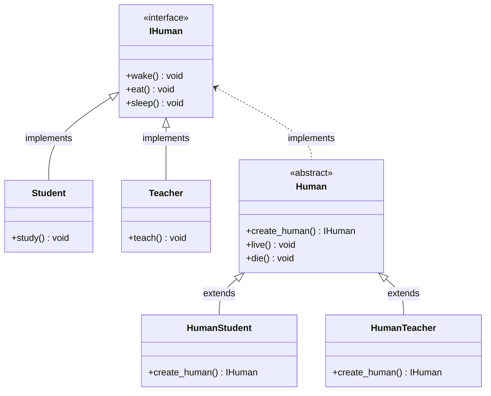
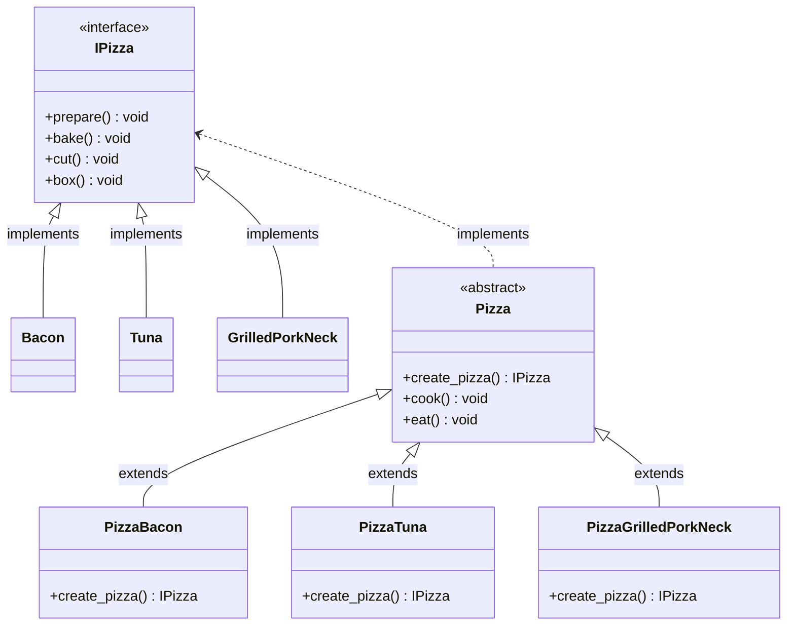
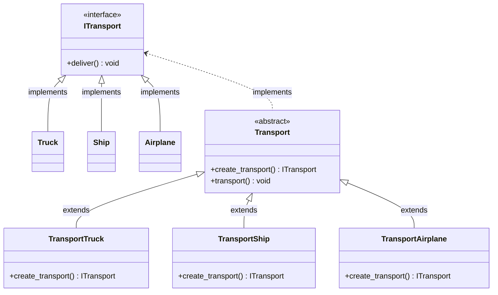

## Generalization Design Pattern Factory Method

```mermaid
classDiagram
    class  IHuman{
        <<interface>>
        +wake() void
        +eat() void
        +sleep() void
    }
    class  Student{
        +study() void
    }
    class  Teacher{
        +teach() void
    }
    class Human{
        <<abstract>>
        +create_human()IHuman
        +live() void
        +die() void
    }
    class HumanStudent{
        +create_human()IHuman
    }
    class HumanTeacher{
        +create_human()IHuman
    }
    IHuman <|-- Student:implements
    IHuman <|-- Teacher:implements
    Human <|-- HumanStudent:extends
    Human <|-- HumanTeacher:extends
    IHuman <.. Human:implements
```

```mermaid
classDiagram
    class  IPizza{
        <<interface>>
        +prepare()void
        +bake()void
        +cut()void
        +box()void
    }
    class Bacon{

    }
    class Tuna{

    }
    class GrilledPorkNeck{

    }
    class Pizza{
        <<abstract>>
        +create_pizza()IPizza
        +cook()void
        +eat()void
    }
    class PizzaBacon{
        +create_pizza()IPizza
    }
    class PizzaTuna{
        +create_pizza()IPizza
    }
    class PizzaGrilledPorkNeck{
        +create_pizza()IPizza
    }

    IPizza <|-- Bacon:implements
    IPizza <|-- Tuna:implements
    IPizza <|-- GrilledPorkNeck:implements
    Pizza <|-- PizzaBacon:extends
    Pizza <|-- PizzaTuna:extends
    Pizza <|-- PizzaGrilledPorkNeck:extends
    IPizza <.. Pizza:implements
```

```mermaid
classDiagram
    class ITransport{
        <<interface>>
        +deliver()void
    }
    class Truck{

    }
    class Ship{

    }
    class Airplane{

    }
    class Transport{
        <<abstract>>
        +create_transport()ITransport
        +transport()void
    }
    class TransportTruck{
        +create_transport()ITransport
    }
    class TransportShip{
        +create_transport()ITransport
    }
    class TransportAirplane{
        +create_transport()ITransport
    }
    ITransport <|-- Truck:implements
    ITransport <|-- Ship:implements
    ITransport <|-- Airplane:implements
    Transport <|-- TransportTruck:extends
    Transport <|-- TransportShip:extends
    Transport <|-- TransportAirplane:extends
    ITransport <.. Transport:implements
```
