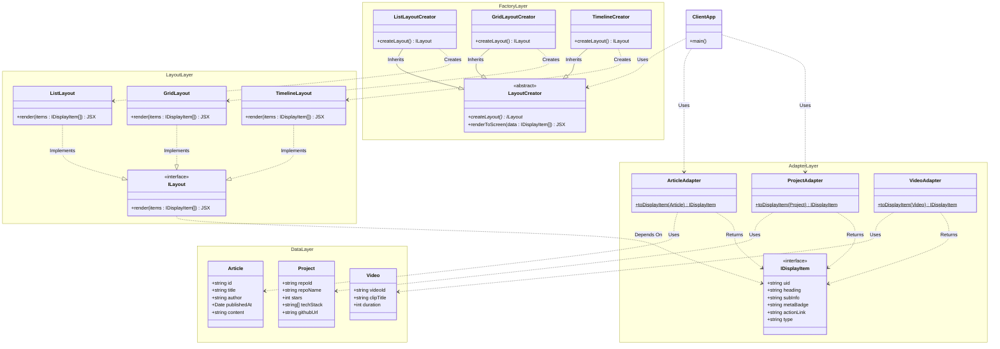

```mermaid
classDiagram
    %% --- 1. Data Layer (Raw Data) ---
    %% ส่วนนี้คือข้อมูลดิบที่โครงสร้างไม่เหมือนกัน
    namespace DataLayer {
        class Article {
            +string id
            +string title
            +string author
            +Date publishedAt
            +string content
        }
        class Project {
            +string repoId
            +string repoName
            +int stars
            +string[] techStack
            +string githubUrl
        }
        class Video {
            %% Future Scalability Example
            +string videoId
            +string clipTitle
            +int duration
        }
    }

    %% --- 2. Adapter Layer ---
    %% ส่วนแปลงร่าง ให้เป็นมาตรฐานกลาง
    namespace AdapterLayer {
        class IDisplayItem {
            <<interface>>
            +string uid
            +string heading
            +string subInfo
            +string metaBadge
            +string actionLink
            +string type
        }

        class ArticleAdapter {
            +toDisplayItem(Article) IDisplayItem$
        }
        class ProjectAdapter {
            +toDisplayItem(Project) IDisplayItem$
        }
        class VideoAdapter {
            %% Future Scalability
            +toDisplayItem(Video) IDisplayItem$
        }
    }

    %% Relationships for Adapter
    ArticleAdapter ..> Article : Uses
    ProjectAdapter ..> Project : Uses
    VideoAdapter ..> Video : Uses
    ArticleAdapter ..> IDisplayItem : Returns
    ProjectAdapter ..> IDisplayItem : Returns
    VideoAdapter ..> IDisplayItem : Returns

    %% --- 3. Layout Layer (Product) ---
    %% ส่วนแสดงผล (Factory Product)
    namespace LayoutLayer {
        class ILayout {
            <<interface>>
            +render(items : IDisplayItem[]) JSX
        }

        class ListLayout {
            +render(items : IDisplayItem[]) JSX
        }
        class GridLayout {
            +render(items : IDisplayItem[]) JSX
        }
        class TimelineLayout {
            %% Future Scalability
            +render(items : IDisplayItem[]) JSX
        }
    }

    %% Relationships for Layout
    ListLayout ..|> ILayout : Implements
    GridLayout ..|> ILayout : Implements
    TimelineLayout ..|> ILayout : Implements
    ILayout ..> IDisplayItem : Depends On

    %% --- 4. Factory Layer (Creator) ---
    %% ส่วนสร้าง Layout (Factory Method Pattern)
    namespace FactoryLayer {
        class LayoutCreator {
            <<abstract>>
            +createLayout() ILayout*
            +renderToScreen(data : IDisplayItem[]) JSX
        }

        class ListLayoutCreator {
            +createLayout() ILayout
        }
        class GridLayoutCreator {
            +createLayout() ILayout
        }
        class TimelineCreator {
            %% Future Scalability
            +createLayout() ILayout
        }
    }

    %% Relationships for Factory
    ListLayoutCreator --|> LayoutCreator : Inherits
    GridLayoutCreator --|> LayoutCreator : Inherits
    TimelineCreator --|> LayoutCreator : Inherits

    %% Factory Creates Product
    ListLayoutCreator ..> ListLayout : Creates
    GridLayoutCreator ..> GridLayout : Creates
    TimelineCreator ..> TimelineLayout : Creates

    %% Client App
    class ClientApp {
        +main()
    }
    ClientApp ..> LayoutCreator : Uses
    ClientApp ..> ArticleAdapter : Uses
    ClientApp ..> ProjectAdapter : Uses
```