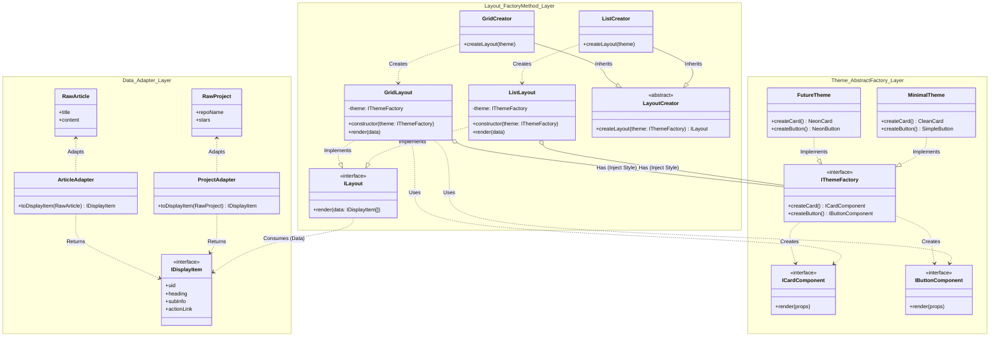

```mermaid
classDiagram
    %% ==========================================
    %% PART 1: ADAPTER PATTERN (จัดการ Data)
    %% ==========================================
    namespace Data_Adapter_Layer {
        class RawArticle {
            +title
            +content
        }
        class RawProject {
            +repoName
            +stars
        }
        
        class IDisplayItem {
            <<interface>>
            +uid
            +heading
            +subInfo
            +actionLink
        }

        class ArticleAdapter {
            +toDisplayItem(RawArticle) IDisplayItem
        }
        class ProjectAdapter {
            +toDisplayItem(RawProject) IDisplayItem
        }
    }

    RawArticle <.. ArticleAdapter : Adapts
    RawProject <.. ProjectAdapter : Adapts
    ArticleAdapter ..> IDisplayItem : Returns
    ProjectAdapter ..> IDisplayItem : Returns

    %% ==========================================
    %% PART 2: ABSTRACT FACTORY (จัดการ Theme)
    %% ==========================================
    namespace Theme_AbstractFactory_Layer {
        %% Abstract Products (ชิ้นส่วน UI)
        class ICardComponent {
            <<interface>>
            +render(props)
        }
        class IButtonComponent {
            <<interface>>
            +render(props)
        }

        %% Abstract Factory (โรงงานธีม)
        class IThemeFactory {
            <<interface>>
            +createCard() ICardComponent
            +createButton() IButtonComponent
        }

        %% Concrete Factories (ธีมจริง)
        class FutureTheme {
            +createCard() NeonCard
            +createButton() NeonButton
        }
        class MinimalTheme {
            +createCard() CleanCard
            +createButton() SimpleButton
        }
    }

    FutureTheme ..|> IThemeFactory : Implements
    MinimalTheme ..|> IThemeFactory : Implements
    IThemeFactory ..> ICardComponent : Creates
    IThemeFactory ..> IButtonComponent : Creates

    %% ==========================================
    %% PART 3: FACTORY METHOD (จัดการ Layout)
    %% ==========================================
    namespace Layout_FactoryMethod_Layer {
        class ILayout {
            <<interface>>
            +render(data: IDisplayItem[])
        }

        class GridLayout {
            -theme: IThemeFactory
            +constructor(theme: IThemeFactory)
            +render(data)
        }
        class ListLayout {
            -theme: IThemeFactory
            +constructor(theme: IThemeFactory)
            +render(data)
        }

        class LayoutCreator {
            <<abstract>>
            +createLayout(theme: IThemeFactory) ILayout
        }

        class GridCreator {
            +createLayout(theme)
        }
        class ListCreator {
            +createLayout(theme)
        }
    }

    GridCreator --|> LayoutCreator : Inherits
    ListCreator --|> LayoutCreator : Inherits
    GridCreator ..> GridLayout : Creates
    ListCreator ..> ListLayout : Creates
    
    GridLayout ..|> ILayout : Implements
    ListLayout ..|> ILayout : Implements

    %% ==========================================
    %% INTEGRATION (จุดเชื่อมโยงสำคัญ)
    %% ==========================================
    
    %% 1. Layout ต้องใช้ Data จาก Adapter
    ILayout ..> IDisplayItem : Consumes (Data)

    %% 2. Layout ต้องใช้ Component จาก Theme
    GridLayout o-- IThemeFactory : Has (Inject Style)
    ListLayout o-- IThemeFactory : Has (Inject Style)

    %% 3. Theme ส่ง Component ให้ Layout ใช้
    GridLayout ..> ICardComponent : Uses
    GridLayout ..> IButtonComponent : Uses
```