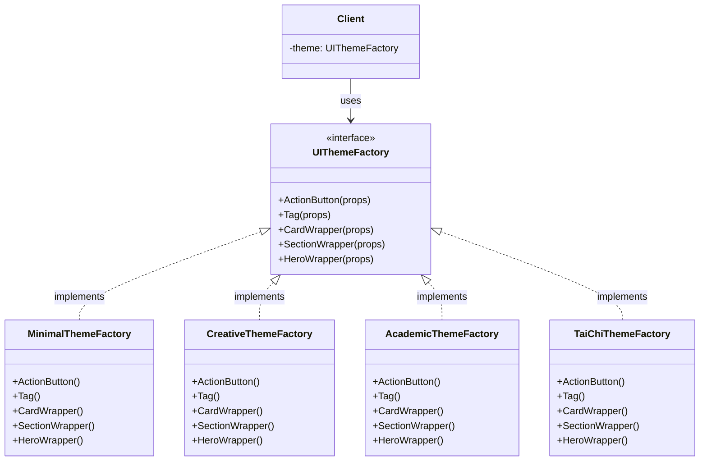
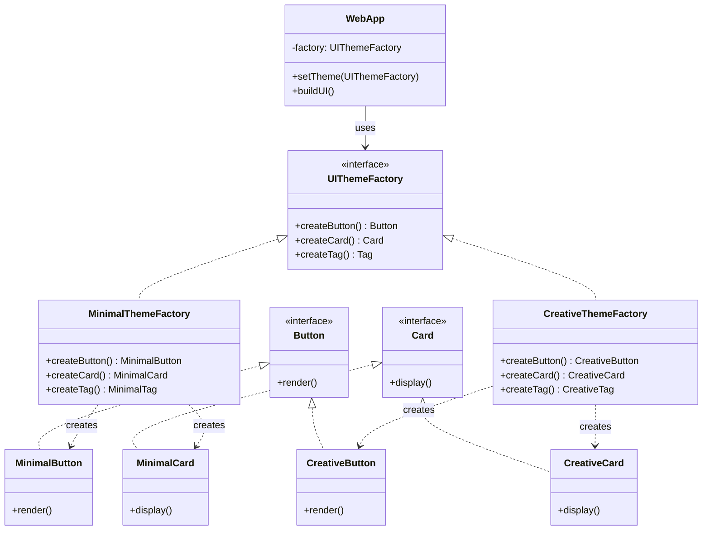
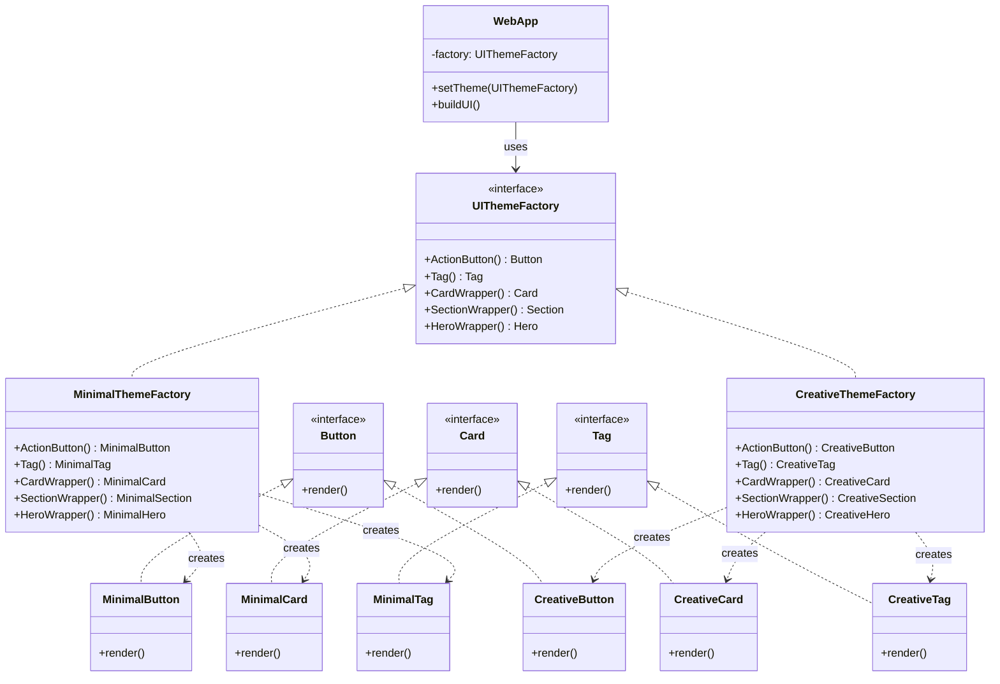
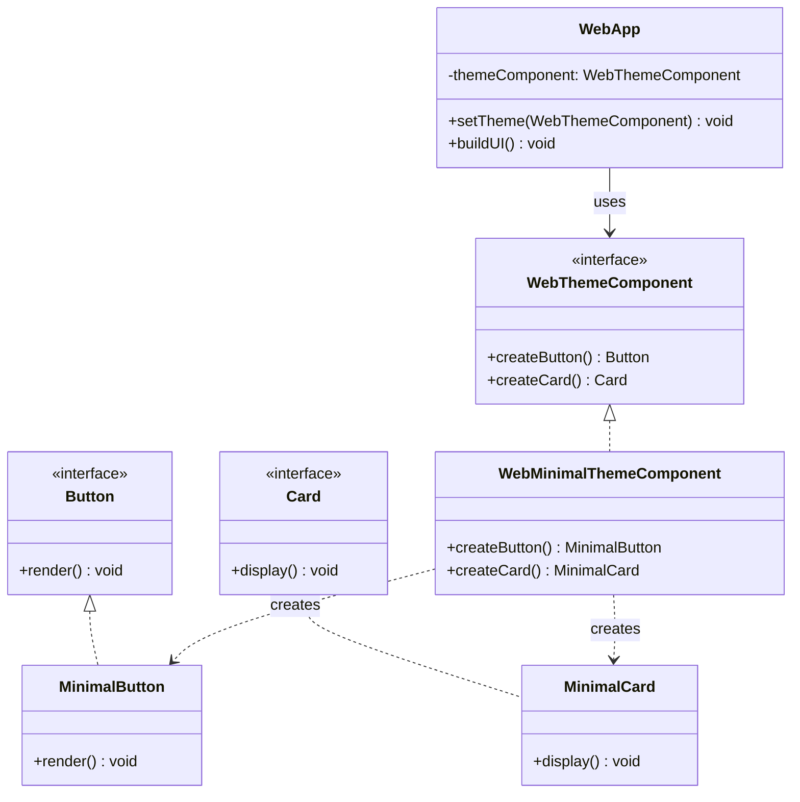

```mermaid
classDiagram
    class UIThemeFactory {
        <<interface>>
        +ActionButton(props)
        +Tag(props)
        +CardWrapper(props)
        +SectionWrapper(props)
        +HeroWrapper(props)
    }

    class MinimalThemeFactory {
        +ActionButton()
        +Tag()
        +CardWrapper()
        +SectionWrapper()
        +HeroWrapper()
    }

    class CreativeThemeFactory {
        +ActionButton()
        +Tag()
        +CardWrapper()
        +SectionWrapper()
        +HeroWrapper()
    }

    class AcademicThemeFactory {
        +ActionButton()
        +Tag()
        +CardWrapper()
        +SectionWrapper()
        +HeroWrapper()
    }
    class TaiChiThemeFactory {
        +ActionButton()
        +Tag()
        +CardWrapper()
        +SectionWrapper()
        +HeroWrapper()
    }

    UIThemeFactory <|.. MinimalThemeFactory : implements
    UIThemeFactory <|.. CreativeThemeFactory : implements
    UIThemeFactory <|.. AcademicThemeFactory : implements
    UIThemeFactory <|.. TaiChiThemeFactory : implements 

    class Client {
        -theme: UIThemeFactory
    }

    Client --> UIThemeFactory : uses
```

```mermaid
classDiagram
    %% --- Abstract Factory ---
    class UIThemeFactory {
        <<interface>>
        +createButton() Button
        +createCard() Card
        +createTag() Tag
    }

    %% --- Concrete Factories ---
    class MinimalThemeFactory {
        +createButton() MinimalButton
        +createCard() MinimalCard
        +createTag() MinimalTag
    }
    class CreativeThemeFactory {
        +createButton() CreativeButton
        +createCard() CreativeCard
        +createTag() CreativeTag
    }

    UIThemeFactory <|.. MinimalThemeFactory
    UIThemeFactory <|.. CreativeThemeFactory

    %% --- Abstract Products ---
    class Button {
        <<interface>>
        +render()
    }
    class Card {
        <<interface>>
        +display()
    }

    %% --- Concrete Products (Minimal) ---
    class MinimalButton { +render() }
    class MinimalCard { +display() }

    %% --- Concrete Products (Creative) ---
    class CreativeButton { +render() }
    class CreativeCard { +display() }

    %% --- Relationships ---
    Button <|.. MinimalButton
    Button <|.. CreativeButton
    Card <|.. MinimalCard
    Card <|.. CreativeCard

    %% Factory produces Products
    MinimalThemeFactory ..> MinimalButton : creates
    MinimalThemeFactory ..> MinimalCard : creates
    CreativeThemeFactory ..> CreativeButton : creates
    CreativeThemeFactory ..> CreativeCard : creates

    %% --- Client ---
    class WebApp {
        -factory: UIThemeFactory
        +setTheme(UIThemeFactory)
        +buildUI()
    }
    WebApp --> UIThemeFactory : uses
```
---

```mermaid
classDiagram
    %% --- Abstract Factory ---
    class UIThemeFactory {
        <<interface>>
        +ActionButton() Button
        +Tag() Tag
        +CardWrapper() Card
        +SectionWrapper() Section
        +HeroWrapper() Hero
    }

    %% --- Concrete Factories ---
    class MinimalThemeFactory {
        +ActionButton() MinimalButton
        +Tag() MinimalTag
        +CardWrapper() MinimalCard
        +SectionWrapper() MinimalSection
        +HeroWrapper() MinimalHero
    }
    class CreativeThemeFactory {
        +ActionButton() CreativeButton
        +Tag() CreativeTag
        +CardWrapper() CreativeCard
        +SectionWrapper() CreativeSection
        +HeroWrapper() CreativeHero
    }

    UIThemeFactory <|.. MinimalThemeFactory
    UIThemeFactory <|.. CreativeThemeFactory

    %% --- Abstract Products ---
    class Button { <<interface>> 
        +render() 
    }
    class Tag { <<interface>> 
        +render() 
    }
    class Card { <<interface>> 
        +render() 
    }

    %% --- Concrete Products (Minimal) ---
    class MinimalButton { 
        +render() 
    }
    class MinimalCard { 
        +render() 
    }
    class MinimalTag { 
        +render() 
    }
    class CreativeTag { 
        +render() 
    }

    %% --- Concrete Products (Creative) ---
    class CreativeButton { 
        +render() 
    }
    class CreativeCard { 
        +render() 
    }

    %% Relationships
    Button <|.. MinimalButton
    Button <|.. CreativeButton
    Card <|.. MinimalCard
    Card <|.. CreativeCard
    Tag <|.. MinimalTag
    Tag <|.. CreativeTag

    %% Factory produces Products
    MinimalThemeFactory ..> MinimalButton : creates
    CreativeThemeFactory ..> CreativeButton : creates
    MinimalThemeFactory ..> MinimalCard : creates
    CreativeThemeFactory ..> CreativeCard : creates
    MinimalThemeFactory ..> MinimalTag : creates
    CreativeThemeFactory ..> CreativeTag : creates

    %% --- Client ---
    class WebApp {
        -factory: UIThemeFactory
        +setTheme(UIThemeFactory)
        +buildUI()
    }
    WebApp --> UIThemeFactory : uses
```

```mermaid
classDiagram
    %% --- abstract product ---
    class Button {
        <<interface>>
        +render()void
    }
    class Card {
        <<interface>>
        +display()void
    }
    %% --- concrete product ---
    class MinimalButton {
        +render()void
    }
    class MinimalCard {
        +display()void
    }
    %% --- abstract factory ---
    class WebThemeComponent{
        <<interface>>
        +createButton() Button
        +createCard() Card
    }
    %% --- concrete factory ---
    class WebMinimalThemeComponent {
        +createButton() MinimalButton
        +createCard() MinimalCard
    }
    %% --- client ---
    class WebApp {
        -themeComponent: WebThemeComponent
        +setTheme(WebThemeComponent) void
        +buildUI() void
    }
    %% --- relationships ---
    WebThemeComponent <|.. WebMinimalThemeComponent
    Button <|.. MinimalButton
    Card <|.. MinimalCard
    WebMinimalThemeComponent ..> MinimalButton : creates
    WebMinimalThemeComponent ..> MinimalCard : creates
    WebApp --> WebThemeComponent : uses
```