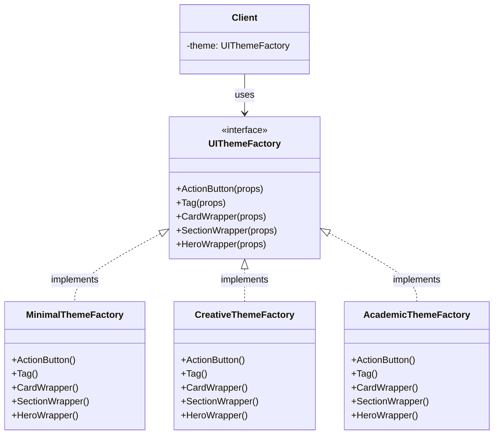

```mermaid
classDiagram
    class UIThemeFactory {
        <<interface>>
        +ActionButton(props)
        +Tag(props)
        +CardWrapper(props)
        +SectionWrapper(props)
        +HeroWrapper(props)
    }

    class MinimalThemeFactory {
        +ActionButton()
        +Tag()
        +CardWrapper()
        +SectionWrapper()
        +HeroWrapper()
    }

    class CreativeThemeFactory {
        +ActionButton()
        +Tag()
        +CardWrapper()
        +SectionWrapper()
        +HeroWrapper()
    }

    class AcademicThemeFactory {
        +ActionButton()
        +Tag()
        +CardWrapper()
        +SectionWrapper()
        +HeroWrapper()
    }

    UIThemeFactory <|.. MinimalThemeFactory : implements
    UIThemeFactory <|.. CreativeThemeFactory : implements
    UIThemeFactory <|.. AcademicThemeFactory : implements

    class Client {
        -theme: UIThemeFactory
    }

    Client --> UIThemeFactory : uses
```