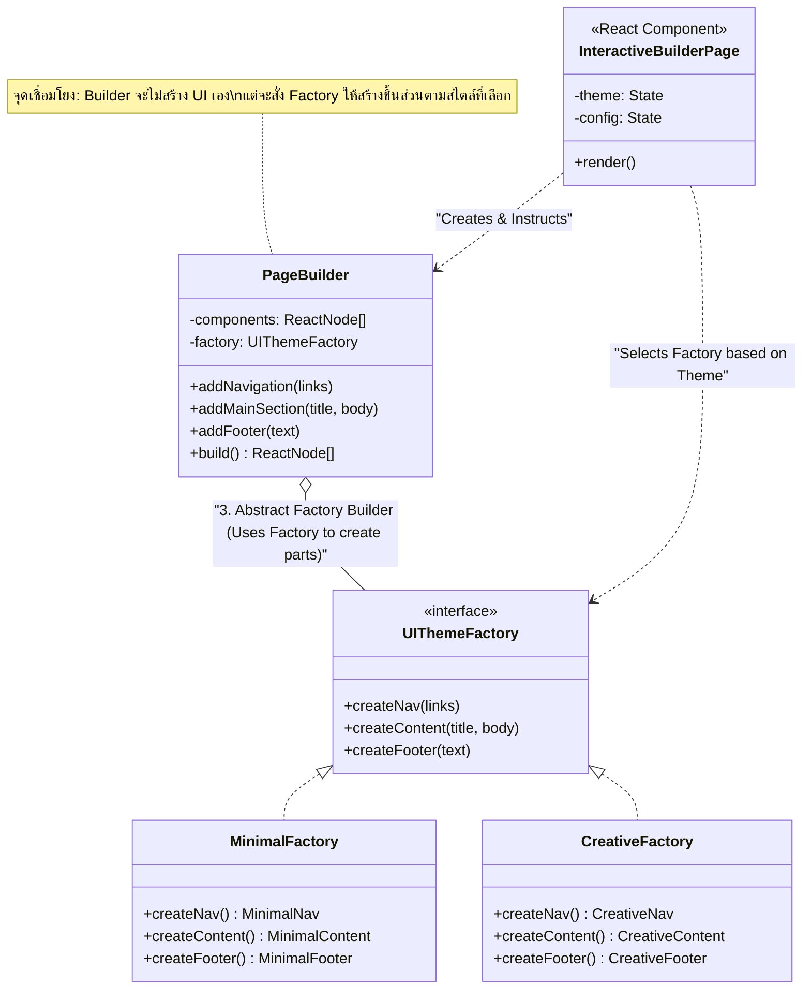
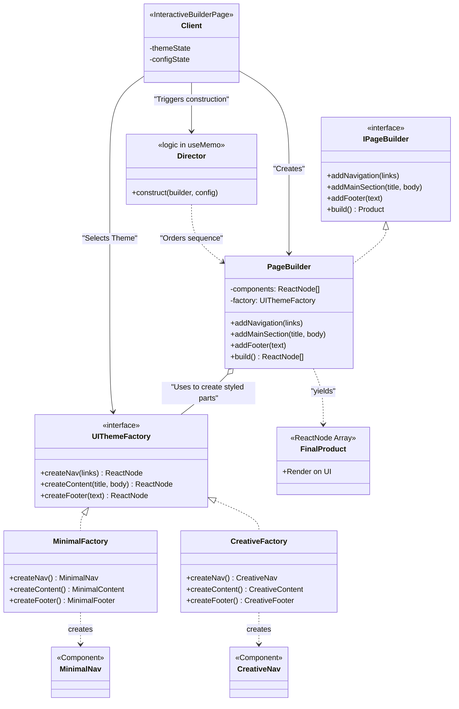

```mermaid
classDiagram
    direction TB

    %% --- ส่วนที่ 1: Abstract Factory (The Styles) ---
    %% โซนนี้รับผิดชอบเรื่อง "หน้าตา" (Look & Feel)
    subgraph Abstract_Factory
        class UIThemeFactory {
            <<interface>>
            +createNav(links)
            +createContent(title, body)
            +createFooter(text)
        }

        class MinimalFactory {
            +createNav() MinimalNav
            +createContent() MinimalContent
            +createFooter() MinimalFooter
        }

        class CreativeFactory {
            +createNav() CreativeNav
            +createContent() CreativeContent
            +createFooter() CreativeFooter
        }

        UIThemeFactory <|.. MinimalFactory
        UIThemeFactory <|.. CreativeFactory
    end

    %% --- ส่วนที่ 2: Builder (The Structure) ---
    %% โซนนี้รับผิดชอบเรื่อง "ลำดับการประกอบ" (Assembly Logic)
    subgraph Builder_Pattern
        class PageBuilder {
            -components: ReactNode[]
            -factory: UIThemeFactory
            +addNavigation(links)
            +addMainSection(title, body)
            +addFooter(text)
            +build() ReactNode[]
        }
    end

    %% --- ส่วนที่ 3: Integration (The Link) ---
    %% โซนที่แสดงการทำงานร่วมกันใน Client Code
    subgraph Integration_Client
        class InteractiveBuilderPage {
            <<React Component>>
            -theme: State
            -config: State
            +render()
        }
    end

    %% Relationships (การเชื่อมโยง)
    PageBuilder o-- UIThemeFactory : "3. Abstract Factory Builder (Uses Factory to create parts)"
    InteractiveBuilderPage ..> PageBuilder : "Creates & Instructs"
    InteractiveBuilderPage ..> UIThemeFactory : "Selects Factory based on Theme"
    
    %% Note for clarity
    note for PageBuilder "จุดเชื่อมโยง: Builder จะไม่สร้าง UI เอง\nแต่จะสั่ง Factory ให้สร้างชิ้นส่วนตามสไตล์ที่เลือก"
```
---

```mermaid
classDiagram
    direction TB

    %% --- 1. Abstract Factory Part ---
    class UIThemeFactory {
        <<interface>>
        +createNav(links) ReactNode
        +createContent(title, body) ReactNode
        +createFooter(text) ReactNode
    }

    class MinimalFactory {
        +createNav() MinimalNav
        +createContent() MinimalContent
        +createFooter() MinimalFooter
    }

    class CreativeFactory {
        +createNav() CreativeNav
        +createContent() CreativeContent
        +createFooter() CreativeFooter
    }

    UIThemeFactory <|.. MinimalFactory
    UIThemeFactory <|.. CreativeFactory

    %% --- 2. Concrete Products ---
    class MinimalNav { <<Component>> }
    class CreativeNav { <<Component>> }
    MinimalFactory ..> MinimalNav : creates
    CreativeFactory ..> CreativeNav : creates

    %% --- 3. Builder Part ---
    class IPageBuilder {
        <<interface>>
        +addNavigation(links)
        +addMainSection(title, body)
        +addFooter(text)
        +build() Product
    }

    class PageBuilder {
        -components: ReactNode[]
        -factory: UIThemeFactory
        +addNavigation(links)
        +addMainSection(title, body)
        +addFooter(text)
        +build() ReactNode[]
    }

    IPageBuilder <|.. PageBuilder
    PageBuilder o-- UIThemeFactory : "Uses to create styled parts"

    %% --- 4. Director & Client ---
    class Director {
        <<logic in useMemo>>
        +construct(builder, config)
    }

    class Client {
        <<InteractiveBuilderPage>>
        -themeState
        -configState
    }

    Client --> UIThemeFactory : "Selects Theme"
    Client --> PageBuilder : "Creates"
    Client --> Director : "Triggers construction"
    Director ..> PageBuilder : "Orders sequence"

    %% --- 5. The Final Product ---
    class FinalProduct {
        <<ReactNode Array>>
        +Render on UI
    }
    PageBuilder ..> FinalProduct : "yields"
```