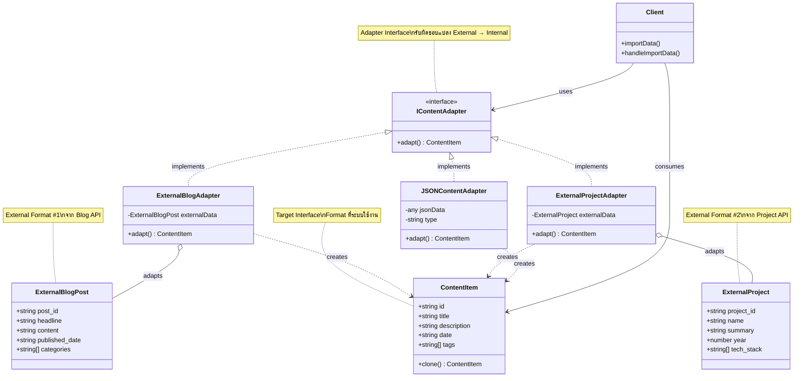
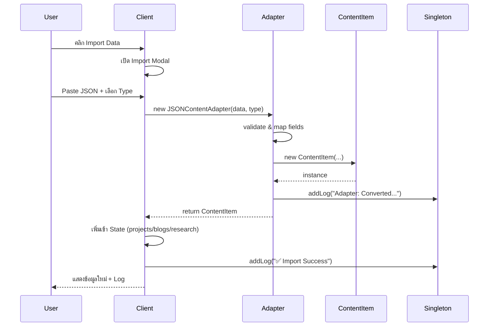

# 🔌 Adapter Pattern - Class Diagram

## 📋 Pattern Overview
**Adapter Pattern** เป็น Structural Design Pattern ที่ทำหน้าที่เป็น "สะพานเชื่อม" ระหว่าง 2 Interface ที่ไม่เข้ากัน ให้สามารถทำงานร่วมกันได้

---

## 🎯 Problem & Solution

### ❌ Problem
- มี External Data Format ที่มาจาก Third-party APIs (เช่น Blog APIs, Project Management APIs)
- Format ของข้อมูลไม่ตรงกับ Internal System (ContentItem)
- ไม่สามารถแก้ไข Source Code ของ External APIs ได้

### ✅ Solution  
- สร้าง **Adapter Class** เพื่อแปลง External Format → Internal Format
- Client ใช้งาน Adapter โดยไม่ต้องรู้รายละเอียดของ External Format
- รองรับหลาย External Sources พร้อมกัน

---

## 📐 Class Diagram (Mermaid)



---

## 🔄 Sequence Flow



---

## 🧩 Implementation Details

### 1️⃣ **IContentAdapter Interface**
```typescript
interface IContentAdapter {
  adapt(): ContentItem;
}
```
- กำหนด contract ที่ทุก Adapter ต้อง implement
- มี method `adapt()` สำหรับแปลงข้อมูล

---

### 2️⃣ **ExternalBlogAdapter**
```typescript
class ExternalBlogAdapter implements IContentAdapter {
  constructor(private externalData: ExternalBlogPost) {}

  adapt(): ContentItem {
    // แปลง External Blog → ContentItem
    return new ContentItem(
      this.externalData.post_id,        // id
      this.externalData.headline,       // title
      this.externalData.content,        // description
      this.externalData.published_date, // date
      this.externalData.categories      // tags
    );
  }
}
```
**Responsibilities:**
- แปลง `ExternalBlogPost` format → `ContentItem` format
- Map fields: `post_id → id`, `headline → title`, etc.
- Log การแปลงผ่าน Singleton Logger

---

### 3️⃣ **ExternalProjectAdapter**
```typescript
class ExternalProjectAdapter implements IContentAdapter {
  constructor(private externalData: ExternalProject) {}

  adapt(): ContentItem {
    return new ContentItem(
      this.externalData.project_id,
      this.externalData.name,
      this.externalData.summary,
      this.externalData.year.toString(), // convert number → string
      this.externalData.tech_stack
    );
  }
}
```
**Key Features:**
- แปลง `year: number` → `date: string`
- รองรับ `tech_stack` ที่เป็น array

---

### 4️⃣ **JSONContentAdapter (Generic Adapter)**
```typescript
class JSONContentAdapter implements IContentAdapter {
  constructor(
    private jsonData: any, 
    private type: 'blog' | 'project' | 'research'
  ) {}

  adapt(): ContentItem {
    // Flexible field mapping
    const id = this.jsonData.id || 
               this.jsonData.post_id || 
               this.jsonData.project_id || 
               Math.random().toString(36).slice(2, 11);

    const title = this.jsonData.title || 
                  this.jsonData.name || 
                  this.jsonData.headline || 
                  'Untitled';

    // ... similar for other fields

    return new ContentItem(id, title, description, date, tags);
  }
}
```
**Advantages:**
- รองรับหลาย field names (id/post_id/project_id)
- Fallback values สำหรับ missing fields
- ยืดหยุ่นกับ External APIs ต่างๆ

---

## 🎨 UI Implementation

### Import Modal Features
1. **Type Selector** - เลือก import เป็น project/blog/research
2. **JSON Textarea** - Paste external JSON data
3. **Sample Data Button** - โหลด sample JSON สำหรับทดสอบ
4. **Validation** - ตรวจสอบ JSON format ก่อน import
5. **Error Handling** - แสดง error ใน Singleton Logger

### User Flow
```
[คลิก Import Data Button] 
  → [เลือก Type (project/blog/research)]
  → [Paste JSON / Load Sample]
  → [คลิก "Import via Adapter"]
  → [Adapter แปลงข้อมูล]
  → [เพิ่มเข้า State]
  → [แสดงใน UI + Log Success]
```

---

## ✅ Design Principles Applied

### 1. **Open/Closed Principle (OCP)**
- เพิ่ม Adapter ใหม่ได้โดยไม่แก้ code เดิม
- Extend functionality without modification

### 2. **Single Responsibility (SRP)**
- แต่ละ Adapter รับผิดชอบแค่ 1 External Format
- `ExternalBlogAdapter` → Blog only
- `ExternalProjectAdapter` → Project only

### 3. **Dependency Inversion (DIP)**
- Client depends on `IContentAdapter` interface
- ไม่ depend on concrete Adapter classes

---

## 🔗 Integration with Other Patterns

| Pattern | Integration Point | Purpose |
|---------|------------------|---------|
| **Singleton** | SessionLogger | Log ทุกครั้งที่ Adapter ทำงาน |
| **Prototype** | ContentItem | Adapter สร้าง ContentItem ที่ clone ได้ |
| **Abstract Factory** | Theme System | UI ของ Import Modal ใช้ theme colors |
| **Builder** | Page Builder | Imported items เพิ่มเข้า sections |

---

## 🧪 Testing Scenarios

### ✅ Happy Path
```json
{
  "id": "ext-001",
  "name": "External Project",
  "summary": "Description...",
  "year": 2024,
  "tech_stack": ["React", "TypeScript"]
}
```
**Expected:** สร้าง ContentItem สำเร็จ, แสดงใน Projects section

---

### ⚠️ Missing Fields
```json
{
  "name": "Incomplete Data"
}
```
**Expected:** ใช้ fallback values, generate random ID

---

### ❌ Invalid JSON
```json
{ invalid json }
```
**Expected:** แสดง error ใน Logger, ไม่ import

---

## 📊 Benefits & Trade-offs

### ✅ Pros
- **Flexibility** - รองรับหลาย External Sources
- **Maintainability** - แก้ไข Adapter โดยไม่กระทบ Client
- **Testability** - Test Adapter แยกจาก Client
- **Scalability** - เพิ่ม Adapter ใหม่ง่าย

### ⚠️ Cons
- **Complexity** - เพิ่ม classes และ interfaces
- **Performance** - มี overhead จากการแปลงข้อมูล
- **Over-engineering** - ถ้ามี External Source น้อย อาจไม่จำเป็น

---

## 🚀 Future Enhancements

1. **Async Adapters** - รองรับ async data fetching
2. **Validation Layer** - Validate data ก่อน adapt
3. **Transformation Pipeline** - Chain multiple adapters
4. **Caching** - Cache adapted results
5. **Schema Mapping Config** - กำหนด field mapping แบบ declarative

---

## 📚 Related Patterns

- **Facade** - Simplify complex subsystems (Adapter focuses on interface conversion)
- **Decorator** - Add behavior dynamically (Adapter converts interfaces)
- **Bridge** - Separate abstraction from implementation
- **Strategy** - Interchangeable algorithms (Adapter is about interface compatibility)

---

## 🎓 Key Takeaways

1. ใช้เมื่อต้องการ **integrate external systems** ที่ interface ไม่เข้ากัน
2. ช่วยให้ระบบ **รองรับหลาย data sources** โดยไม่แก้ core logic
3. เหมาะกับการ **import/export data** จาก APIs, files, databases
4. ทำให้ code **ยืดหยุ่น และ maintainable** ในระยะยาว

---

**Implementation:** [page.tsx](../../app/page.tsx) (Lines 100-180)  
**Related Docs:** [docs/adapter.md](../docs/adapter.md)  
**Pattern Type:** Structural Design Pattern
