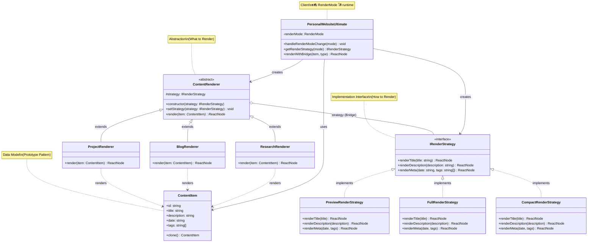
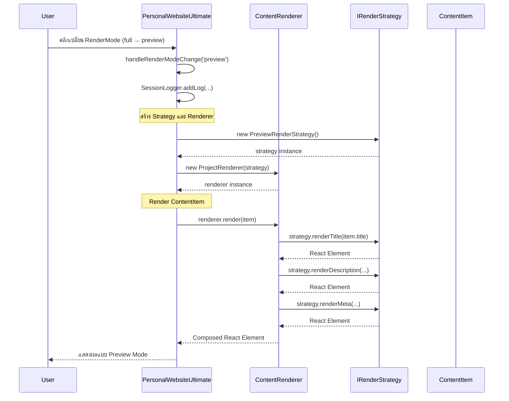

# 🌉 Bridge Pattern - Class Diagram

## 📋 Pattern Overview
**Bridge Pattern** เป็น Structural Design Pattern ที่แยก **Abstraction (อะไร)** ออกจาก **Implementation (ยังไง)** ให้ทั้ง 2 ส่วนสามารถเปลี่ยนแปลงได้อิสระจากกันโดยไม่ขึ้นต่อกัน

---

## 🎯 Problem & Solution

### ❌ Problem
- มี **ContentItem** หลายประเภท (Project, Blog, Research)
- มี **Render Strategy** หลายแบบ (Preview, Full, Compact)
- ถ้าไม่ใช้ Bridge Pattern จะต้องสร้าง Class จำนวน: **3 types × 3 strategies = 9 classes!**
- เมื่อเพิ่ม Type หรือ Strategy ใหม่ จำนวน Classes จะเพิ่มแบบ exponential

### ✅ Solution  
- แยก **Abstraction** (ContentRenderer) ออกจาก **Implementation** (RenderStrategy)
- ใช้ **Composition แทน Inheritance** - Renderer "มี" Strategy แทนที่จะเป็น Strategy
- เพิ่ม Type ใหม่: เพิ่ม Refined Abstraction 1 ตัว
- เพิ่ม Strategy ใหม่: เพิ่ม Concrete Implementation 1 ตัว
- **Total Classes: 3 types + 3 strategies = 6 classes** (แทนที่จะเป็น 9)

---

## 📐 Class Diagram (Mermaid)



---

## 🔄 Sequence Flow



---

## 🧩 Implementation Details

### 1️⃣ **IRenderStrategy (Implementor Interface)**
กำหนดวิธีการ render แต่ละส่วนของ ContentItem

```typescript
interface IRenderStrategy {
  renderTitle(title: string): React.ReactNode;
  renderDescription(description: string): React.ReactNode;
  renderMeta(date: string, tags: string[]): React.ReactNode;
}
```

**Purpose:** เป็น contract ที่ทุก Concrete Strategy ต้อง implement

---

### 2️⃣ **Concrete Implementors**

#### PreviewRenderStrategy (แสดงแบบสั้น)
```typescript
class PreviewRenderStrategy implements IRenderStrategy {
  renderTitle(title: string): React.ReactNode {
    return <h4 className="font-bold text-base truncate">{title}</h4>;
  }

  renderDescription(description: string): React.ReactNode {
    return <p className="text-xs opacity-70 line-clamp-1">{description}</p>;
  }

  renderMeta(date: string, tags: string[]): React.ReactNode {
    return (
      <div className="flex items-center gap-2 text-xs opacity-50">
        <span>{date}</span>
        {tags.length > 0 && <span>• {tags.length} tags</span>}
      </div>
    );
  }
}
```
**Features:** 
- Title: truncate (ตัดข้อความยาว)
- Description: แสดง 1 บรรทัด (line-clamp-1)
- Meta: แสดงแค่จำนวน tags ไม่แสดง tag names

---

#### FullRenderStrategy (แสดงแบบเต็ม)
```typescript
class FullRenderStrategy implements IRenderStrategy {
  renderTitle(title: string): React.ReactNode {
    return <h3 className="font-bold text-xl mb-2">{title}</h3>;
  }

  renderDescription(description: string): React.ReactNode {
    return <p className="text-sm opacity-80 leading-relaxed mb-3">{description}</p>;
  }

  renderMeta(date: string, tags: string[]): React.ReactNode {
    return (
      <div className="space-y-2">
        <div className="text-xs opacity-60 flex items-center gap-2">
          <span className="font-mono">{date}</span>
        </div>
        <div className="flex flex-wrap gap-1">
          {tags.map((tag, idx) => (
            <span key={idx} className="px-2 py-0.5 bg-blue-500/10 text-blue-400 text-xs rounded border border-blue-500/30">
              {tag}
            </span>
          ))}
        </div>
      </div>
    );
  }
}
```
**Features:**
- Title: ขนาดใหญ่ (text-xl)
- Description: แสดงเต็ม (leading-relaxed)
- Meta: แสดง tag pills แบบสวยงาม

---

#### CompactRenderStrategy (แสดงแบบกระชับ)
```typescript
class CompactRenderStrategy implements IRenderStrategy {
  renderTitle(title: string): React.ReactNode {
    return <span className="font-semibold text-sm">{title}</span>;
  }

  renderDescription(): React.ReactNode {
    return null; // ไม่แสดง description
  }

  renderMeta(date: string, tags: string[]): React.ReactNode {
    return (
      <span className="text-xs opacity-50">
        {date} • {tags.slice(0, 2).join(', ')}
        {tags.length > 2 && ' +' + (tags.length - 2)}
      </span>
    );
  }
}
```
**Features:**
- Title: ขนาดเล็ก (text-sm)
- Description: ไม่แสดง (return null)
- Meta: แสดงแค่ 2 tags แรก + count (+3)

---

### 3️⃣ **ContentRenderer (Abstraction)**
Base class ที่ "มี" RenderStrategy และ delegate การ render ให้ Strategy

```typescript
abstract class ContentRenderer {
  protected strategy: IRenderStrategy;

  constructor(strategy: IRenderStrategy) {
    this.strategy = strategy;
  }

  // Bridge: เปลี่ยน Strategy runtime ได้
  setStrategy(strategy: IRenderStrategy): void {
    this.strategy = strategy;
    SessionLogger.getInstance().addLog(
      `Bridge Pattern: Changed render strategy to ${strategy.constructor.name}`
    );
  }

  // Template Method ที่ต้อง implement โดย subclass
  abstract render(item: ContentItem): React.ReactNode;
}
```

**Key Points:**
- ใช้ **Composition** (has-a) แทน Inheritance (is-a)
- `setStrategy()` ช่วยให้เปลี่ยน Strategy ได้แบบ dynamic
- `render()` เป็น abstract method ให้ subclass implement

---

### 4️⃣ **Refined Abstractions**

#### ProjectRenderer
```typescript
class ProjectRenderer extends ContentRenderer {
  render(item: ContentItem): React.ReactNode {
    return (
      <div className="border-l-4 border-blue-500 pl-3 py-2">
        <div className="flex items-center gap-2 mb-1">
          <Code size={14} className="text-blue-400" />
          {this.strategy.renderTitle(item.title)}
        </div>
        {this.strategy.renderDescription(item.description)}
        {this.strategy.renderMeta(item.date, item.tags)}
      </div>
    );
  }
}
```
**Characteristics:**
- Border: Blue (project theme)
- Icon: Code icon
- Delegates rendering ให้ `this.strategy`

---

#### BlogRenderer
```typescript
class BlogRenderer extends ContentRenderer {
  render(item: ContentItem): React.ReactNode {
    return (
      <div className="border-l-4 border-purple-500 pl-3 py-2">
        <div className="flex items-center gap-2 mb-1">
          <Feather size={14} className="text-purple-400" />
          {this.strategy.renderTitle(item.title)}
        </div>
        {this.strategy.renderDescription(item.description)}
        {this.strategy.renderMeta(item.date, item.tags)}
      </div>
    );
  }
}
```
**Characteristics:**
- Border: Purple (blog theme)
- Icon: Feather icon
- Same delegation pattern

---

#### ResearchRenderer
```typescript
class ResearchRenderer extends ContentRenderer {
  render(item: ContentItem): React.ReactNode {
    return (
      <div className="border-l-4 border-green-500 pl-3 py-2">
        <div className="flex items-center gap-2 mb-1">
          <Book size={14} className="text-green-400" />
          {this.strategy.renderTitle(item.title)}
        </div>
        {this.strategy.renderDescription(item.description)}
        {this.strategy.renderMeta(item.date, item.tags)}
      </div>
    );
  }
}
```
**Characteristics:**
- Border: Green (research theme)
- Icon: Book icon
- Consistent rendering pattern

---

## 🎨 UI Implementation

### Client Code (PersonalWebsiteUltimate)

#### Get Strategy Helper
```typescript
const getRenderStrategy = (mode: RenderMode): IRenderStrategy => {
  switch (mode) {
    case 'preview': return new PreviewRenderStrategy();
    case 'full': return new FullRenderStrategy();
    case 'compact': return new CompactRenderStrategy();
    default: return new FullRenderStrategy();
  }
};
```

---

#### Render with Bridge Helper
```typescript
const renderWithBridge = (
  item: ContentItem, 
  type: 'project' | 'blog' | 'research'
): React.ReactNode => {
  const strategy = getRenderStrategy(renderMode);
  let renderer: ContentRenderer;

  switch (type) {
    case 'project':
      renderer = new ProjectRenderer(strategy);
      break;
    case 'blog':
      renderer = new BlogRenderer(strategy);
      break;
    case 'research':
      renderer = new ResearchRenderer(strategy);
      break;
  }

  return renderer.render(item);
};
```

---

#### UI Controls
```tsx
<div className="bg-white/10 backdrop-blur-md p-1 rounded-full">
  {(['preview', 'full', 'compact'] as RenderMode[]).map(mode => (
    <button 
      key={mode} 
      onClick={() => handleRenderModeChange(mode)} 
      className={renderMode === mode ? 'active' : ''}
    >
      {mode === 'preview' && '👁️'} 
      {mode === 'full' && '📄'} 
      {mode === 'compact' && '📦'} 
      {mode}
    </button>
  ))}
</div>
```

---

## ✅ Design Principles Applied

### 1. **Open/Closed Principle (OCP)**
- ✅ เพิ่ม RenderStrategy ใหม่โดยไม่แก้ ContentRenderer
- ✅ เพิ่ม ContentRenderer type ใหม่โดยไม่แก้ RenderStrategy

**Example:**
```typescript
// เพิ่ม Strategy ใหม่
class MinimalRenderStrategy implements IRenderStrategy {
  // implement interface
}

// เพิ่ม Renderer ใหม่
class ArticleRenderer extends ContentRenderer {
  render(item: ContentItem): React.ReactNode { ... }
}
```

---

### 2. **Single Responsibility Principle (SRP)**
- **RenderStrategy**: รับผิดชอบเฉพาะ "HOW" to render
- **ContentRenderer**: รับผิดชอบเฉพาะ "WHAT" to render และ composition

---

### 3. **Dependency Inversion Principle (DIP)**
- ContentRenderer depend on **IRenderStrategy interface** ไม่ใช่ Concrete Strategy
- Client สร้าง Strategy และ inject เข้า Renderer (Dependency Injection)

---

## 🔗 Integration with Other Patterns

| Pattern | Integration | How |
|---------|-------------|-----|
| **Singleton** | SessionLogger | Log เมื่อเปลี่ยน Strategy |
| **Prototype** | ContentItem | Items ที่ render มาจาก Prototype |
| **Abstract Factory** | Theme System | Renderer ใช้ theme colors/styles |
| **Factory Method** | Layout Factory | Layouts ใช้ Bridge renderer |
| **Builder** | Page Builder | Builder ประกอบ rendered items |
| **Adapter** | Import Data | Imported items สามารถ render ผ่าน Bridge |

---

## 📊 Comparison: Without vs With Bridge

### ❌ Without Bridge (Inheritance Explosion)
```
ProjectPreviewRenderer
ProjectFullRenderer
ProjectCompactRenderer
BlogPreviewRenderer
BlogFullRenderer
BlogCompactRenderer
ResearchPreviewRenderer
ResearchFullRenderer
ResearchCompactRenderer
→ Total: 9 classes (3 × 3)
```

**Problems:**
- เพิ่ม Type ใหม่ → ต้องสร้าง 3 classes ใหม่
- เพิ่ม Strategy ใหม่ → ต้องสร้าง 3 classes ใหม่
- Code duplication สูง

---

### ✅ With Bridge (Composition)
```
Strategies:
- PreviewRenderStrategy
- FullRenderStrategy
- CompactRenderStrategy

Renderers:
- ProjectRenderer
- BlogRenderer
- ResearchRenderer

→ Total: 6 classes (3 + 3)
```

**Benefits:**
- เพิ่ม Type ใหม่ → เพิ่ม 1 Renderer
- เพิ่ม Strategy ใหม่ → เพิ่ม 1 Strategy
- No code duplication

---

## 🧪 Testing Scenarios

### ✅ Test Case 1: Switch Render Mode
**Input:** User คลิก "preview" → "full" → "compact"

**Expected:**
- ✅ ทุก ContentItem เปลี่ยน rendering style ตาม mode
- ✅ SessionLogger บันทึก log
- ✅ UI update ทันที (no page reload)

---

### ✅ Test Case 2: Add New ContentItem
**Input:** Import new project via Adapter

**Expected:**
- ✅ Item ใหม่ render ด้วย current RenderMode
- ✅ สามารถ switch mode ได้ทันที
- ✅ ไม่มี error

---

### ✅ Test Case 3: Add New Strategy
**Input:** เพิ่ม `DetailedRenderStrategy`

```typescript
class DetailedRenderStrategy implements IRenderStrategy {
  renderTitle(title: string): React.ReactNode {
    return <h2>{title}</h2>;
  }
  renderDescription(description: string): React.ReactNode {
    return <p>{description}</p>;
  }
  renderMeta(date: string, tags: string[]): React.ReactNode {
    return <div>Date: {date}, Tags: {tags.join(', ')}</div>;
  }
}
```

**Expected:**
- ✅ ไม่ต้องแก้ ContentRenderer classes
- ✅ เพิ่มได้โดย implement interface
- ✅ Client สามารถใช้ได้ทันที

---

## 📊 Benefits & Trade-offs

### ✅ Pros

| Benefit | Description | Impact |
|---------|-------------|--------|
| **Decoupling** 🔓 | Abstraction แยกจาก Implementation | เปลี่ยนได้อิสระ |
| **Scalability** 📈 | เพิ่ม dimension ใหม่ง่าย | 3+3 classes แทน 9 |
| **Maintainability** 🛠️ | แก้ไข Strategy ไม่กระทบ Renderer | แยก concerns |
| **Flexibility** 🔄 | เปลี่ยน Strategy runtime ได้ | Dynamic behavior |
| **Code Reuse** ♻️ | Strategy ใช้ร่วมกันได้ | DRY principle |

---

### ⚠️ Cons

| Issue | Impact | Mitigation |
|-------|--------|------------|
| **Complexity** | เพิ่ม classes/interfaces | เหมาะกับ multi-dimensional variation |
| **Indirection** | เพิ่ม layer ระหว่าง client กับ logic | Document ให้ชัดเจน |
| **Over-engineering** | อาจซับซ้อนเกินไปถ้า variation น้อย | ใช้เมื่อมี 2+ dimensions |

---

## 🚀 Advanced Features (Future)

### 1. **Caching Strategies**
```typescript
class CachedRenderStrategy implements IRenderStrategy {
  private cache = new Map<string, React.ReactNode>();
  
  renderTitle(title: string): React.ReactNode {
    if (!this.cache.has(title)) {
      this.cache.set(title, this.computeTitle(title));
    }
    return this.cache.get(title);
  }
}
```

---

### 2. **Animated Strategies**
```typescript
class AnimatedRenderStrategy implements IRenderStrategy {
  renderTitle(title: string): React.ReactNode {
    return (
      <motion.h3 
        initial={{ opacity: 0, y: -20 }}
        animate={{ opacity: 1, y: 0 }}
      >
        {title}
      </motion.h3>
    );
  }
}
```

---

### 3. **Responsive Strategies**
```typescript
const useResponsiveStrategy = () => {
  const [width] = useWindowSize();
  
  if (width < 768) return new CompactRenderStrategy();
  if (width < 1024) return new PreviewRenderStrategy();
  return new FullRenderStrategy();
};
```

---

## 🎓 When to Use

### ✅ Use Bridge Pattern When:
- มี **2+ dimensions ที่ต้องเปลี่ยนแปลงอิสระ** (Type vs Strategy)
- ต้องการ **เปลี่ยน implementation runtime**
- ต้องการ **avoid inheritance explosion**
- ต้องการ **share implementation** ระหว่าง abstractions
- Platform-specific implementations (iOS vs Android)

---

### ❌ Avoid When:
- มี **variation เดียว** (ใช้ Strategy Pattern แทน)
- Implementation **ไม่เปลี่ยน runtime**
- Project **เล็กและไม่ซับซ้อน**
- **Over-engineering** มากกว่าประโยชน์

---

## 📚 Related Patterns

### Strategy Pattern
- **Strategy**: เปลี่ยน algorithm runtime
- **Bridge**: แยก abstraction จาก implementation
- **ความต่าง**: Strategy focus on behavior, Bridge focus on structure

---

### Adapter Pattern
- **Adapter**: แปลง interface ให้เข้ากัน
- **Bridge**: แยก abstraction จาก implementation
- **ความต่าง**: Adapter fixes incompatibility, Bridge prevents explosion

---

### Abstract Factory
- **Abstract Factory**: สร้าง family of objects
- **Bridge**: แยก object hierarchy เป็น 2 dimensions
- **ความต่าง**: Factory creates, Bridge separates

---

## 💡 Key Takeaways

1. **Bridge = แยก "What" ออกจาก "How"**
2. **Composition > Inheritance** - ใช้ "has-a" แทน "is-a"
3. **ป้องกัน Class Explosion** - 3+3 > 3×3
4. **เปลี่ยน Implementation runtime ได้**
5. **เหมาะกับ Multi-dimensional Variation**

---

## 📖 Resources

- **Implementation**: [page.tsx](../../app/page.tsx) (Lines 190-310)
- **Pattern Type**: Structural Design Pattern
- **Gang of Four**: Object Structural Pattern
- **Also Known As**: Handle/Body Pattern

---

**Created**: 2024  
**Author**: Design Patterns Documentation  
**Version**: 1.0  
**Related**: [adapter.md](./adapter.md), [docs/bridge.md](../docs/bridge.md)
