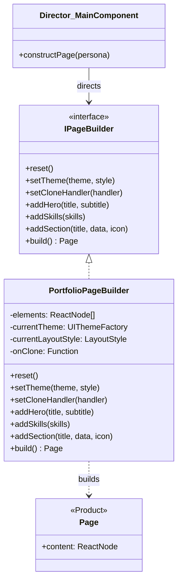

```mermaid
classDiagram
    %% =========================
    %% BUILDER PATTERN (REVISED)
    %% =========================

    class Page {
        <<Product>>
        +content: ReactNode
    }

    class IPageBuilder {
        <<interface>>
        +reset()
        +setTheme(theme, style)
        +setCloneHandler(handler)
        +addHero(title, subtitle)
        +addSkills(skills)
        +addSection(title, data, icon)
        +build() Page
    }

    class PortfolioPageBuilder {
        -elements: ReactNode[]
        -currentTheme: UIThemeFactory
        -currentLayoutStyle: LayoutStyle
        -onClone: Function
        +reset()
        +setTheme(theme, style)
        +setCloneHandler(handler)
        +addHero(title, subtitle)
        +addSkills(skills)
        +addSection(title, data, icon)
        +build() Page
    }

    class Director_MainComponent {
        +constructPage(persona)
    }

    IPageBuilder <|.. PortfolioPageBuilder
    PortfolioPageBuilder ..> Page : builds
    Director_MainComponent --> IPageBuilder : directs
```