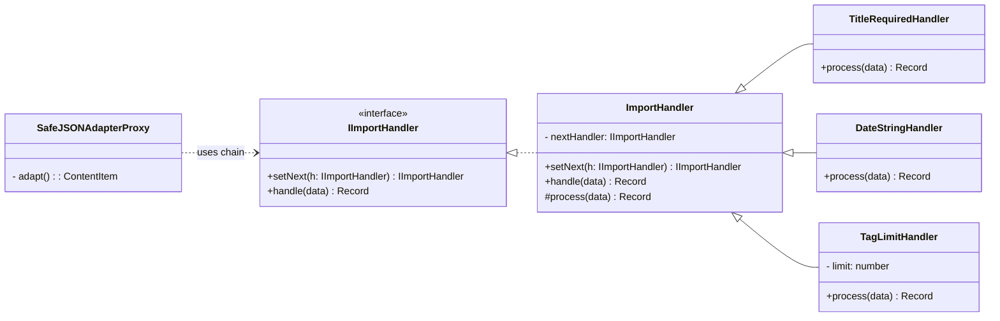
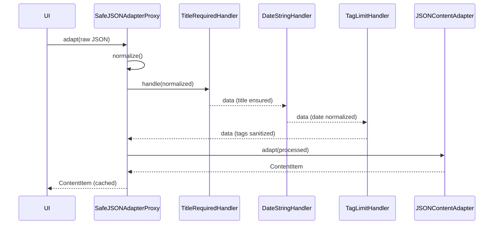

# Chain of Responsibility - Mermaid Diagrams

## Class Diagram

## Sequence: Import Pipeline

## Notes
- Chain of Responsibility แยก concerns เป็น handler เล็กๆ ต่อกันเป็นสาย
- Proxy เรียก chain เพื่อ validate/sanitize ก่อนส่งต่อให้ Adapter
- เพิ่ม/ลบ/เรียงลำดับ handler ได้โดยไม่กระทบ client code
