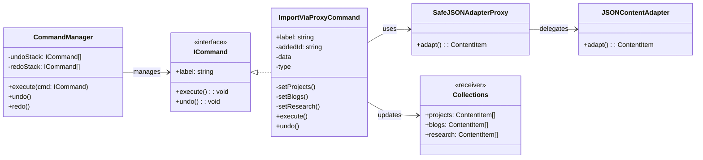
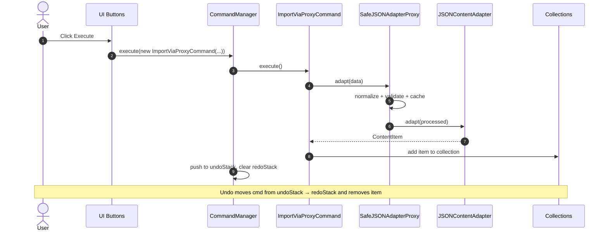

# Command Pattern (Import + Undo/Redo)

```mermaid
classDiagram
  direction LR
  class ICommand {
    <<interface>>
    +label: string
    +execute(): void
    +undo(): void
  }
  class CommandManager {
    -undoStack: ICommand[]
    -redoStack: ICommand[]
    +execute(cmd: ICommand)
    +undo()
    +redo()
  }
  class ImportViaProxyCommand {
    +label: string
    -addedId: string
    -data
    -type
    -setProjects()
    -setBlogs()
    -setResearch()
    +execute()
    +undo()
  }
  class SafeJSONAdapterProxy {
    +adapt(): ContentItem
  }
  class JSONContentAdapter {
    +adapt(): ContentItem
  }
  class Collections {
    <<receiver>>
    +projects: ContentItem[]
    +blogs: ContentItem[]
    +research: ContentItem[]
  }

  ICommand <|.. ImportViaProxyCommand
  CommandManager --> ICommand : manages
  ImportViaProxyCommand --> SafeJSONAdapterProxy : uses
  SafeJSONAdapterProxy --> JSONContentAdapter : delegates
  ImportViaProxyCommand --> Collections : updates
```

```mermaid
sequenceDiagram
  autonumber
  actor User
  participant UI as UI Buttons
  participant Invoker as CommandManager
  participant Cmd as ImportViaProxyCommand
  participant Proxy as SafeJSONAdapterProxy
  participant Adapter as JSONContentAdapter
  participant State as Collections

  User->>UI: Click Execute
  UI->>Invoker: execute(new ImportViaProxyCommand(...))
  Invoker->>Cmd: execute()
  Cmd->>Proxy: adapt(data)
  Proxy->>Proxy: normalize + validate + cache
  Proxy->>Adapter: adapt(processed)
  Adapter-->>Cmd: ContentItem
  Cmd->>State: add item to collection
  Invoker->>Invoker: push to undoStack, clear redoStack
  Note over User,State: Undo moves cmd from undoStack → redoStack and removes item
```