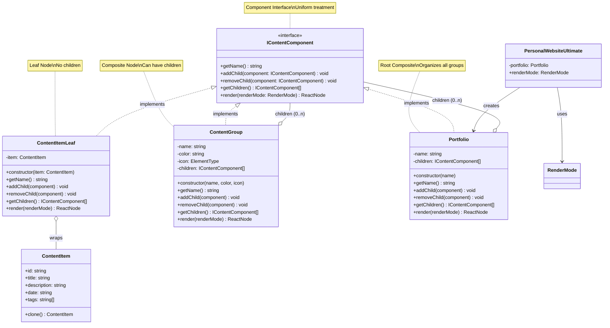
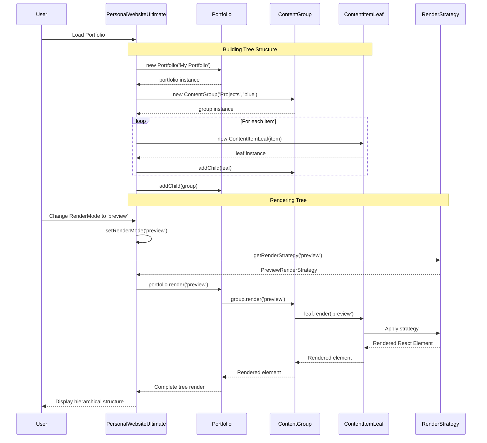

# 🌳 Composite Pattern - Class Diagram

## 📋 Pattern Overview
**Composite Pattern** เป็น Structural Design Pattern ที่ช่วยให้สามารถ **compose objects เข้าด้วยกันเป็น tree structures** ได้ โดย **treat individual objects และ compositions uniformly** (Uniform Treatment)

---

## 🎯 Problem & Solution

### ❌ Problem
- ต้องแสดง **hierarchical content** เช่น Portfolio → Categories → Items
- ต้องการ **support nested structures** ที่ซ้อนกันได้ตามลำดับชั้น
- ไม่ต้องแยก handling logic สำหรับ individual items และ groups
- ต้องการ **tree traversal** ที่ชาญฉลาด

### ✅ Solution  
- สร้าง **Component Interface** ที่ใช้ร่วมกันได้ทั้ง leaves (items) และ composites (groups)
- Individual items implement interface แบบ simple (leaf)
- Containers implement interface แบบ complex (composite)
- Client treat ทั้งคู่ด้วยวิธีเดียวกัน ผ่าน interface

---

## 📐 Class Diagram (Mermaid)



---

## 🔄 Sequence Flow



---

## 🧩 Implementation Details

### 1️⃣ **IContentComponent (Component Interface)**
กำหนด contract ที่ทั้ง leaves และ composites ต้อง implement

```typescript
interface IContentComponent {
  getName(): string;
  addChild(component: IContentComponent): void;
  removeChild(component: IContentComponent): void;
  getChildren(): IContentComponent[];
  render(renderMode: RenderMode): React.ReactNode;
}
```

**Purpose:** Uniform treatment สำหรับทั้ง individual items และ groups

---

### 2️⃣ **ContentItemLeaf (Leaf)**
Represent individual ContentItem - ไม่มี children

```typescript
class ContentItemLeaf implements IContentComponent {
  constructor(private item: ContentItem) {}

  getName(): string {
    return this.item.title;
  }

  addChild(): void {
    console.warn("Cannot add child to leaf node");
  }

  removeChild(): void {
    console.warn("Cannot remove child from leaf node");
  }

  getChildren(): IContentComponent[] {
    return [];
  }

  render(renderMode: RenderMode): React.ReactNode {
    const strategy = getRenderStrategy(renderMode);
    const renderer = new ProjectRenderer(strategy);
    return (
      <div key={this.item.id} className="pl-2">
        {renderer.render(this.item)}
      </div>
    );
  }
}
```

**Characteristics:**
- ✅ Wraps ContentItem
- ✅ addChild/removeChild = no-op (ไม่มี children)
- ✅ render() = delegate ให้ ProjectRenderer
- ✅ ใช้ Bridge Pattern สำหรับ rendering

---

### 3️⃣ **ContentGroup (Composite)**
สามารถมี children - represents category/group

```typescript
class ContentGroup implements IContentComponent {
  private children: IContentComponent[] = [];

  constructor(
    private name: string,
    private color: 'blue' | 'purple' | 'green' | 'orange' = 'orange',
    private icon: React.ElementType = Plus
  ) {}

  getName(): string {
    return this.name;
  }

  addChild(component: IContentComponent): void {
    this.children.push(component);
    SessionLogger.getInstance().addLog(
      `Composite Pattern: Added "${component.getName()}" to "${this.name}"`
    );
  }

  removeChild(component: IContentComponent): void {
    this.children = this.children.filter(c => c !== component);
    SessionLogger.getInstance().addLog(
      `Composite Pattern: Removed child from "${this.name}"`
    );
  }

  getChildren(): IContentComponent[] {
    return this.children;
  }

  render(renderMode: RenderMode): React.ReactNode {
    const colorMap = {
      blue: 'border-blue-500 text-blue-400',
      purple: 'border-purple-500 text-purple-400',
      green: 'border-green-500 text-green-400',
      orange: 'border-orange-500 text-orange-400',
    };

    const Icon = this.icon;

    return (
      <div key={this.name} className={`border-l-4 ${colorMap[this.color]} pl-4 py-3`}>
        <div className="flex items-center gap-2 mb-2">
          <Icon size={16} />
          <span className="font-bold text-sm">{this.name}</span>
          <span className="text-xs opacity-60">({this.children.length})</span>
        </div>
        <div className="space-y-2 ml-2">
          {this.children.map((child, idx) => (
            <div key={idx}>
              {child.render(renderMode)}
            </div>
          ))}
        </div>
      </div>
    );
  }
}
```

**Characteristics:**
- ✅ สามารถมี children ได้
- ✅ addChild() = add to list + log
- ✅ removeChild() = remove from list
- ✅ render() = recursively render children + apply color/icon
- ✅ Display child count

---

### 4️⃣ **Portfolio (Root Composite)**
Root of tree - represents entire portfolio

```typescript
class Portfolio implements IContentComponent {
  private children: IContentComponent[] = [];

  constructor(private name: string) {}

  getName(): string {
    return this.name;
  }

  addChild(component: IContentComponent): void {
    this.children.push(component);
  }

  removeChild(component: IContentComponent): void {
    this.children = this.children.filter(c => c !== component);
  }

  getChildren(): IContentComponent[] {
    return this.children;
  }

  render(renderMode: RenderMode): React.ReactNode {
    return (
      <div className="space-y-4">
        {this.children.map((child, idx) => (
          <div key={idx}>
            {child.render(renderMode)}
          </div>
        ))}
      </div>
    );
  }
}
```

**Purpose:** Root node ที่ organize ทั้งหมด

---

## 🎮 Usage Example

### Building Tree Structure
```typescript
// 1. Create Portfolio (root)
const portfolio = new Portfolio('My Full Portfolio');

// 2. Create categories (composites)
const projectsGroup = new ContentGroup('Featured Projects', 'blue', Code);
const blogsGroup = new ContentGroup('Tech Blog', 'purple', Feather);
const researchGroup = new ContentGroup('Academic Research', 'green', Book);

// 3. Create items (leaves)
const item1 = new ContentItemLeaf(new ContentItem(...));
const item2 = new ContentItemLeaf(new ContentItem(...));

// 4. Build tree: Portfolio → Groups → Items
projectsGroup.addChild(item1);
projectsGroup.addChild(item2);
blogsGroup.addChild(item3);
researchGroup.addChild(item4);

portfolio.addChild(projectsGroup);
portfolio.addChild(blogsGroup);
portfolio.addChild(researchGroup);
```

---

### Rendering Tree
```typescript
// Uniform rendering interface
// ทั้ง leaf และ composite ใช้ render() method เดียวกัน
const html = portfolio.render(renderMode);

// Result: ทั้ง Portfolio, Groups, Items render ตามลำดับชั้น
// Portfolio.render()
//   ↓ for each child (Groups)
//   ↓ Group.render()
//     ↓ for each child (Items)
//     ↓ Item.render()
//       ↓ return <div>...</div>
```

---

## ✅ Design Principles Applied

### 1. **Composite Pattern Structure**
```
Portfolio (Root Composite)
├── ContentGroup "Projects" (Composite)
│   ├── ContentItemLeaf (Item 1) (Leaf)
│   └── ContentItemLeaf (Item 2) (Leaf)
├── ContentGroup "Blogs" (Composite)
│   └── ContentItemLeaf (Item 3) (Leaf)
└── ContentGroup "Research" (Composite)
    └── ContentItemLeaf (Item 4) (Leaf)
```

---

### 2. **Uniform Treatment**
```typescript
// Same interface ทั้ง leaf และ composite
const component: IContentComponent; // Could be leaf or composite

component.getName();           // Works for both
component.render(mode);        // Works for both
component.addChild(child);     // Works - composite, no-op - leaf
component.getChildren();       // Works - composite [], leaf []
```

---

### 3. **Open/Closed Principle (OCP)**
- ✅ เพิ่ม Component type ใหม่ได้โดยไม่แก้ existing code
- ✅ Client ไม่ต้องรู้เป็น leaf หรือ composite

---

### 4. **Integration with Bridge Pattern**
```typescript
// Composite ใช้ Bridge ในการ render
render(renderMode: RenderMode): React.ReactNode {
  const strategy = getRenderStrategy(renderMode);
  const renderer = new ProjectRenderer(strategy);
  return renderer.render(this.item);
}
```

---

## 🔗 Integration with Other Patterns

| Pattern | Integration | How |
|---------|-------------|-----|
| **Singleton** | SessionLogger | Log เมื่อ addChild/removeChild |
| **Prototype** | ContentItem | Leaves wrap Prototype objects |
| **Bridge** | RenderStrategy | Composite ใช้ Bridge render items |
| **Adapter** | Import Data | Imported items ใช้เป็น leaves |
| **Abstract Factory** | Theme System | Groups ใช้ theme colors |

---

## 📊 Comparison: Flat vs Composite

### ❌ Flat Structure
```typescript
// ต้อง handle categories และ items แยก
{categories.map(cat => (
  <div>
    {cat.name}
    {items.filter(i => i.category === cat.id).map(i => (
      <div>{i.title}</div>
    ))}
  </div>
))}

// Problem:
// - Client ต้องรู้ data structure
// - Nested logic ยุ่ง
// - Suport deep nesting ยาก
```

---

### ✅ Composite Structure
```typescript
// Uniform rendering
const portfolio = buildPortfolioTree();
<div>{portfolio.render(mode)}</div>

// Benefits:
// - Client ไม่ต้องรู้ structure
// - Recursive rendering ง่าย
// - Support unlimited nesting
// - Same logic for all levels
```

---

## 🧪 Testing Scenarios

### ✅ Test Case 1: Basic Tree Creation
```typescript
const portfolio = new Portfolio('Test');
const group = new ContentGroup('Group1', 'blue');
const leaf = new ContentItemLeaf(item);

group.addChild(leaf);
portfolio.addChild(group);

expect(portfolio.getChildren().length).toBe(1);
expect(group.getChildren().length).toBe(1);
expect(leaf.getChildren().length).toBe(0);
```

---

### ✅ Test Case 2: Rendering All Levels
```typescript
const html = portfolio.render('full');
expect(html).toContain('Test');
expect(html).toContain('Group1');
expect(html).toContain(item.title);
```

---

### ✅ Test Case 3: Adding/Removing Children
```typescript
const leaf1 = new ContentItemLeaf(item1);
const leaf2 = new ContentItemLeaf(item2);

group.addChild(leaf1);
group.addChild(leaf2);
expect(group.getChildren().length).toBe(2);

group.removeChild(leaf1);
expect(group.getChildren().length).toBe(1);
```

---

### ✅ Test Case 4: Deep Nesting
```typescript
const root = new Portfolio('Root');
const level1 = new ContentGroup('Level1', 'blue');
const level2 = new ContentGroup('Level2', 'green');
const leaf = new ContentItemLeaf(item);

root.addChild(level1);
level1.addChild(level2);
level2.addChild(leaf);

const html = root.render('full');
expect(html).toContain('Root');
expect(html).toContain('Level1');
expect(html).toContain('Level2');
expect(html).toContain(item.title);
```

---

## 📊 Benefits & Trade-offs

### ✅ Pros

| Benefit | Description | Impact |
|---------|-------------|--------|
| **Recursive Structure** 🌳 | Support unlimited nesting | Flexible hierarchies |
| **Uniform Interface** 🎯 | Same method for all | Simple client code |
| **Composability** 🔧 | Compose freely | Mix and match |
| **Scalability** 📈 | Handle large trees | Efficient traversal |
| **Simplicity** ✨ | No special cases | Easy to understand |

---

### ⚠️ Cons

| Issue | Impact | Mitigation |
|-------|--------|------------|
| **Complexity** | More classes | Worth it for hierarchies |
| **Memory** | Wrapper objects | Cache or use Flyweight |
| **Type Safety** | Treatment uniform | Document carefully |
| **Performance** | Recursive calls | Optimize hot paths |

---

## 🚀 Advanced Features (Future)

### 1. **Visitor Pattern Integration**
```typescript
interface IComponentVisitor {
  visitLeaf(leaf: ContentItemLeaf): void;
  visitComposite(composite: ContentGroup): void;
}

class StatisticsVisitor implements IComponentVisitor {
  visitLeaf(leaf: ContentItemLeaf): void {
    this.itemCount++;
  }
  
  visitComposite(composite: ContentGroup): void {
    this.groupCount++;
  }
}
```

---

### 2. **Iterator Pattern**
```typescript
class TreeIterator implements Iterator<IContentComponent> {
  constructor(private root: IContentComponent) {}
  
  *traverse(): Generator<IContentComponent> {
    yield this.root;
    for (const child of this.root.getChildren()) {
      yield* new TreeIterator(child).traverse();
    }
  }
}
```

---

### 3. **Filtering/Search**
```typescript
class CompositeSearch {
  static findByName(root: IContentComponent, name: string): IContentComponent[] {
    const results: IContentComponent[] = [];
    
    if (root.getName().includes(name)) {
      results.push(root);
    }
    
    for (const child of root.getChildren()) {
      results.push(...this.findByName(child, name));
    }
    
    return results;
  }
}
```

---

### 4. **Tree Statistics**
```typescript
class TreeStatistics {
  static getDepth(node: IContentComponent): number {
    const children = node.getChildren();
    if (children.length === 0) return 1;
    return 1 + Math.max(...children.map(c => this.getDepth(c)));
  }
  
  static getLeafCount(node: IContentComponent): number {
    const children = node.getChildren();
    if (children.length === 0) return 1;
    return children.reduce((sum, c) => sum + this.getLeafCount(c), 0);
  }
}
```

---

## 🎓 When to Use

### ✅ Use Composite Pattern When:
- มี **hierarchical data** ที่ต้องแสดง
- ต้อง **treat individual objects และ compositions uniformly**
- มี **unknown tree depth** (unlimited nesting)
- ต้อง **recursive operations** เช่น rendering, traversal
- Data structure เป็น **tree-like** ตามธรรมชาติ

**Examples:**
- File systems (folders & files)
- Menu structures (menu items & submenus)
- Organization charts
- UI component trees
- DOM (Document Object Model)

---

### ❌ Avoid When:
- Data structure **flat** ไม่มี hierarchy
- **Fixed depth** - ไม่ต้องรองรับ unlimited nesting
- Client ต้อง **differentiate** leaf vs composite
- Performance **critical** - recursive calls มี overhead
- Simple cases - use simple loop ดีกว่า

---

## 📚 Related Patterns

### Iterator Pattern
- **Iterator**: Traverse composite structures
- **Composite**: Define recursive structure
- **Together**: Iterator works on Composite trees

---

### Visitor Pattern
- **Visitor**: Perform operations on composite
- **Composite**: Define structure
- **Together**: Separate algorithm from structure

---

### Decorator Pattern
- **Decorator**: Add behavior to objects
- **Composite**: Compose objects
- **ความต่าง**: Decorator linear, Composite hierarchical

---

### Abstract Factory
- **Abstract Factory**: Create families of objects
- **Composite**: Organize created objects hierarchically

---

## 💡 Key Takeaways

1. **Composite = Tree Structure ที่ Uniform**
   - Leaves ไม่มี children
   - Composites สามารถมี children
   - ทั้งคู่ implement interface เดียวกัน

2. **Recursive Rendering**
   - Parent.render() → Child.render() → ...
   - Automatic tree traversal

3. **Treat Uniformly**
   - Client ไม่ต้องรู้เป็น leaf หรือ composite
   - Same interface ทั้งหมด

4. **Real-world Use**
   - DOM, File systems, Menu structures
   - Any hierarchical data

5. **Support Unlimited Nesting**
   - สามารถ nest deep ได้
   - Recursive nature handles it

---

## 📖 Resources

- **Implementation**: [page.tsx](../../app/page.tsx) (Lines 280-360)
- **Class Diagram**: Current file
- **Documentation**: [docs/composite.md](../docs/composite.md)
- **Pattern Type**: Structural Design Pattern
- **Gang of Four**: Object Structural Pattern

---

**Created**: 2024  
**Author**: Design Patterns Documentation  
**Version**: 1.0  
**Related Patterns**: [adapter.md](./adapter.md), [bridge.md](./bridge.md)
