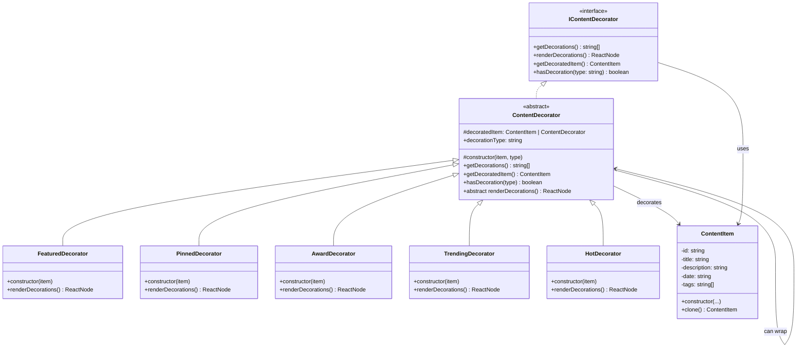
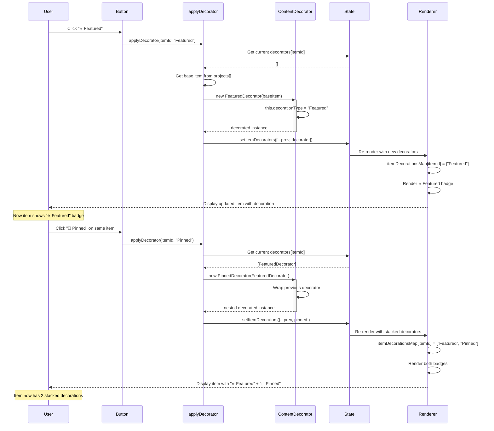
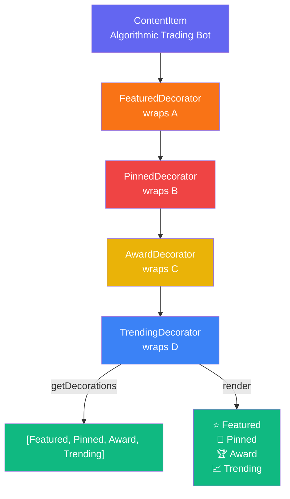

# 🎨 Decorator Pattern - Class Diagram & Visualization

## 📊 Class Diagram



---

## 🔄 Decoration Flow Diagram



---

## 🏗️ Stacking Multiple Decorators



---

## 💻 Code Implementation Details

### 1️⃣ Interface Definition
```typescript
interface IContentDecorator {
  getDecorations(): string[];           // Get all decorations applied
  renderDecorations(): React.ReactNode; // Render visual badges
  getDecoratedItem(): ContentItem;      // Get base item
  hasDecoration(type: string): boolean; // Check if has decoration
}
```

### 2️⃣ Base Decorator Class
```typescript
abstract class ContentDecorator implements IContentDecorator {
  protected decoratedItem: ContentItem | ContentDecorator; // Can wrap item OR decorator
  public decorationType: string;                            // Type of decoration
  
  constructor(item: ContentItem | ContentDecorator, type: string) {
    this.decoratedItem = item;
    this.decorationType = type;
    SessionLogger.getInstance().addLog(
      `Decorator Pattern: Added "${type}" decoration`
    );
  }
  
  // Collect all decorations from chain
  getDecorations(): string[] {
    const wrappedDecorations = 
      this.decoratedItem instanceof ContentDecorator 
        ? this.decoratedItem.getDecorations() 
        : [];
    return [...wrappedDecorations, this.decorationType];
  }
  
  // Get the original ContentItem from decorator chain
  getDecoratedItem(): ContentItem {
    return this.decoratedItem instanceof ContentDecorator
      ? this.decoratedItem.getDecoratedItem()
      : this.decoratedItem;
  }
  
  hasDecoration(type: string): boolean {
    return this.getDecorations().includes(type);
  }
  
  abstract renderDecorations(): React.ReactNode;
}
```

### 3️⃣ Concrete Decorator (Featured Example)
```typescript
class FeaturedDecorator extends ContentDecorator {
  constructor(item: ContentItem | ContentDecorator) {
    super(item, 'Featured');
  }
  
  renderDecorations(): React.ReactNode {
    return (
      <span className="px-2 py-0.5 bg-amber-500/20 text-amber-400 
                       text-xs rounded border border-amber-500/50 
                       font-semibold">
        ⭐ Featured
      </span>
    );
  }
}
```

---

## 🎯 Usage Example

### Basic Decoration
```typescript
// Start with content item
const item = new ContentItem('1', 'Trading Bot', 'Algorithm...', '2024', ['Python']);

// Add single decorator
const featured = new FeaturedDecorator(item);
featured.getDecorations(); // Returns: ["Featured"]
```

### Stacking Decorators
```typescript
const item = new ContentItem('1', 'Trading Bot', '...', '2024', ['Python']);

// Layer decorators one by one
const featured = new FeaturedDecorator(item);
const pinned = new PinnedDecorator(featured);
const award = new AwardDecorator(pinned);

// All decorations are collected
award.getDecorations(); // ["Featured", "Pinned", "Award"]

// Get original item
award.getDecoratedItem() === item; // true

// Check for specific decoration
award.hasDecoration('Pinned'); // true
```

### Rendering Decorations
```typescript
const item = new ContentItem(...);
const featured = new FeaturedDecorator(item);
const pinned = new PinnedDecorator(featured);

// Render each decoration badge
pinned.getDecorations().forEach(type => {
  // Render corresponding badge (⭐ Featured, 📌 Pinned, etc.)
});
```

---

## 🔀 Comparison with Other Patterns

### Decorator vs Inheritance
```
❌ Inheritance (Bad):
class FeaturedContentItem extends ContentItem { ... }
class PinnedContentItem extends ContentItem { ... }
class FeaturedAndPinnedContentItem extends ContentItem { ... }
// Explosion of classes!

✅ Decorator (Good):
const featured = new FeaturedDecorator(item);
const pinned = new PinnedDecorator(featured);
// Flexible combination!
```

### Decorator vs Strategy
```
Strategy: Changes HOW to do something
- Different rendering strategies
- Different algorithms

Decorator: Adds WHAT to something
- Add features
- Add responsibilities
- Add visual decorations
```

---

## 🧬 State Management in React

### Initial State
```typescript
const [itemDecorators, setItemDecorators] = 
  useState<Record<string, ContentDecorator[]>>({});
// { itemId: [FeaturedDecorator, PinnedDecorator, ...] }
```

### Apply Decorator Function
```typescript
const applyDecorator = (itemId: string, type: 'Featured' | 'Pinned' | ...) => {
  setItemDecorators(prev => {
    const current = prev[itemId] || [];
    
    // Check if already applied
    if (current.some(d => d.decorationType === type)) {
      // Remove if exists (toggle)
      return { ...prev, [itemId]: current.filter(d => d.decorationType !== type) };
    }
    
    // Add new decorator, wrapping previous one
    const baseItem = current.length > 0 ? current[current.length - 1] : item;
    const decorator = createDecorator(baseItem, type);
    
    return { ...prev, [itemId]: [...current, decorator] };
  });
};
```

### Derive Decoration Map for Rendering
```typescript
const itemDecorationsMap: Record<string, string[]> = {};
Object.entries(itemDecorators).forEach(([itemId, decorators]) => {
  itemDecorationsMap[itemId] = decorators.map(d => d.decorationType);
  // Maps to: { "item1": ["Featured", "Pinned"], "item2": ["Award"] }
});
```

---

## 📐 Pattern Structure

| Component | Responsibility | Example |
|-----------|-----------------|---------|
| **IContentDecorator** | Define decorator contract | Interface for all decorators |
| **ContentDecorator** | Base implementation, chain management | Abstract base class |
| **FeaturedDecorator** | Add "Featured" badge | ⭐ Concrete implementation |
| **PinnedDecorator** | Add "Pinned" badge | 📌 Concrete implementation |
| **AwardDecorator** | Add "Award" badge | 🏆 Concrete implementation |
| **TrendingDecorator** | Add "Trending" badge | 📈 Concrete implementation |
| **HotDecorator** | Add "Hot" badge | 🔥 Concrete implementation |

---

## ✨ Key Features

### 1. **Recursive Wrapping**
```
item → FeaturedDecorator → PinnedDecorator → AwardDecorator
                 ↓                ↓                 ↓
            decoration        decoration      all decorations
```

### 2. **Chaining Methods**
```typescript
getDecorations() // Gets entire chain
getDecoratedItem() // Gets original item
hasDecoration(type) // Checks chain
```

### 3. **Flexible Composition**
- Add any combination of decorators
- Order doesn't affect functionality
- Can remove individual decorators

### 4. **Uniform Interface**
```typescript
// Works same whether decorated or not
decoratedOrNotItem.getDecorations()
decoratedOrNotItem.renderDecorations()
```

---

## 🧪 Test Scenarios

### Scenario 1: Single Decoration
```typescript
const item = contentItems[0];
const featured = new FeaturedDecorator(item);

// Test
assert(featured.getDecorations() === ["Featured"]);
assert(featured.getDecoratedItem() === item);
assert(featured.hasDecoration("Featured") === true);
```

### Scenario 2: Multiple Decorators
```typescript
const item = contentItems[0];
const featured = new FeaturedDecorator(item);
const pinned = new PinnedDecorator(featured);
const trending = new TrendingDecorator(pinned);

// Test
assert(trending.getDecorations() === ["Featured", "Pinned", "Trending"]);
assert(trending.getDecoratedItem() === item); // Still original
assert(trending.hasDecoration("Pinned") === true);
assert(trending.hasDecoration("Award") === false);
```

### Scenario 3: Decorator Toggling
```typescript
const decorators = [];

// Apply Featured
applyDecorator(itemId, "Featured");
// itemDecorators[itemId] = [FeaturedDecorator]

// Apply Award
applyDecorator(itemId, "Award");
// itemDecorators[itemId] = [FeaturedDecorator, AwardDecorator]

// Remove Featured (toggle)
applyDecorator(itemId, "Featured");
// itemDecorators[itemId] = [AwardDecorator] (Featured removed)
```

### Scenario 4: UI Rendering
```typescript
// Show all applied decorations
itemDecorations[itemId].forEach(decoration => {
  renderBadge(decoration.renderDecorations());
});

// Shows: ⭐ Featured 📌 Pinned 🏆 Award ...
```

---

## 🎨 Visual Rendering

### Single Decoration
```
[Item Card]
┌─────────────────────┐
│ Algorithmic Bot     │
│ Python, Finance     │
│ [⭐ Featured]       │
└─────────────────────┘
```

### Multiple Decorations
```
[Item Card]
┌────────────────────────────────────────┐
│ Algorithmic Bot                        │
│ Python, Finance                        │
│ [⭐ Featured] [📌 Pinned] [🏆 Award] │
└────────────────────────────────────────┘
```

### Stacked in State
```
itemDecorators = {
  "item1": [Featured, Pinned, Award],
  "item2": [Trending, Hot],
  "item3": []
}

itemDecorationsMap = {
  "item1": ["Featured", "Pinned", "Award"],
  "item2": ["Trending", "Hot"],
  "item3": []
}
```

---

## 📈 Benefits

| Benefit | Description | Use Case |
|---------|-------------|----------|
| **Flexibility** | Add/remove features at runtime | Toggle badges on items |
| **Composition** | Combine multiple decorations | Mix ⭐+📌+🏆 |
| **Reusability** | Decorators work with any item | Works with all content items |
| **Clean Code** | No inheritance explosion | Avoid FeaturedPinnedAwardedItem class |
| **Open/Closed** | Open for extension, closed for modification | Add new decorators without changing core |
| **Single Responsibility** | Each decorator does one thing | FeaturedDecorator = add featured badge |

---

## ⚠️ Trade-offs

| Trade-off | Impact | Solution |
|-----------|--------|----------|
| **Wrapper Chain** | Memory overhead | Use only needed decorators |
| **Complexity** | Understanding stacking | Good documentation |
| **Performance** | Recursive method calls | Cache results if needed |
| **Debugging** | Hard to trace wrapped items | Use getDecoratedItem() |

---

## 🚀 Advanced Features

### Custom Decorator Creation
```typescript
class CustomDecorator extends ContentDecorator {
  constructor(item: ContentItem | ContentDecorator) {
    super(item, 'Custom');
  }
  
  renderDecorations(): React.ReactNode {
    return <span>🎯 Custom Badge</span>;
  }
}

// Use
const custom = new CustomDecorator(item);
```

### Decorator Predicates
```typescript
// Check decoration patterns
const hasFeaturedAndPinned = (decorations: string[]) => 
  decorations.includes("Featured") && decorations.includes("Pinned");

// Filter items by decorations
const importantItems = items.filter(item => 
  hasFeaturedAndPinned(itemDecorationsMap[item.id])
);
```

### Decoration History
```typescript
// Log decoration events
const applyDecorator = (itemId: string, type: string) => {
  setItemDecorators(prev => {
    const next = { ...prev, [itemId]: [...(prev[itemId] || []), decorator] };
    logDecorationChange(itemId, type, "added");
    return next;
  });
};
```

---

## 📚 Related Patterns

### Composite Pattern (Hierarchical Structure)
- **Decorator**: Adds behavior to objects
- **Composite**: Organizes objects in hierarchy
- **Together**: Decorate items in composite tree

### Strategy Pattern (Behavior Variation)
- **Decorator**: Adds features to objects
- **Strategy**: Changes how something works
- **Difference**: What vs How

### Prototype Pattern (Cloning)
- **Decorator**: Wraps existing objects
- **Prototype**: Creates new instances by cloning
- **Together**: Clone and decorate items

---

## 🎓 When to Use

### ✅ Use Decorator When:
1. **Add Features Dynamically**
   - Badges, indicators, decorations
   - Features that toggle on/off

2. **Avoid Class Explosion**
   - Many feature combinations
   - Exponential subclass growth

3. **Single Responsibility**
   - Each decorator does one thing
   - Easy to maintain

4. **Runtime Composition**
   - Features decided at runtime
   - Flexible stacking

### ❌ Avoid When:
1. **Simple Objects**
   - Few features needed
   - Simple inheritance works

2. **Immutable Objects**
   - Objects can't be wrapped
   - Frozen/sealed objects

3. **Performance Critical**
   - Wrapper overhead matters
   - Real-time systems

---

## 💡 Key Takeaways

1. **Decorator = Wrapping**
   - Wraps object to add behavior
   - Maintains same interface

2. **Stacking = Composition**
   - Can stack multiple decorators
   - Creates decoration chain

3. **Flexibility > Inheritance**
   - No class explosion
   - Combine features freely

4. **Real-world Use**
   - Badges, badges, badges
   - Toggle-able features
   - Optional enhancements

---

## 📖 Implementation Files

- **Implementation**: [page.tsx](../../app/page.tsx) (Lines 350-420)
- **State Management**: useReducer, useState for tracking decorators
- **Components**: Integrated with Builder, Factory, and Composite patterns
- **UI**: Decorator buttons in card components

---

**Pattern**: Structural Design Pattern  
**Type**: Object Composition  
**Main Benefit**: Add behavior without modifying objects  
**Complexity**: Medium  
**Use Frequency**: High (badges, features, decorations)

Created: 2024  
Last Updated: December 2024  
Related: [adapter.md](./adapter.md), [bridge.md](./bridge.md), [composite.md](./composite.md)
