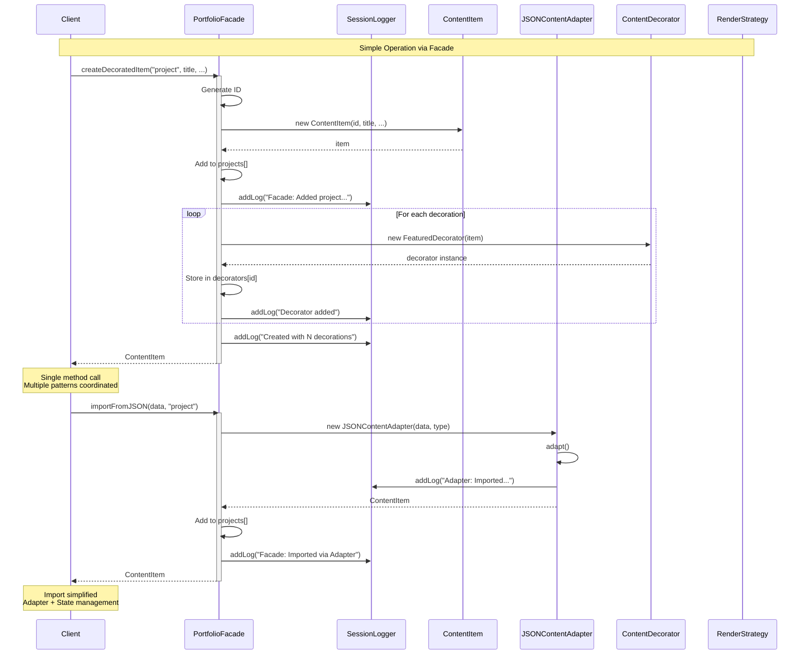
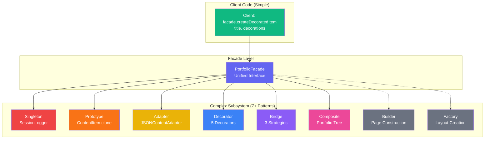

# 🏢 Facade Pattern - Class Diagram & Visualization

## 📊 Class Diagram

```mermaid
classDiagram
    %% Facade Class
    class PortfolioFacade {
        <<Facade>>
        -instance: PortfolioFacade$
        -projects: ContentItem[]
        -blogs: ContentItem[]
        -research: ContentItem[]
        -decorators: Record~string, ContentDecorator[]~
        -constructor()
        +getInstance()$ PortfolioFacade
        +addProject(...) ContentItem
        +addBlog(...) ContentItem
        +addResearch(...) ContentItem
        +cloneItem(id) ContentItem
        +importFromJSON(data, type) ContentItem
        +applyDecoration(id, type) void
        +createDecoratedItem(...) ContentItem
        +renderItem(item, mode) ReactNode
        +getProjects() ContentItem[]
        +getBlogs() ContentItem[]
        +getResearch() ContentItem[]
        +getDecorations(id) string[]
        +getAllDecorations() Record
        -findItem(id) ContentItem
        +setProjects(items) void
        +setBlogs(items) void
        +setResearch(items) void
        +setDecorators(decs) void
    }

    %% Subsystem Classes (7+ Patterns)
    class SessionLogger {
        <<Singleton>>
        +getInstance()
        +addLog(message)
    }

    class ContentItem {
        <<Prototype>>
        +clone() ContentItem
    }

    class JSONContentAdapter {
        <<Adapter>>
        +adapt() ContentItem
    }

    class ContentDecorator {
        <<Decorator>>
        +getDecorations()
        +renderDecorations()
    }

    class IRenderStrategy {
        <<Bridge - Strategy>>
        +renderTitle()
        +renderDescription()
        +renderMeta()
    }

    class ContentRenderer {
        <<Bridge - Abstraction>>
        +render(item)
    }

    class Portfolio {
        <<Composite>>
        +addChild()
        +render()
    }

    %% Relationships
    PortfolioFacade --> SessionLogger : uses
    PortfolioFacade --> ContentItem : creates/manages
    PortfolioFacade --> JSONContentAdapter : uses
    PortfolioFacade --> ContentDecorator : creates
    PortfolioFacade --> IRenderStrategy : uses
    PortfolioFacade --> ContentRenderer : uses
    PortfolioFacade --> Portfolio : coordinates
    
    PortfolioFacade ..> "simplifies" : Facade Pattern
    
    note for PortfolioFacade "Unified Interface\nHides complexity of\n7+ design patterns"
```

---

## 🔄 Facade Operation Flow



---

## 🏗️ Subsystem Complexity Hidden by Facade



---

## 💻 Code Implementation

### Facade Class Structure
```typescript
class PortfolioFacade {
  // Singleton instance
  private static instance: PortfolioFacade;
  
  // State management
  private projects: ContentItem[] = [];
  private blogs: ContentItem[] = [];
  private research: ContentItem[] = [];
  private decorators: Record<string, ContentDecorator[]> = {};
  
  // Private constructor (Singleton)
  private constructor() {
    SessionLogger.getInstance().addLog("Facade initialized");
  }
  
  // Get instance
  public static getInstance(): PortfolioFacade {
    if (!PortfolioFacade.instance) {
      PortfolioFacade.instance = new PortfolioFacade();
    }
    return PortfolioFacade.instance;
  }
  
  // === High-Level Methods ===
  
  // Simple CRUD
  addProject(id, title, description, date, tags): ContentItem {
    const item = new ContentItem(id, title, description, date, tags);
    this.projects.push(item);
    SessionLogger.getInstance().addLog(`Added project "${title}"`);
    return item;
  }
  
  // Clone with decorations
  cloneItem(itemId): ContentItem | null {
    const item = this.findItem(itemId);
    if (!item) return null;
    
    const cloned = item.clone(); // Prototype
    
    // Copy decorations
    if (this.decorators[itemId]) {
      this.decorators[cloned.id] = [...this.decorators[itemId]];
    }
    
    // Add to collection
    this.addToAppropriateCollection(cloned);
    return cloned;
  }
  
  // Import with Adapter
  importFromJSON(jsonData, type): ContentItem {
    const adapter = new JSONContentAdapter(jsonData, type);
    const item = adapter.adapt(); // Adapter Pattern
    
    // Add to collection
    this.addByType(item, type);
    
    SessionLogger.getInstance().addLog(`Imported ${type}`);
    return item;
  }
  
  // Apply decoration
  applyDecoration(itemId, decorationType): void {
    const item = this.findItem(itemId);
    if (!item) return;
    
    const current = this.decorators[itemId] || [];
    
    // Toggle if exists
    if (current.some(d => d.decorationType === decorationType)) {
      this.decorators[itemId] = current.filter(
        d => d.decorationType !== decorationType
      );
      return;
    }
    
    // Create decorator
    const baseItem = current.length > 0 
      ? current[current.length - 1] 
      : item;
    const decorator = this.createDecorator(baseItem, decorationType);
    
    this.decorators[itemId] = [...current, decorator];
  }
  
  // Create decorated item (One-liner!)
  createDecoratedItem(
    type, title, description, date, tags, decorations
  ): ContentItem {
    const id = this.generateId();
    const item = this.addByType({ id, title, description, date, tags }, type);
    
    // Apply all decorations
    decorations.forEach(dec => this.applyDecoration(item.id, dec));
    
    SessionLogger.getInstance().addLog(
      `Created ${type} with ${decorations.length} decorations`
    );
    
    return item;
  }
  
  // Render with Bridge
  renderItem(item, mode): React.ReactNode {
    const strategy = getRenderStrategy(mode); // Bridge
    const renderer = new ProjectRenderer(strategy);
    return renderer.render(item);
  }
}
```

---

## 🎯 Usage Examples

### Before Facade (Complex)
```typescript
// Client must know all subsystems
const logger = SessionLogger.getInstance();
const item = new ContentItem('1', 'Title', 'Desc', '2024', ['tag']);

// Must manage state
projects.push(item);

// Must create decorators manually
const featured = new FeaturedDecorator(item);
const pinned = new PinnedDecorator(featured);
decorators['1'] = [featured, pinned];

// Must log manually
logger.addLog("Added item with decorations");

// Must render with Bridge manually
const strategy = getRenderStrategy('full');
const renderer = new ProjectRenderer(strategy);
const html = renderer.render(item);
```

### After Facade (Simple)
```typescript
// Single line!
const facade = PortfolioFacade.getInstance();

const item = facade.createDecoratedItem(
  'project',
  'Title',
  'Desc',
  '2024',
  ['tag'],
  ['Featured', 'Pinned']
);

// Everything handled automatically:
// ✅ Item created
// ✅ Added to state
// ✅ Decorations applied
// ✅ Logged via Singleton
// ✅ State updated
```

---

### Example: Import and Decorate
```typescript
// Before: Multiple steps
const adapter = new JSONContentAdapter(data, 'project');
const item = adapter.adapt();
projects.push(item);
const featured = new FeaturedDecorator(item);
decorators[item.id] = [featured];
SessionLogger.getInstance().addLog("Imported and decorated");

// After: Two lines
const facade = PortfolioFacade.getInstance();
const item = facade.importFromJSON(data, 'project');
facade.applyDecoration(item.id, 'Featured');
```

---

### Example: Clone with Decorations
```typescript
// Before: Complex cloning
const original = findItem('1');
const cloned = original.clone(); // Prototype
const originalDecs = decorators['1'];
decorators[cloned.id] = [...originalDecs]; // Copy decorations
projects.push(cloned);
SessionLogger.getInstance().addLog("Cloned with decorations");

// After: One line
const cloned = facade.cloneItem('1');
```

---

## 📐 Pattern Structure

| Component | Responsibility | Complexity Hidden |
|-----------|----------------|-------------------|
| **PortfolioFacade** | Unified interface | All subsystem interactions |
| **addProject()** | Create & add item | ContentItem + State + Logging |
| **cloneItem()** | Clone with decorations | Prototype + Decorator copying |
| **importFromJSON()** | Import external data | Adapter + State management |
| **applyDecoration()** | Add decoration | Decorator creation + State |
| **createDecoratedItem()** | Create with decorations | Item + Decorators + Logging |
| **renderItem()** | Render with strategy | Bridge Pattern delegation |

---

## ✨ Key Features

### 1. **Subsystem Coordination**
```typescript
// Facade coordinates multiple patterns
facade.createDecoratedItem(...) → 
  ContentItem (created) +
  Decorator (applied) +
  Singleton (logged) +
  State (updated)
```

### 2. **Simplified Interface**
```
Complex Subsystem:
- SessionLogger.getInstance().addLog(...)
- new ContentItem(...)
- new FeaturedDecorator(...)
- projects.push(...)

Simple Facade:
- facade.addProject(...)
```

### 3. **Pattern Integration**
| Pattern | Used By Facade | Purpose |
|---------|----------------|---------|
| Singleton | SessionLogger | Automatic logging |
| Prototype | cloneItem() | Item duplication |
| Adapter | importFromJSON() | External data |
| Decorator | applyDecoration() | Add features |
| Bridge | renderItem() | Rendering |
| Composite | (indirect) | Tree structure |
| Builder | (indirect) | Page building |
| Factory | (indirect) | Layout creation |

---

## 🔀 Comparison with Other Patterns

### Facade vs Adapter
```
Adapter: Converts one interface to another
- Different interface
- Makes incompatible work together

Facade: Simplifies complex subsystem
- Same system, simpler interface
- Hides complexity
```

### Facade vs Mediator
```
Mediator: Centralized communication
- Objects communicate through mediator
- Decouples objects

Facade: Simplified interface
- Client → Facade → Subsystem
- One-way simplification
```

### Facade vs Proxy
```
Proxy: Controls access to object
- Same interface as original
- Adds control/lazy loading

Facade: Simplifies subsystem
- Different (simpler) interface
- Hides complexity
```

---

## 🧪 Test Scenarios

### Scenario 1: Create Decorated Item
```typescript
const facade = PortfolioFacade.getInstance();

const item = facade.createDecoratedItem(
  'project',
  'Test Project',
  'Description',
  '2024',
  ['Test'],
  ['Featured', 'Hot']
);

// Assert
assert(item.title === 'Test Project');
assert(facade.getDecorations(item.id).length === 2);
assert(facade.getProjects().includes(item));
// Logged automatically
```

### Scenario 2: Import via Facade
```typescript
const facade = PortfolioFacade.getInstance();

const data = {
  name: 'External Project',
  summary: 'From API',
  year: 2024,
  tech_stack: ['React']
};

const item = facade.importFromJSON(data, 'project');

// Assert
assert(item.title === 'External Project');
assert(facade.getProjects().includes(item));
// Adapter used automatically
// Logged automatically
```

### Scenario 3: Clone with Decorations
```typescript
const facade = PortfolioFacade.getInstance();

// Original item with decorations
const original = facade.createDecoratedItem(
  'project', 'Original', '...', '2024', ['tag'], ['Featured']
);

// Clone
const cloned = facade.cloneItem(original.id);

// Assert
assert(cloned.id !== original.id);
assert(cloned.title === 'Original (Copy)');
assert(facade.getDecorations(cloned.id).length === 1);
assert(facade.getDecorations(cloned.id)[0] === 'Featured');
```

---

## 📊 Benefits

| Benefit | Description | Example |
|---------|-------------|---------|
| **Simplification** ✨ | Hide complexity | One method vs many |
| **Decoupling** 🔓 | Client independent of subsystem | Change internals freely |
| **Ease of Use** 🎯 | Simple high-level methods | Intuitive API |
| **Maintainability** 🛠️ | Changes localized | Update facade only |
| **Testing** 🧪 | Easy to mock | Single interface |
| **Learning Curve** 📚 | New users productive | Don't need to know all |

---

## ⚠️ Trade-offs

| Trade-off | Impact | Mitigation |
|-----------|--------|------------|
| **God Object** | Facade too large | Keep focused methods |
| **Limited Flexibility** | Can't access subsystem | Provide escape hatch |
| **Maintenance** | Another layer | Keep methods simple |
| **Overhead** | Extra indirection | Minimal performance cost |

---

## 🚀 Advanced Features

### Fluent Interface
```typescript
class PortfolioFacade {
  addProject(...): this {
    // ... add project
    return this;
  }
  
  applyDecoration(...): this {
    // ... apply decoration
    return this;
  }
}

// Chaining
facade
  .addProject('1', 'Title', '...', '2024', ['tag'])
  .applyDecoration('1', 'Featured')
  .applyDecoration('1', 'Hot');
```

### Batch Operations
```typescript
class PortfolioFacade {
  importMultiple(dataArray: any[], type: string): ContentItem[] {
    return dataArray.map(data => this.importFromJSON(data, type));
  }
  
  decorateAll(itemIds: string[], decoration: string): void {
    itemIds.forEach(id => this.applyDecoration(id, decoration));
  }
}
```

### Query Methods
```typescript
class PortfolioFacade {
  findByTag(tag: string): ContentItem[] {
    return [...this.projects, ...this.blogs, ...this.research]
      .filter(item => item.tags.includes(tag));
  }
  
  getDecoratedItems(decoration: string): ContentItem[] {
    return Object.entries(this.decorators)
      .filter(([_, decs]) => decs.some(d => d.decorationType === decoration))
      .map(([id, _]) => this.findItem(id))
      .filter(item => item !== undefined);
  }
}
```

---

## 🎓 When to Use

### ✅ Use Facade When:

1. **Complex Subsystem**
   - Many classes/patterns
   - Difficult to understand
   - Steep learning curve

2. **Layer Abstraction**
   - Want simple high-level API
   - Hide implementation details
   - Reduce dependencies

3. **Multiple Entry Points**
   - Subsystem has many ways to do things
   - Want standardized approach
   - Consistent usage

4. **Decoupling**
   - Client shouldn't know subsystem
   - Want flexibility to change
   - Minimize coupling

---

### ❌ Avoid When:

1. **Simple System**
   - Few classes
   - Already simple
   - No complexity to hide

2. **Need Full Control**
   - Client needs all features
   - Facade too limiting
   - Performance critical

3. **Frequent Changes**
   - Subsystem unstable
   - Facade becomes maintenance burden
   - Hard to keep in sync

---

## 💡 Key Takeaways

1. **Facade = Simplified Interface**
   - Hide complexity
   - Provide easy-to-use methods
   - One interface for subsystem

2. **Coordinate Patterns**
   - Orchestrate multiple patterns
   - Handle interactions
   - Automatic coordination

3. **Client Simplification**
   - Don't need to know subsystem
   - Simple high-level API
   - Productive immediately

4. **Real-world Use**
   - Library wrappers
   - API clients
   - Complex system simplification
   - Legacy system modernization

5. **Not God Object**
   - Keep methods focused
   - Delegate to subsystem
   - Don't put all logic here

---

## 📖 Implementation Files

- **Implementation**: [page.tsx](../../app/page.tsx) (Lines 430-580)
- **Methods**: 15+ high-level operations
- **Patterns Integrated**: 7+ design patterns
- **State Management**: React hooks + Facade coordination

---

## 🔗 Integration with Other Patterns

### Singleton (SessionLogger)
```typescript
// Facade uses Singleton for logging
addProject(...) {
  const item = new ContentItem(...);
  this.projects.push(item);
  SessionLogger.getInstance().addLog(...); // Singleton
  return item;
}
```

### Prototype (Cloning)
```typescript
// Facade simplifies cloning
cloneItem(id) {
  const item = this.findItem(id);
  const cloned = item.clone(); // Prototype
  // Handle decorations + state
  return cloned;
}
```

### Adapter (Import)
```typescript
// Facade wraps Adapter
importFromJSON(data, type) {
  const adapter = new JSONContentAdapter(data, type); // Adapter
  const item = adapter.adapt();
  this.addToCollection(item, type);
  return item;
}
```

### Decorator (Features)
```typescript
// Facade manages Decorators
applyDecoration(id, type) {
  const decorator = this.createDecorator(...); // Decorator
  this.decorators[id].push(decorator);
}
```

### Bridge (Rendering)
```typescript
// Facade delegates to Bridge
renderItem(item, mode) {
  const strategy = getRenderStrategy(mode); // Bridge
  const renderer = new ProjectRenderer(strategy);
  return renderer.render(item);
}
```

---

**Pattern**: Structural Design Pattern  
**Type**: Object Structural  
**Main Benefit**: Simplifies complex subsystems  
**Complexity**: Low-Medium  
**Use Frequency**: Very High (libraries, APIs, wrappers)

Created: 2024  
Last Updated: December 2024  
Related: [adapter.md](./adapter.md), [bridge.md](./bridge.md), [composite.md](./composite.md), [decorator.md](./decorator.md)
