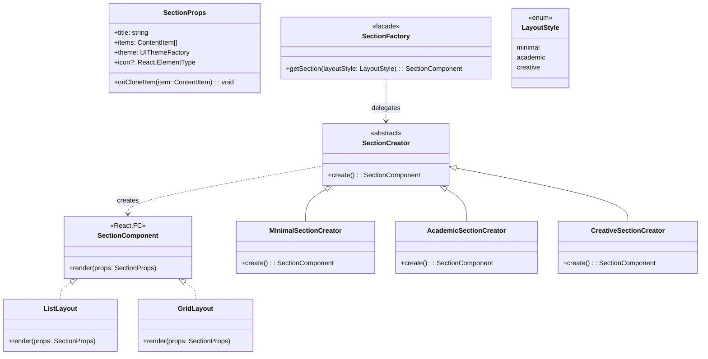

```mermaid
classDiagram
    %% =========================
    %% Product Abstraction
    %% =========================
    class SectionComponent {
        <<React.FC>>
        +render(props: SectionProps)
    }

    class SectionProps {
        +title: string
        +items: ContentItem[]
        +theme: UIThemeFactory
        +icon?: React.ElementType
        +onCloneItem(item: ContentItem): void
    }

    %% =========================
    %% Concrete Products
    %% =========================
    class ListLayout {
        +render(props: SectionProps)
    }

    class GridLayout {
        +render(props: SectionProps)
    }

    SectionComponent <|.. ListLayout
    SectionComponent <|.. GridLayout

    %% =========================
    %% Factory Method (GoF)
    %% =========================
    class SectionCreator {
        <<abstract>>
        +create(): SectionComponent
    }

    class MinimalSectionCreator {
        +create(): SectionComponent
    }

    class AcademicSectionCreator {
        +create(): SectionComponent
    }

    class CreativeSectionCreator {
        +create(): SectionComponent
    }

    SectionCreator <|-- MinimalSectionCreator
    SectionCreator <|-- AcademicSectionCreator
    SectionCreator <|-- CreativeSectionCreator

    %% =========================
    %% Registry / Facade
    %% =========================
    class SectionFactory {
        <<facade>>
        +getSection(layoutStyle: LayoutStyle): SectionComponent
    }

    SectionFactory ..> SectionCreator : delegates
    SectionCreator ..> SectionComponent : creates

    %% =========================
    %% Supporting Types
    %% =========================
    class LayoutStyle {
        <<enum>>
        minimal
        academic
        creative
    }

```