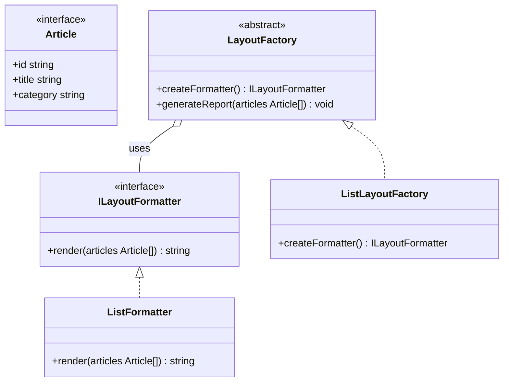

```mermaid
classDiagram
    class Article {
        <<interface>>
        +id string
        +title string
        +category string
    }
    %% Product Interfaces ทุก Layout Formatter ต้อง implement การ render
    class ILayoutFormatter {
        <<interface>>
        +render(articles Article[]) string
    }
    %% Concrete Products สามารถ implement Layout Formatter อื่นๆ ต่อไปจาก class ListFormatter เช่น GridFormatter , TimelineLayoutFactory , MasonryLayoutFactory , CarouselLayoutFactory
    class ListFormatter {
        +render(articles Article[]) string
    }
    %% Creator Abstraction
    class LayoutFactory {
        <<abstract>>
        +createFormatter() ILayoutFormatter
        +generateReport(articles Article[]) void
    }
    %% Concrete Creator สามารถ implement Layout Factory อื่นๆ ต่อไปจาก  class ListLayoutFactory เช่น GridLayoutFactory , TimelineLayoutFactory , MasonryLayoutFactory , CarouselLayoutFactory
    class ListLayoutFactory {
        +createFormatter() ILayoutFormatter 
        %% return new ListFormatter()
    }

    ILayoutFormatter <|.. ListFormatter
    LayoutFactory <|.. ListLayoutFactory
    LayoutFactory o-- ILayoutFormatter : uses
```