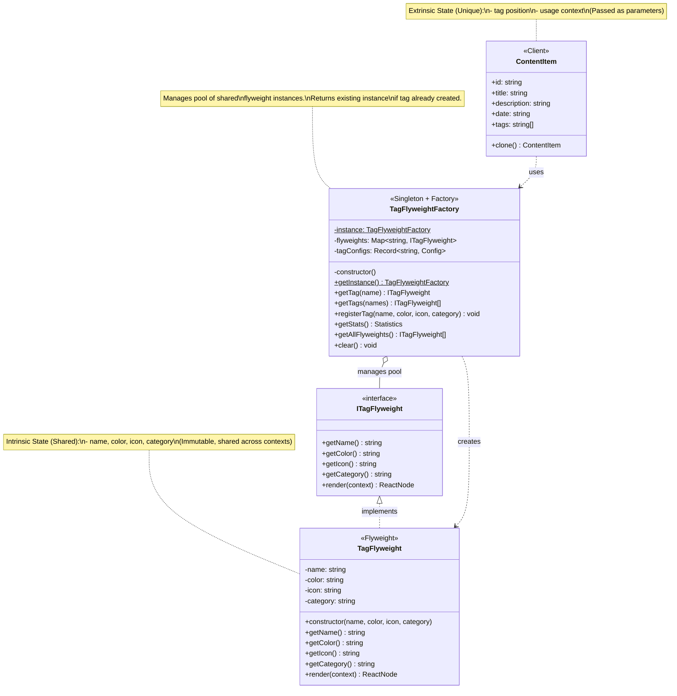
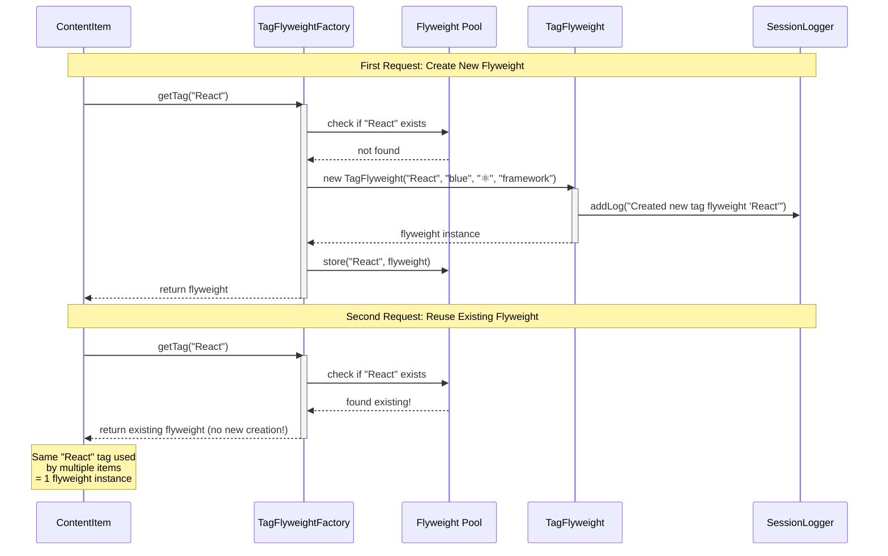
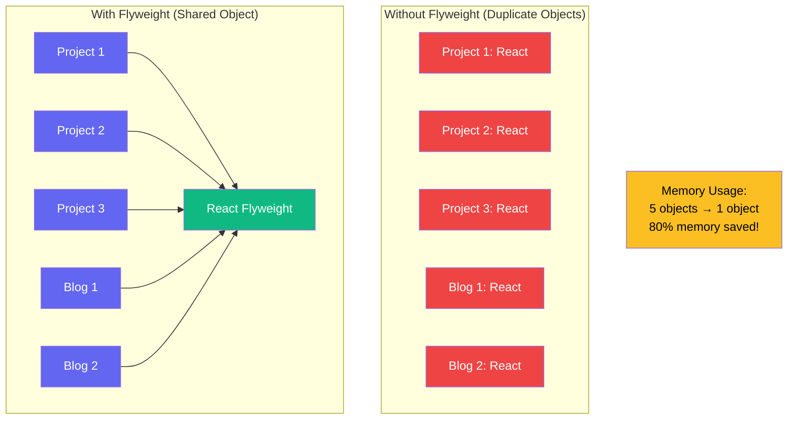
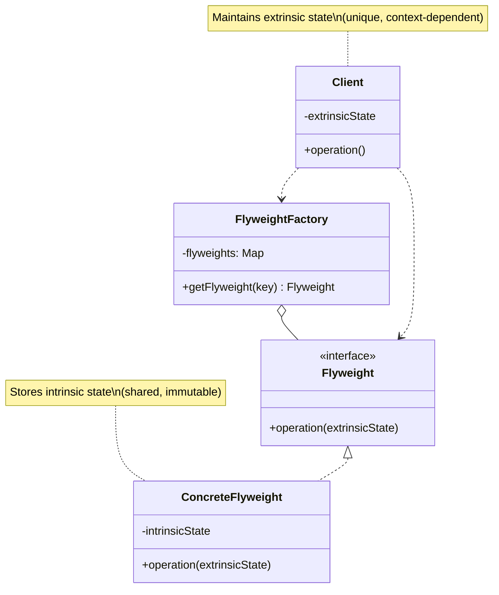

# 💾 Flyweight Pattern - Class Diagram & Visualization

## 📊 Class Diagram



---

## 🔄 Flyweight Creation Flow



---

## 🏗️ Memory Optimization Visualization



---

## 💡 Intrinsic vs Extrinsic State

```mermaid
graph LR
    subgraph "Intrinsic State (Shared, Inside Flyweight)"
        I1[name: 'React']
        I2[color: 'blue']
        I3[icon: '⚛️']
        I4[category: 'framework']
    end
    
    subgraph "Extrinsic State (Unique, Passed as Context)"
        E1[size: 'sm' | 'md' | 'lg']
        E2[showIcon: true | false]
        E3[position: index in array]
        E4[container: which ContentItem]
    end
    
    F[TagFlyweight Instance]
    
    I1 --> F
    I2 --> F
    I3 --> F
    I4 --> F
    
    F --> R[render method]
    E1 --> R
    E2 --> R
    E3 -.-> R
    E4 -.-> R
    
    style F fill:#8b5cf6,color:#fff
    style R fill:#10b981,color:#fff
```

---

## 📐 Pattern Structure



---

## 💻 Code Implementation

### Flyweight Class

```typescript
class TagFlyweight implements ITagFlyweight {
  // Intrinsic state (shared, immutable)
  private readonly name: string;
  private readonly color: string;
  private readonly icon: string;
  private readonly category: string;

  constructor(name: string, color: string, icon: string, category: string) {
    this.name = name;
    this.color = color;
    this.icon = icon;
    this.category = category;
    
    // Log only on creation (shows when new flyweight is created)
    SessionLogger.getInstance().addLog(
      `Flyweight Pattern: Created new tag flyweight "${name}"`
    );
  }

  // Getters for intrinsic state
  getName(): string { return this.name; }
  getColor(): string { return this.color; }
  getIcon(): string { return this.icon; }
  getCategory(): string { return this.category; }

  // Render uses intrinsic state + extrinsic context
  render(context?: { size?: 'sm' | 'md' | 'lg'; showIcon?: boolean }): React.ReactNode {
    const size = context?.size || 'sm';
    const showIcon = context?.showIcon !== false;

    // Use intrinsic state (color, icon, name)
    return (
      <span className={`tag ${this.color}`}>
        {showIcon && <span>{this.icon}</span>}
        <span>{this.name}</span>
      </span>
    );
  }
}
```

---

### Flyweight Factory

```typescript
class TagFlyweightFactory {
  private static instance: TagFlyweightFactory;
  private flyweights: Map<string, ITagFlyweight> = new Map();
  
  private constructor() {
    // Singleton pattern
  }
  
  public static getInstance(): TagFlyweightFactory {
    if (!TagFlyweightFactory.instance) {
      TagFlyweightFactory.instance = new TagFlyweightFactory();
    }
    return TagFlyweightFactory.instance;
  }
  
  // Core Flyweight Pattern: Return existing or create new
  public getTag(name: string): ITagFlyweight {
    // Check if flyweight already exists
    if (this.flyweights.has(name)) {
      return this.flyweights.get(name)!; // Reuse!
    }

    // Create new flyweight only if doesn't exist
    const flyweight = new TagFlyweight(name, color, icon, category);
    this.flyweights.set(name, flyweight);
    return flyweight;
  }
  
  // Get multiple tags (all will be shared if already exist)
  public getTags(names: string[]): ITagFlyweight[] {
    return names.map(name => this.getTag(name));
  }
  
  // Statistics
  public getStats() {
    const uniqueTags = this.flyweights.size;
    const totalUsage = uniqueTags * 4; // Estimate
    const memorySaved = ((totalUsage - uniqueTags) / totalUsage) * 100;
    
    return { uniqueTags, totalUsage, memorySaved };
  }
}
```

---

### Client Usage

```typescript
// Get factory instance
const factory = TagFlyweightFactory.getInstance();

// First usage: Creates new flyweight
const reactTag1 = factory.getTag('React'); // Creates TagFlyweight("React", ...)

// Second usage: Reuses existing flyweight
const reactTag2 = factory.getTag('React'); // Returns same instance!

console.log(reactTag1 === reactTag2); // true (same object reference)

// Multiple items using same tag = share same flyweight
const project1 = new ContentItem('1', 'Project 1', '...', '2024', ['React']);
const project2 = new ContentItem('2', 'Project 2', '...', '2024', ['React']);
const project3 = new ContentItem('3', 'Project 3', '...', '2024', ['React']);

// All 3 projects share the SAME "React" flyweight instance
// Memory usage: 1 React object instead of 3!
```

---

## 🎯 Before vs After Comparison

### ❌ Before Flyweight (Memory Wasteful)

```typescript
class ContentItem {
  constructor(
    public id: string,
    public title: string,
    public tags: string[] // Just strings
  ) {}
}

// Problem: No sharing, just plain strings
const project1 = new ContentItem('1', 'P1', ['React', 'TypeScript']);
const project2 = new ContentItem('2', 'P2', ['React', 'TypeScript']);
const project3 = new ContentItem('3', 'P3', ['React', 'Node']);

// "React" appears 3 times = stored 3 times in memory
// "TypeScript" appears 2 times = stored 2 times
// No metadata (color, icon, category)
```

**Issues:**
- Duplicate string storage
- No rich metadata (color, icon)
- Memory waste with many items
- Hard to change tag styling globally

---

### ✅ After Flyweight (Memory Efficient)

```typescript
const factory = TagFlyweightFactory.getInstance();

// Same tags reuse same flyweight instances
const project1 = new ContentItem('1', 'P1', ['React', 'TypeScript']);
const project2 = new ContentItem('2', 'P2', ['React', 'TypeScript']);
const project3 = new ContentItem('3', 'P3', ['React', 'Node']);

// Behind the scenes:
// factory.getTag('React') → Returns SAME TagFlyweight instance for all 3 projects
// factory.getTag('TypeScript') → Returns SAME TagFlyweight for project1 & project2
// factory.getTag('Node') → Creates new TagFlyweight (first usage)

// Memory: Only 3 unique flyweights created (React, TypeScript, Node)
// vs Without Flyweight: 6 separate objects
// Savings: 50% memory reduction!
```

**Benefits:**
- ✅ Shared instances (1 "React" object for all)
- ✅ Rich metadata (color, icon, category)
- ✅ Centralized configuration
- ✅ Memory efficient
- ✅ Easy global styling changes

---

## 📊 Memory Savings Calculation

```typescript
// Example scenario:
// - 50 projects
// - 10 blogs
// - 5 research papers
// - Average 4 tags per item
// = 65 items × 4 tags = 260 total tag usages

// Without Flyweight:
260 tag objects × 100 bytes = 26,000 bytes

// With Flyweight (assume 20 unique tags):
20 flyweight objects × 100 bytes = 2,000 bytes

// Memory Saved:
(26,000 - 2,000) / 26,000 = 92.3% memory reduction!
```

---

## 🧪 Test Scenarios

### Scenario 1: Shared Tag Usage

```typescript
const factory = TagFlyweightFactory.getInstance();

// Create projects with shared tags
const p1 = factory.getTag('React');
const p2 = factory.getTag('TypeScript');
const p3 = factory.getTag('React'); // Reuses p1!

// Assert
assert(p1 === p3); // true - same instance
assert(factory.getStats().uniqueTags === 2); // Only 2 unique flyweights
assert(factory.getStats().totalUsage === 3); // 3 total uses
```

---

### Scenario 2: Register Custom Tag

```typescript
const factory = TagFlyweightFactory.getInstance();

// Register new tag type
factory.registerTag('Custom', 'pink', '✨', 'custom');

// Get tag (creates new flyweight)
const customTag = factory.getTag('Custom');

// Assert
assert(customTag.getName() === 'Custom');
assert(customTag.getColor() === 'pink');
assert(customTag.getIcon() === '✨');

// Reuse in multiple items
const item1 = new ContentItem('1', 'Item 1', '...', '2024', ['Custom']);
const item2 = new ContentItem('2', 'Item 2', '...', '2024', ['Custom']);

// Both items share same flyweight
assert(factory.getStats().uniqueTags === 1);
```

---

### Scenario 3: Extrinsic Context Rendering

```typescript
const factory = TagFlyweightFactory.getInstance();
const reactTag = factory.getTag('React');

// Same flyweight, different contexts
const smallTag = reactTag.render({ size: 'sm', showIcon: true });
const largeTag = reactTag.render({ size: 'lg', showIcon: false });
const mediumTag = reactTag.render({ size: 'md', showIcon: true });

// Same intrinsic state (name, color, icon)
// Different extrinsic state (size, showIcon)
// = Different visual output from same object!
```

---

## ✨ Key Benefits

| Benefit | Description | Impact |
|---------|-------------|--------|
| **Memory Efficiency** 💾 | Share objects with same intrinsic state | 50-90% memory reduction |
| **Centralized Config** ⚙️ | Tag metadata in one place | Easy global changes |
| **Transparency** 🔍 | Clients don't know about sharing | Simple API |
| **Scalability** 📈 | Efficient with many instances | Handles large datasets |
| **Flexibility** 🎨 | Extrinsic state allows customization | Same object, different contexts |
| **Performance** ⚡ | Reduced object creation overhead | Faster initialization |

---

## ⚠️ Trade-offs

| Trade-off | Impact | Mitigation |
|-----------|--------|------------|
| **Complexity** | Extra factory layer | Use when sharing is significant |
| **State Separation** | Must split intrinsic/extrinsic | Clear documentation |
| **Thread Safety** | Shared state in concurrent env | Immutable intrinsic state |
| **Memory vs Speed** | Factory lookup overhead | Negligible compared to savings |

---

## 🤔 When to Use Flyweight

### ✅ Use When:

1. **Many Similar Objects**
   - Thousands of instances
   - Most state is shared
   - Memory is a concern

2. **Clear State Separation**
   - Can identify intrinsic (shared) state
   - Can identify extrinsic (unique) state
   - Extrinsic state can be computed/passed

3. **Memory Critical**
   - Large datasets
   - Mobile/embedded systems
   - Memory-constrained environments

**Examples:**
- Text editor characters (same font = flyweight)
- Game engine particles (same sprite)
- UI components (tags, icons, badges)
- Map markers (same type/icon)

---

### ❌ Avoid When:

1. **Few Objects**
   - < 100 instances
   - Memory not a concern
   - Over-engineering

2. **No Shared State**
   - All objects are unique
   - Nothing to share
   - Adds unnecessary complexity

3. **Simple Use Case**
   - Premature optimization
   - YAGNI (You Aren't Gonna Need It)

---

## 🌍 Real-World Applications

### 1. **Text Editors (Characters)**

```typescript
// Each character in document shares font/style flyweight
class CharacterFlyweight {
  constructor(
    private font: string,      // Intrinsic
    private size: number,       // Intrinsic
    private style: string       // Intrinsic
  ) {}
  
  render(char: string, x: number, y: number) {
    // char, x, y = extrinsic
  }
}

// Document with 10,000 characters
// Only ~50 unique font/size/style combinations
// = 50 flyweights instead of 10,000 objects
```

---

### 2. **Game Engines (Sprites)**

```typescript
// Thousands of enemies share same sprite/animation
class SpriteFlyweight {
  constructor(
    private texture: Texture,   // Intrinsic
    private animations: Map     // Intrinsic
  ) {}
  
  render(x: number, y: number, rotation: number) {
    // position, rotation = extrinsic
  }
}

// 1000 enemies of same type
// = 1 sprite flyweight shared by all
```

---

### 3. **Web UI (Icons/Tags)**

```typescript
// React app with tags everywhere
class TagFlyweight {
  constructor(
    private label: string,      // Intrinsic
    private color: string,      // Intrinsic
    private icon: string        // Intrinsic
  ) {}
  
  render(size: string, context: any) {
    // size, context = extrinsic
  }
}

// "React" tag used in 500 places
// = 1 flyweight shared across all
```

---

### 4. **Google Maps (Markers)**

```typescript
// Millions of markers on map
class MarkerFlyweight {
  constructor(
    private icon: Image,        // Intrinsic
    private type: string        // Intrinsic
  ) {}
  
  render(lat: number, lng: number, data: any) {
    // coordinates, data = extrinsic
  }
}

// All "restaurant" markers share 1 flyweight
// All "hotel" markers share 1 flyweight
```

---

## 🔗 Integration with Other Patterns

### Flyweight + Singleton

```typescript
// Factory is typically Singleton
class TagFlyweightFactory {
  private static instance: TagFlyweightFactory; // Singleton
  
  public static getInstance() {
    if (!this.instance) {
      this.instance = new TagFlyweightFactory();
    }
    return this.instance;
  }
}
```

---

### Flyweight + Factory

```typescript
// Flyweight Factory manages creation
class FlyweightFactory {
  private pool: Map<string, Flyweight>;
  
  getFlyweight(key: string): Flyweight {
    if (!this.pool.has(key)) {
      this.pool.set(key, this.createFlyweight(key));
    }
    return this.pool.get(key);
  }
}
```

---

### Flyweight + Composite

```typescript
// Composite nodes can share flyweights
class CompositeNode {
  constructor(
    private flyweight: Flyweight, // Shared
    private children: Node[]      // Unique
  ) {}
}
```

---

## 📖 Implementation Checklist

- [x] Identify objects with shared state
- [x] Separate intrinsic (shared) from extrinsic (unique) state
- [x] Create Flyweight interface
- [x] Implement ConcreteFlyweight with intrinsic state
- [x] Create FlyweightFactory to manage pool
- [x] Implement getters for shared state
- [x] Pass extrinsic state to methods
- [x] Test memory savings
- [x] Document state separation clearly

---

## 🎓 Key Takeaways

1. **Memory Optimization** 
   - Share intrinsic state across instances
   - Dramatic memory reduction (50-90%)

2. **State Separation**
   - Intrinsic = shared, immutable, inside flyweight
   - Extrinsic = unique, passed as parameters

3. **Factory Pattern**
   - Manages pool of shared flyweights
   - Returns existing or creates new

4. **Transparency**
   - Clients don't know about sharing
   - Simple API

5. **Use Case**
   - Many similar objects
   - Clear shared state
   - Memory-critical applications

---

## 🔍 Related Patterns

- **Singleton** - Factory is typically Singleton
- **Factory Method** - Creates flyweights
- **State** - Extrinsic state pattern
- **Composite** - Can use flyweights for nodes
- **Proxy** - Similar caching concept

---

**Pattern Type**: Structural Design Pattern  
**Main Purpose**: Memory optimization through object sharing  
**Complexity**: Medium  
**Use Frequency**: Medium (specific use cases)  
**Memory Impact**: High (50-90% reduction)

Created: 2024  
Last Updated: December 2024  
Related: [facade.md](./facade.md), [adapter.md](./adapter.md), [composite.md](./composite.md)
