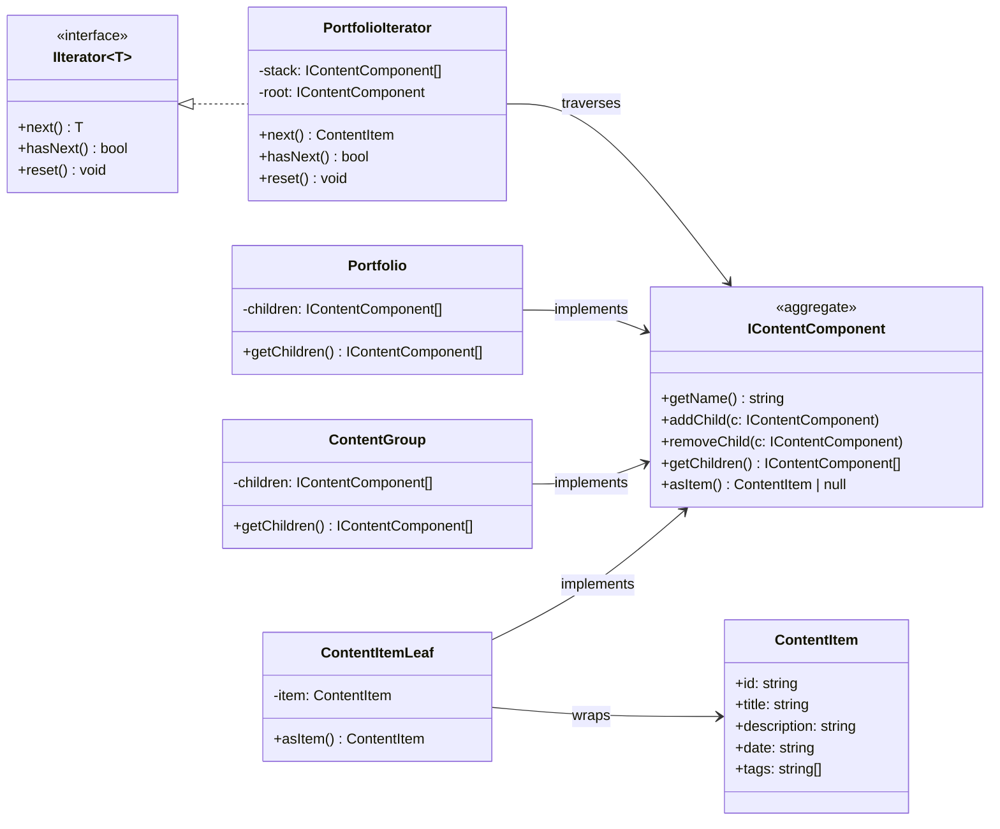
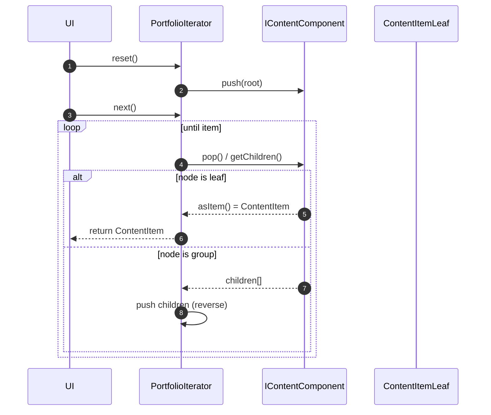

# Iterator Pattern (Composite Traversal)

```mermaid
classDiagram
  direction LR
  class IIterator~T~ {
    <<interface>>
    +next() T
    +hasNext() bool
    +reset() void
  }
  class IContentComponent {
    <<aggregate>>
    +getName() string
    +addChild(c: IContentComponent)
    +removeChild(c: IContentComponent)
    +getChildren() IContentComponent[]
    +asItem() ContentItem | null
  }
  class PortfolioIterator {
    -stack: IContentComponent[]
    -root: IContentComponent
    +next() ContentItem
    +hasNext() bool
    +reset() void
  }
  class Portfolio {
    -children: IContentComponent[]
    +getChildren() IContentComponent[]
  }
  class ContentGroup {
    -children: IContentComponent[]
    +getChildren() IContentComponent[]
  }
  class ContentItemLeaf {
    -item: ContentItem
    +asItem() ContentItem
  }
  class ContentItem {
    +id: string
    +title: string
    +description: string
    +date: string
    +tags: string[]
  }

  IIterator <|.. PortfolioIterator
  PortfolioIterator --> IContentComponent : traverses
  Portfolio --> IContentComponent : implements
  ContentGroup --> IContentComponent : implements
  ContentItemLeaf --> IContentComponent : implements
  ContentItemLeaf --> ContentItem : wraps
```

```mermaid
sequenceDiagram
  autonumber
  participant UI
  participant Iter as PortfolioIterator
  participant Tree as IContentComponent
  participant Leaf as ContentItemLeaf

  UI->>Iter: reset()
  Iter->>Tree: push(root)
  UI->>Iter: next()
  loop until item
    Iter->>Tree: pop() / getChildren()
    alt node is leaf
      Tree-->>Iter: asItem() = ContentItem
      Iter-->>UI: return ContentItem
    else node is group
      Tree-->>Iter: children[]
      Iter->>Iter: push children (reverse)
    end
  end
```
