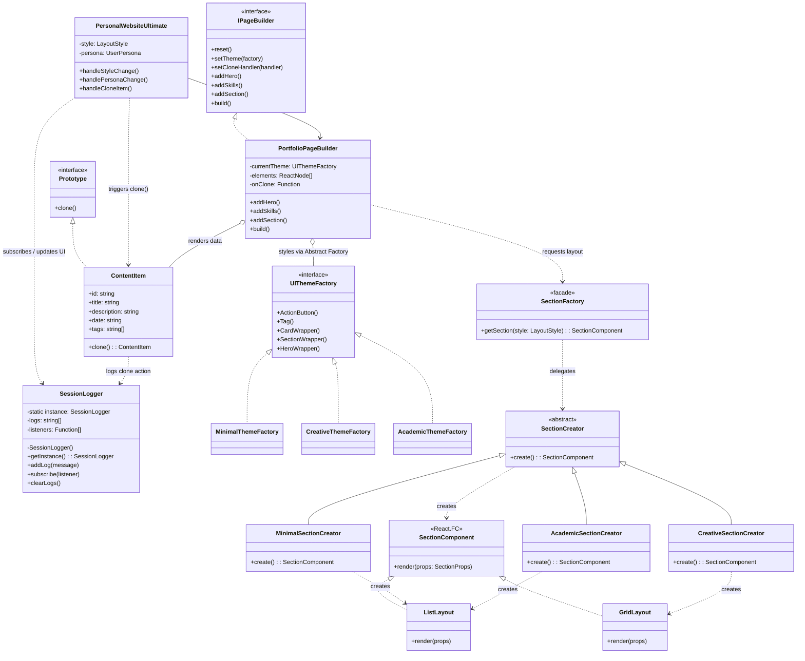

```mermaid
classDiagram

%% ==================================================
%% 1. CLIENT / DIRECTOR
%% ==================================================
class PersonalWebsiteUltimate {
    -style: LayoutStyle
    -persona: UserPersona
    +handleStyleChange()
    +handlePersonaChange()
    +handleCloneItem()
}

%% ==================================================
%% 2. SINGLETON PATTERN
%% ==================================================
class SessionLogger {
    -static instance: SessionLogger
    -logs: string[]
    -listeners: Function[]
    -SessionLogger()
    +getInstance(): SessionLogger
    +addLog(message)
    +subscribe(listener)
    +clearLogs()
}

PersonalWebsiteUltimate ..> SessionLogger : subscribes / updates UI

%% ==================================================
%% 3. PROTOTYPE PATTERN
%% ==================================================
class Prototype {
    <<interface>>
    +clone()
}

class ContentItem {
    +id: string
    +title: string
    +description: string
    +date: string
    +tags: string[]
    +clone(): ContentItem
}

Prototype <|.. ContentItem
ContentItem ..> SessionLogger : logs clone action
PersonalWebsiteUltimate ..> ContentItem : triggers clone()

%% ==================================================
%% 4. ABSTRACT FACTORY PATTERN (THEME SYSTEM)
%% ==================================================
class UIThemeFactory {
    <<interface>>
    +ActionButton()
    +Tag()
    +CardWrapper()
    +SectionWrapper()
    +HeroWrapper()
}

class MinimalThemeFactory
class CreativeThemeFactory
class AcademicThemeFactory

UIThemeFactory <|.. MinimalThemeFactory
UIThemeFactory <|.. CreativeThemeFactory
UIThemeFactory <|.. AcademicThemeFactory

%% ==================================================
%% 5. FACTORY METHOD PATTERN (LAYOUT SYSTEM - GoF)
%% ==================================================
class SectionComponent {
    <<React.FC>>
    +render(props: SectionProps)
}

class ListLayout {
    +render(props)
}

class GridLayout {
    +render(props)
}

SectionComponent <|.. ListLayout
SectionComponent <|.. GridLayout


class SectionCreator {
    <<abstract>>
    +create(): SectionComponent
}

class MinimalSectionCreator {
    +create(): SectionComponent
}

class AcademicSectionCreator {
    +create(): SectionComponent
}

class CreativeSectionCreator {
    +create(): SectionComponent
}

SectionCreator <|-- MinimalSectionCreator
SectionCreator <|-- AcademicSectionCreator
SectionCreator <|-- CreativeSectionCreator

MinimalSectionCreator ..> ListLayout : creates
AcademicSectionCreator ..> ListLayout : creates
CreativeSectionCreator ..> GridLayout : creates

%% ---- Facade / Registry (NOT core GoF) ----
class SectionFactory {
    <<facade>>
    +getSection(style: LayoutStyle): SectionComponent
}

SectionFactory ..> SectionCreator : delegates
SectionCreator ..> SectionComponent : creates

%% ==================================================
%% 6. BUILDER PATTERN (PAGE COMPOSITION)
%% ==================================================
class IPageBuilder {
    <<interface>>
    +reset()
    +setTheme(factory)
    +setCloneHandler(handler)
    +addHero()
    +addSkills()
    +addSection()
    +build()
}

class PortfolioPageBuilder {
    -currentTheme: UIThemeFactory
    -elements: ReactNode[]
    -onClone: Function
    +addHero()
    +addSkills()
    +addSection()
    +build()
}

IPageBuilder <|.. PortfolioPageBuilder

%% ==================================================
%% 7. RELATIONSHIPS BETWEEN PATTERNS
%% ==================================================
PersonalWebsiteUltimate --> PortfolioPageBuilder : directs (Director)
PortfolioPageBuilder o-- UIThemeFactory : styles via Abstract Factory
PortfolioPageBuilder ..> SectionFactory : requests layout
PortfolioPageBuilder o-- ContentItem : renders data
```