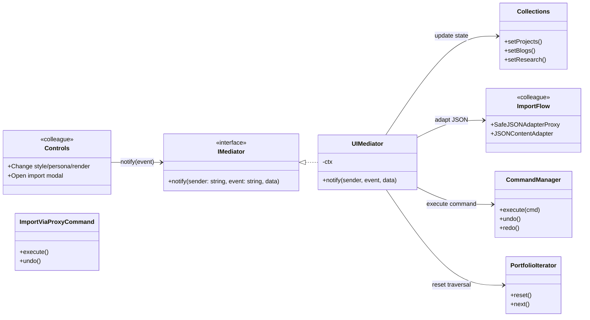
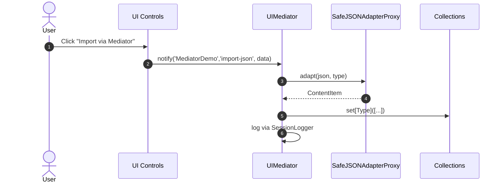

# Mediator Pattern — Centralized UI Coordination

```mermaid
classDiagram
  direction LR
  class IMediator {
    <<interface>>
    +notify(sender: string, event: string, data)
  }
  class UIMediator {
    -ctx
    +notify(sender, event, data)
  }
  class Controls {
    <<colleague>>
    +Change style/persona/render
    +Open import modal
  }
  class ImportFlow {
    <<colleague>>
    +SafeJSONAdapterProxy
    +JSONContentAdapter
  }
  class CommandManager {
    +execute(cmd)
    +undo()
    +redo()
  }
  class ImportViaProxyCommand {
    +execute()
    +undo()
  }
  class PortfolioIterator {
    +reset()
    +next()
  }
  class Collections {
    +setProjects()
    +setBlogs()
    +setResearch()
  }

  IMediator <|.. UIMediator
  Controls --> IMediator : notify(event)
  UIMediator --> Collections : update state
  UIMediator --> ImportFlow : adapt JSON
  UIMediator --> CommandManager : execute command
  UIMediator --> PortfolioIterator : reset traversal
```

```mermaid
sequenceDiagram
  autonumber
  actor User
  participant Ctl as UI Controls
  participant Med as UIMediator
  participant Adp as SafeJSONAdapterProxy
  participant Col as Collections

  User->>Ctl: Click "Import via Mediator"
  Ctl->>Med: notify('MediatorDemo','import-json', data)
  Med->>Adp: adapt(json, type)
  Adp-->>Med: ContentItem
  Med->>Col: set[Type]([...])
  Med->>Med: log via SessionLogger
```
