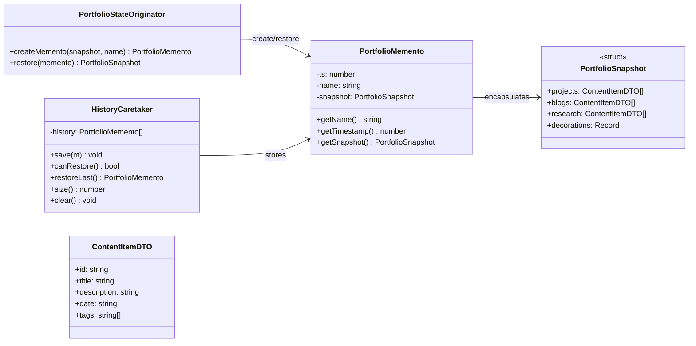
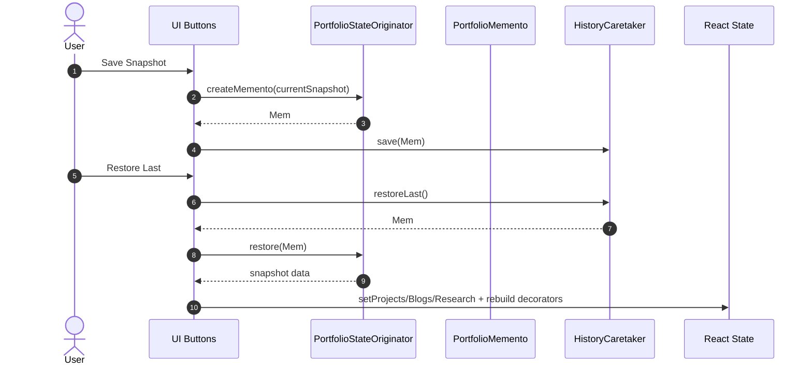

# Memento Pattern — Snapshot/Restore Portfolio State

```mermaid
classDiagram
  direction LR
  class PortfolioSnapshot {
    <<struct>>
    +projects: ContentItemDTO[]
    +blogs: ContentItemDTO[]
    +research: ContentItemDTO[]
    +decorations: Record<string, DecorationType[]>
  }
  class PortfolioMemento {
    -ts: number
    -name: string
    -snapshot: PortfolioSnapshot
    +getName() string
    +getTimestamp() number
    +getSnapshot() PortfolioSnapshot
  }
  class PortfolioStateOriginator {
    +createMemento(snapshot, name) PortfolioMemento
    +restore(memento) PortfolioSnapshot
  }
  class HistoryCaretaker {
    -history: PortfolioMemento[]
    +save(m) void
    +canRestore() bool
    +restoreLast() PortfolioMemento
    +size() number
    +clear() void
  }
  class ContentItemDTO {
    +id: string
    +title: string
    +description: string
    +date: string
    +tags: string[]
  }

  PortfolioStateOriginator --> PortfolioMemento : create/restore
  HistoryCaretaker --> PortfolioMemento : stores
  PortfolioMemento --> PortfolioSnapshot : encapsulates
```

```mermaid
sequenceDiagram
  autonumber
  actor User
  participant UI as UI Buttons
  participant Org as PortfolioStateOriginator
  participant Mem as PortfolioMemento
  participant Care as HistoryCaretaker
  participant State as React State

  User->>UI: Save Snapshot
  UI->>Org: createMemento(currentSnapshot)
  Org-->>UI: Mem
  UI->>Care: save(Mem)

  User->>UI: Restore Last
  UI->>Care: restoreLast()
  Care-->>UI: Mem
  UI->>Org: restore(Mem)
  Org-->>UI: snapshot data
  UI->>State: setProjects/Blogs/Research + rebuild decorators
```
