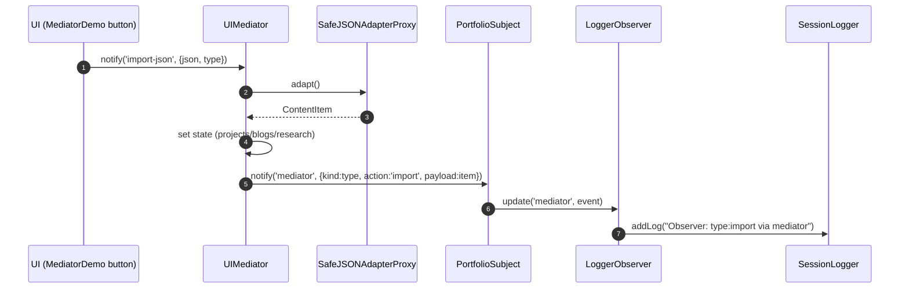

# Observer Pattern (Behavioral)

```mermaid
classDiagram
    direction LR
    class ISubject~T~ {
      +subscribe(o: IObserver~T~)
      +unsubscribe(o: IObserver~T~)
      +notify(event: string, data: T)
    }

    class IObserver~T~ {
      +update(event: string, data: T)
    }

    class PortfolioEvent {
      <<type>>
      +kind: 'project'|'blog'|'research'|'decorations'|'snapshot'|'iterator'|'command'
      +action: 'add'|'remove'|'import'|'clone'|'undo'|'redo'|'save'|'restore'|'reset'
      +payload: any
    }

    class PortfolioSubject {
      -observers: Set~IObserver~PortfolioEvent~~
      +subscribe(o)
      +unsubscribe(o)
      +notify(event, data: PortfolioEvent)
    }

    class LoggerObserver {
      +update(event: string, data: PortfolioEvent)
    }

    class UIMediator {
      -ctx: { subject?: PortfolioSubject, ... }
      +notify(sender, event, data?)
    }

    class PersonalWebsiteUltimate {
      -subjectRef: PortfolioSubject
      -mediatorRef: UIMediator
      -useEffect(): void
    }

    ISubject <|.. PortfolioSubject
    IObserver <|.. LoggerObserver
    PersonalWebsiteUltimate --> PortfolioSubject : creates & holds
    PersonalWebsiteUltimate --> LoggerObserver : subscribes
    UIMediator --> PortfolioSubject : notifies on import/command
```


