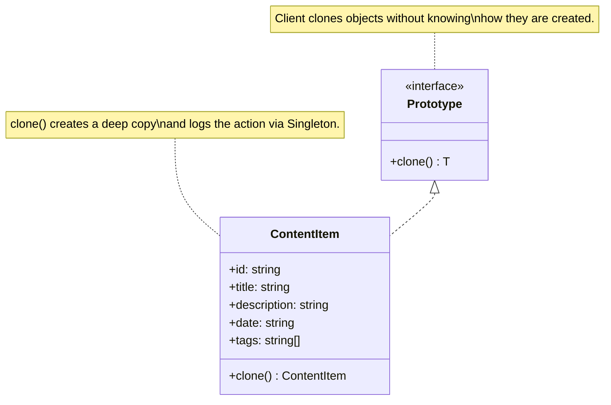

```mermaid
classDiagram
    %% =========================
    %% PROTOTYPE PATTERN (REVISED)
    %% =========================

    class Prototype {
        <<interface>>
        +clone() T
    }

    class ContentItem {
        +id: string
        +title: string
        +description: string
        +date: string
        +tags: string[]
        +clone() ContentItem
    }

    Prototype <|.. ContentItem

    note for Prototype "Client clones objects without knowing\nhow they are created."
    note for ContentItem "clone() creates a deep copy\nand logs the action via Singleton."
```