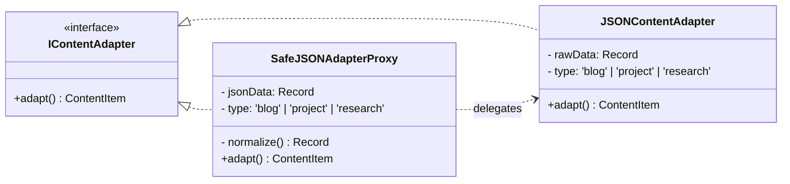
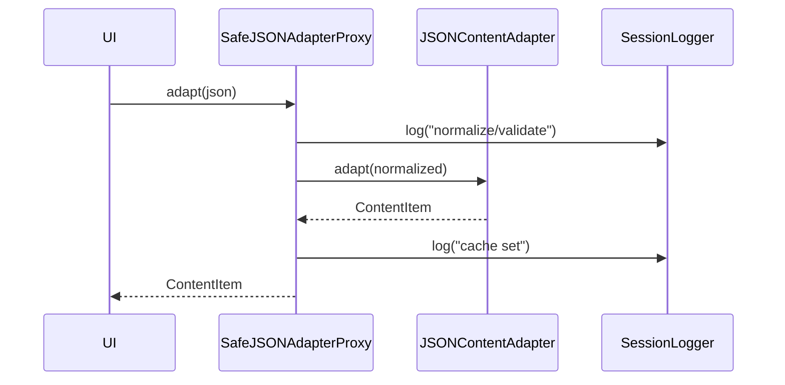
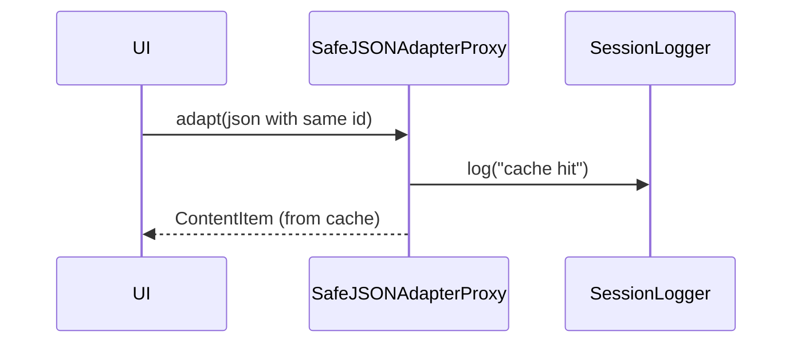

# Proxy Pattern - Mermaid Diagrams

## Class Diagram

## Sequence: Cache Miss → Cache Set

## Sequence: Cache Hit

## Notes
- Proxy เพิ่ม cross-cutting concerns: validation/normalization + caching โดยไม่แก้ไข Adapter เดิม
- ใช้ร่วมกับ Facade: `PortfolioFacade.importFromJSON()` เรียกผ่าน Proxy โดยอัตโนมัติ
