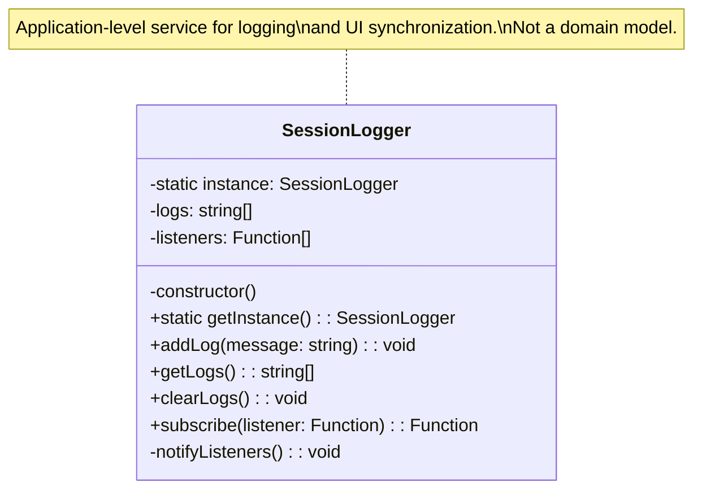

```mermaid
classDiagram
    %% =========================
    %% SINGLETON PATTERN (REVISED)
    %% =========================

    class SessionLogger {
        -static instance: SessionLogger
        -logs: string[]
        -listeners: Function[]
        -constructor()
        +static getInstance(): SessionLogger
        +addLog(message: string): void
        +getLogs(): string[]
        +clearLogs(): void
        +subscribe(listener: Function): Function
        -notifyListeners(): void
    }

    note for SessionLogger "Application-level service for logging\nand UI synchronization.\nNot a domain model."
```