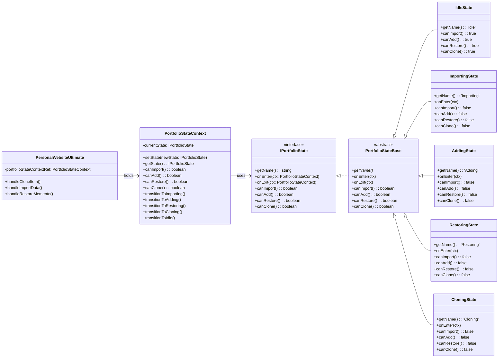
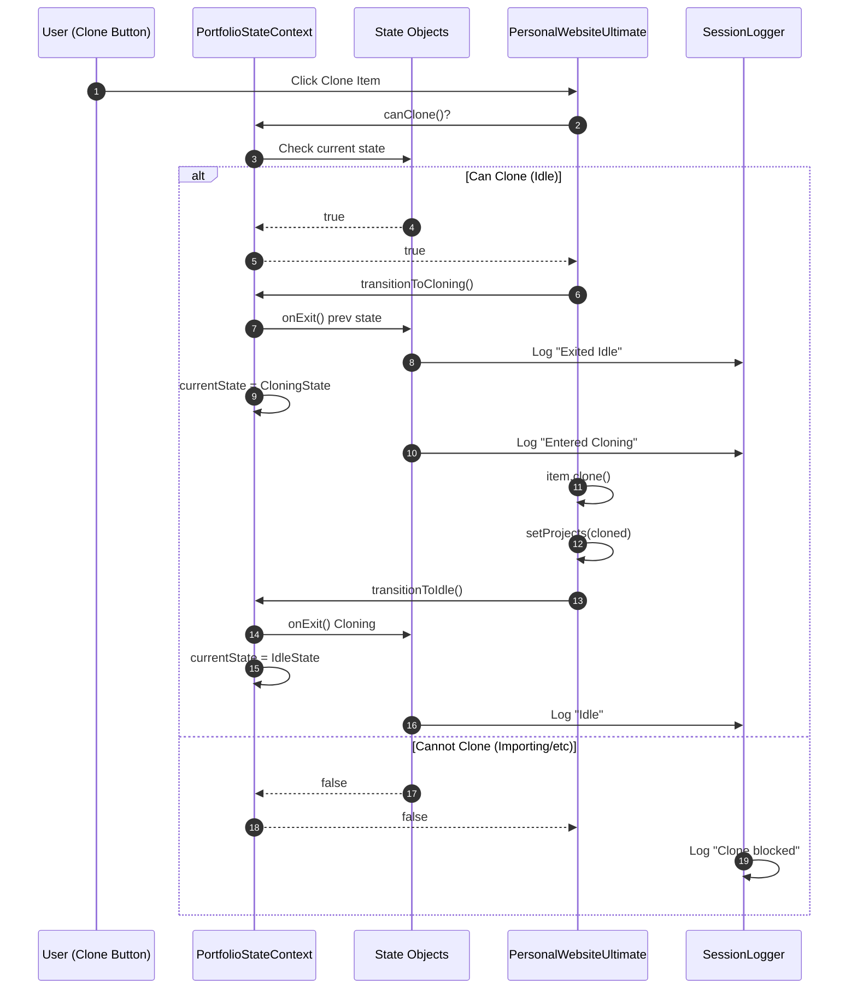

# State Pattern (Behavioral)

## Pattern Overview

- **Purpose**: Manage state-dependent behavior; prevent invalid operations based on current state
- **Key Components**:
  - `IPortfolioState`: Defines interface all states must follow
  - `PortfolioStateBase`: Abstract base with default behavior
  - `IdleState`, `ImportingState`, `AddingState`, `RestoringState`, `CloningState`: Concrete states
  - `PortfolioStateContext`: Holds current state, delegates transitions and queries
  - `PersonalWebsiteUltimate`: Uses context to check state before operations

## How It Works

1. **Initial State**: `PortfolioStateContext` starts in `IdleState`
2. **State Transitions**: When an operation begins (clone, import, restore), context transitions to the appropriate state (CloningState, ImportingState, RestoringState)
3. **State Queries**: Before allowing an operation, handlers call `canClone()`, `canImport()`, `canRestore()` etc.
4. **Encapsulation**: Each state defines what operations are allowed; logic is distributed across states rather than in conditional statements
5. **Cleanup**: When an operation completes, context transitions back to `IdleState`
