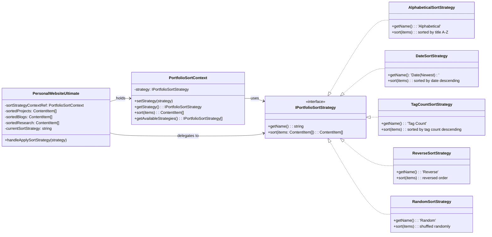
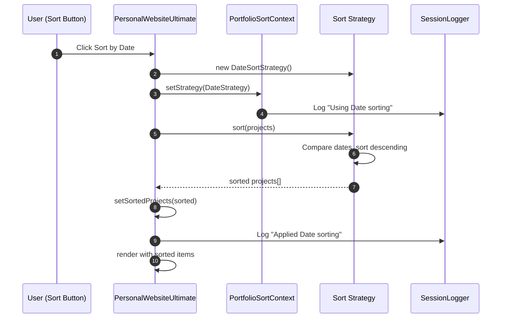

# Strategy Pattern (Behavioral)

## Pattern Overview

**Purpose**: Encapsulate sorting/filtering algorithms into separate strategies that can be switched at runtime without changing the client code.

**Key Components**:
- `IPortfolioSortStrategy`: Interface all sorting strategies must implement
- **Concrete Strategies**:
  - `AlphabeticalSortStrategy`: Sort by title A-Z
  - `DateSortStrategy`: Sort by date (newest first)
  - `TagCountSortStrategy`: Sort by number of tags (most first)
  - `ReverseSortStrategy`: Reverse current order
  - `RandomSortStrategy`: Shuffle items randomly
- `PortfolioSortContext`: Holds and manages the current strategy
- `PersonalWebsiteUltimate`: Uses context to apply strategies

## How It Works

1. **Strategy Selection**: User clicks a sort button
2. **Context Switch**: `handleApplySortStrategy()` creates a new strategy and passes it to the context
3. **Algorithm Execution**: Context calls `sort()` on the selected strategy
4. **Result Application**: Sorted items are stored in state (`sortedProjects`, `sortedBlogs`, `sortedResearch`)
5. **Rendering**: Component renders with the newly sorted items
6. **Logging**: Each strategy logs its action to SessionLogger

## Benefits

- **Open/Closed Principle**: Can add new sorting strategies without modifying existing code
- **Runtime Flexibility**: Switch sorting strategies dynamically based on user input
- **Encapsulation**: Sorting logic is isolated in strategy classes
- **Reusability**: Same strategies can be applied to different collections (projects, blogs, research)
- **Testing**: Each strategy can be tested independently
