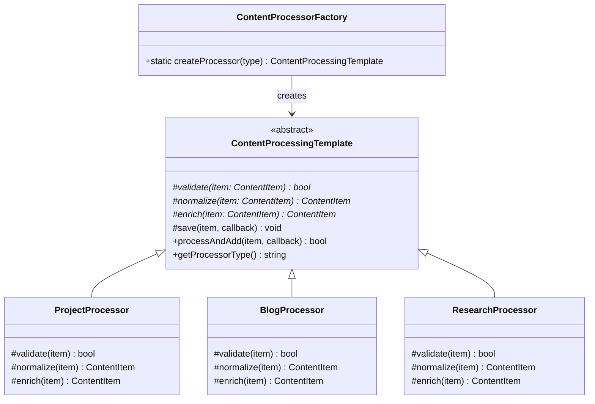
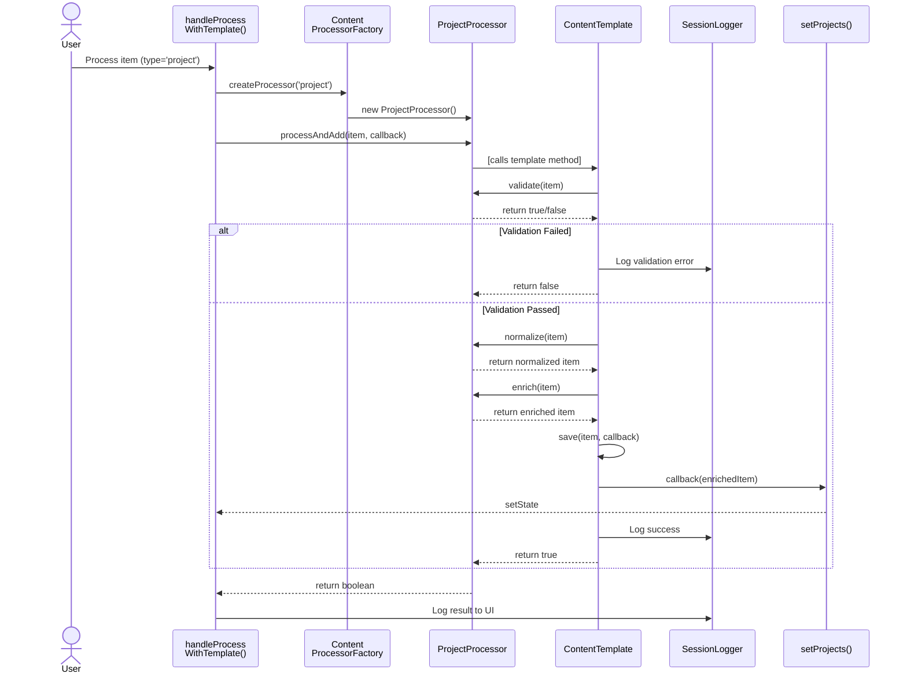

# Template Method Pattern

## Purpose
Template Method เป็น behavioral pattern ที่กำหนด **skeleton of an algorithm** ในฐาน class แต่ให้ subclasses override ขั้นตอนเฉพาะโดยไม่เปลี่ยนโครงสร้างโดยรวม

## Pattern Overview

### Advantages
- **Single Responsibility**: แต่ละ class มี responsibility เดียว
- **Inversion of Control**: Base class ควบคุมขั้นตอน แต่ subclass ตัดสินใจรายละเอียด
- **Code Reuse**: ขั้นตอนร่วมกันอยู่ที่ base class เท่านั้น
- **Flexibility**: สามารถเพิ่ม subclass ใหม่ได้โดยไม่แก้ base class
- **Consistency**: ทุก subclass ปฏิบัติตามโครงสร้างเดียวกัน

## Class Diagram



## Sequence Diagram - Content Processing Flow



## Implementation Details

### Template Method Base Class
Defines the algorithm skeleton with:
1. **Validate**: Check if content meets requirements
2. **Normalize**: Clean and standardize data format
3. **Enrich**: Add type-specific metadata or decorations
4. **Save**: Persist to collection (common step)

### Concrete Implementations

#### ProjectProcessor
- **Validate**: Title required (>0 chars), Tags required (>0)
- **Normalize**: Trim fields, ensure date is string
- **Enrich**: Add "🚀" prefix, ensure "Tech" tag exists
- **Result**: Rich project entry with tech metadata

#### BlogProcessor
- **Validate**: Title >3 chars, Description >10 chars
- **Normalize**: Capitalize title, lowercase tags
- **Enrich**: Add "📝" prefix, add "content" tag if missing
- **Result**: Standardized blog entry

#### ResearchProcessor
- **Validate**: Title >5, Description >20, Tags ≥2 (stricter)
- **Normalize**: UPPERCASE title, ensure 2+ tags
- **Enrich**: Add "🎓" prefix, add "academic" tag
- **Result**: Academic-formatted research entry

## Integration with Portfolio System

```
User Action
    ↓
handleProcessContentWithTemplate(item, type)
    ↓
ContentProcessorFactory.createProcessor(type)
    ↓
Processor.processAndAdd(item, callback)
    ↓
Template Method Execution
    ├─ validate() → [type-specific rules]
    ├─ normalize() → [type-specific formatting]
    ├─ enrich() → [type-specific metadata]
    └─ save() → [common step for all types]
    ↓
Result: Rich, validated, enriched content item
```

## Key Differences from Other Patterns

| Pattern | Focus | Usage |
|---------|-------|-------|
| **Template Method** | Define algorithm skeleton | Content processing pipeline |
| **Strategy** | Swap entire algorithms | Sorting/filtering algorithms |
| **Decorator** | Add behavior dynamically | Add badges/decorations |
| **State** | Change behavior by state | Portfolio operation states |

Template Method encodes the **sequence** of steps, while Strategy encodes the **entire algorithm**.

## Benefits in Portfolio Context

1. **Consistent Processing**: All content types follow same pipeline
2. **Easy Extension**: Add new content type = one new subclass
3. **Shared Validation**: Can add common validation to base class
4. **Enrichment System**: Each type enriches content differently
5. **Error Handling**: Centralized in template method
6. **Logging**: Built into template for all types

## Example Usage

```typescript
// Create processor for specific type
const processor = ContentProcessorFactory.createProcessor('project');

// Process and add to collection
const success = processor.processAndAdd(newItem, (item) => {
  setProjects([item, ...projects]);
});

// Result: Item validated, normalized, enriched, and added to collection
// All via structured template method approach
```

## Related Patterns in Portfolio

- **Singleton**: SessionLogger for unified logging across all processors
- **Factory**: ContentProcessorFactory creates appropriate processor
- **Observer**: Subject notified when content processed
- **State**: Portfolio state context prevents overlapping operations
