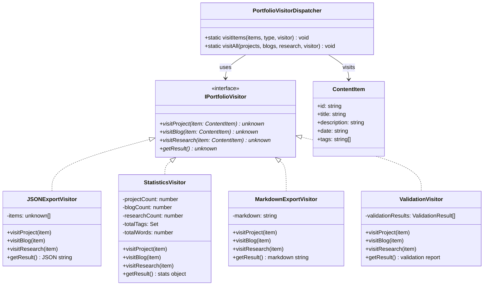
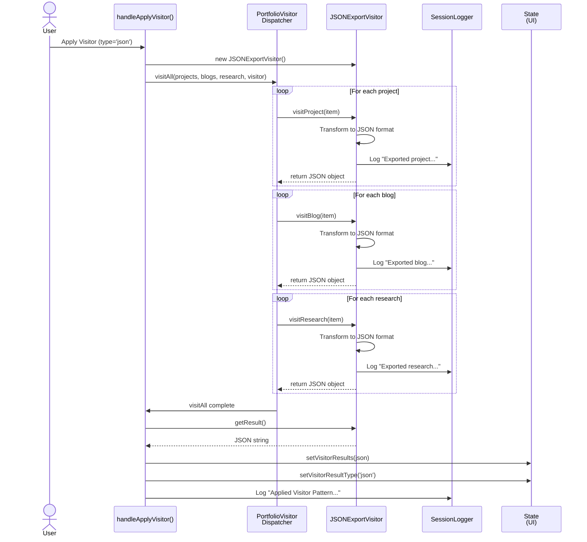

# Visitor Pattern

## Purpose
Visitor เป็น behavioral pattern ที่ช่วยให้คุณ **define new operations** บน object structures โดยไม่ต้องเปลี่ยนแปลง classes ของ objects เหล่านั้น

## Pattern Overview

### Key Concept
แบ่งการออกแบบเป็น 2 ส่วน:
1. **Object Structure** (ContentItem) - ไม่เปลี่ยนแปลง, รู้วิธีรับ visitor
2. **Operations** (Visitors) - เพิ่มใหม่ได้โดยไม่กระทบ object structure

### Advantages
- **Open/Closed Principle**: เปิดสำหรับ operations ใหม่, ปิดสำหรับการเปลี่ยนแปลง objects
- **Separation of Concerns**: ลอจิก operations แยกจาก object structure
- **Easy to Add Operations**: เพิ่ม visitor ใหม่ง่าย ไม่ต้องแก้ object
- **Gather Related Operations**: Operations ที่เกี่ยวข้องอยู่ที่ visitor เดียว
- **Centralized Logic**: ลอจิก operation ในที่เดียว เป็นระเบียบ

## Class Diagram



## Sequence Diagram - Visitor Execution Flow



## Concrete Visitors Implementation

### 1. JSONExportVisitor
**Purpose:** Export all portfolio items to JSON format

```
Transform each item:
- Project → {type, id, title, technologies, year}
- Blog → {type, id, title, content, publishDate, tags}
- Research → {type, id, title, abstract, year, keywords}

Result: JSON array of all exported items
```

### 2. StatisticsVisitor
**Purpose:** Generate portfolio statistics

```
Collect metrics:
- Count projects, blogs, research
- Unique tags across all items
- Total word count
- Average words per item

Result: {
  projects: number,
  blogs: number,
  research: number,
  totalItems: number,
  uniqueTags: number,
  totalWords: number,
  averageWordsPerItem: number
}
```

### 3. MarkdownExportVisitor
**Purpose:** Export portfolio to Markdown format

```
Generate markdown:
- Project: "## 🚀 Title\nDescription\nYear\nTechs"
- Blog: "## 📝 Title\nContent\nDate\nTags"
- Research: "## 🎓 Title\nAbstract\nYear\nKeywords"

Result: Complete Markdown document
```

### 4. ValidationVisitor
**Purpose:** Validate content quality

```
Check each type:
- Project: title(>0), description(>10), tags(>0), date required
- Blog: title(>3), description(>20), tags(>1)
- Research: title(>5), description(>50), tags(>2) - stricter

Result: {
  summary: "X/Y items passed",
  details: [validation per item],
  passRate: percentage
}
```

## Dispatcher Pattern

```typescript
// Visit specific collection with visitor
PortfolioVisitorDispatcher.visitItems(
  projects, 
  'project', 
  visitor
);

// Visit all collections with single visitor
PortfolioVisitorDispatcher.visitAll(
  projects,
  blogs,
  research,
  visitor
);
```

## Integration Flow

```
User Action (ApplyVisitor)
    ↓
handleApplyVisitor(visitorType)
    ↓
Create appropriate visitor instance
    ↓
PortfolioVisitorDispatcher.visitAll()
    ├─ visitor.visitProject(item) × N
    ├─ visitor.visitBlog(item) × M
    └─ visitor.visitResearch(item) × P
    ↓
visitor.getResult()
    ↓
setVisitorResults (state update)
    ↓
Render results to UI
```

## Comparison with Other Patterns

| Pattern | Purpose | When to Use |
|---------|---------|------------|
| **Visitor** | Define new operations without changing objects | Multiple independent operations needed |
| **Strategy** | Select algorithm at runtime | Single operation, multiple implementations |
| **Template Method** | Define algorithm skeleton | Reuse algorithm steps across types |
| **Decorator** | Add responsibility to objects | Enhance existing objects dynamically |

## Real-World Use Cases

### Portfolio Analytics
- Export statistics to CSV
- Generate portfolio summary reports
- Calculate skill frequency

### Content Management
- Validate content quality
- Generate preview pages
- Archive/backup items

### Data Analysis
- Analyze word frequency
- Generate readability scores
- Collect metadata

## Key Benefits in Portfolio System

1. **Extensible**: Add JSONExportVisitor, StatisticsVisitor, MarkdownVisitor без изменения ContentItem
2. **Maintainable**: Each visitor has single responsibility
3. **Testable**: Visitors can be tested independently
4. **Reusable**: Visitors can work with any collection
5. **Clean**: Separates data (ContentItem) from operations (Visitors)

## Example Usage

```typescript
// Create visitor for JSON export
const jsonVisitor = new JSONExportVisitor();

// Apply to all items
PortfolioVisitorDispatcher.visitAll(
  projects,
  blogs,
  research,
  jsonVisitor
);

// Get exported JSON
const exportedData = jsonVisitor.getResult();
console.log(exportedData); // {"type": "project", ...}

// Or for statistics
const statsVisitor = new StatisticsVisitor();
PortfolioVisitorDispatcher.visitAll(projects, blogs, research, statsVisitor);
const stats = statsVisitor.getResult();
// {projects: 2, blogs: 1, research: 1, uniqueTags: 5, ...}
```

## Related Patterns

- **Singleton**: SessionLogger for unified logging across all visitors
- **Composite**: Portfolio structure that visitors traverse
- **Iterator**: Iterate through items before visitor processes them
- **Factory**: ContentProcessorFactory creates visitors (alternative approach)
- **Observer**: Subject notified when visitor operations complete
