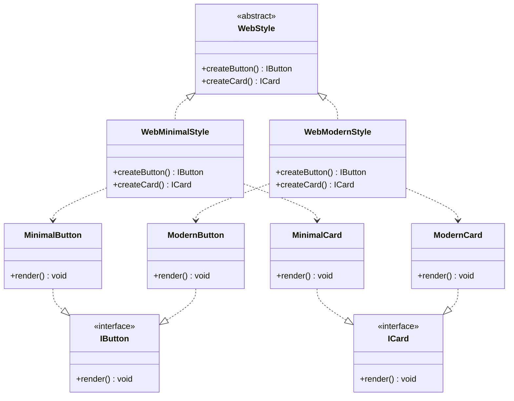

```mermaid
classDiagram
    class IButton{
        <<interface>>
        +render() void
    }
    class ICard{
        <<interface>>
        +render() void
    }
    class MinimalButton{
        +render() void
    }
    class MinimalCard{
        +render() void
    }
    class ModernButton{
        +render() void
    }
    class ModernCard{
        +render() void
    }
    class WebStyle{
        <<abstract>>
        +createButton() IButton
        +createCard() ICard
    }
    class WebMinimalStyle{
        +createButton() IButton
        %% return new MinimalButton()
        +createCard() ICard
        %% return new MinimalCard()
    }
    class WebModernStyle{
        +createButton() IButton
        %% return new ModernButton()
        +createCard() ICard
        %% return new ModernCard()
    }
    MinimalButton ..|> IButton
    ModernButton ..|> IButton
    MinimalCard ..|> ICard
    ModernCard ..|> ICard
    WebStyle <|.. WebMinimalStyle
    WebStyle <|.. WebModernStyle
    WebMinimalStyle ..> MinimalButton
    WebMinimalStyle ..> MinimalCard
    WebModernStyle ..> ModernButton
    WebModernStyle ..> ModernCard
```