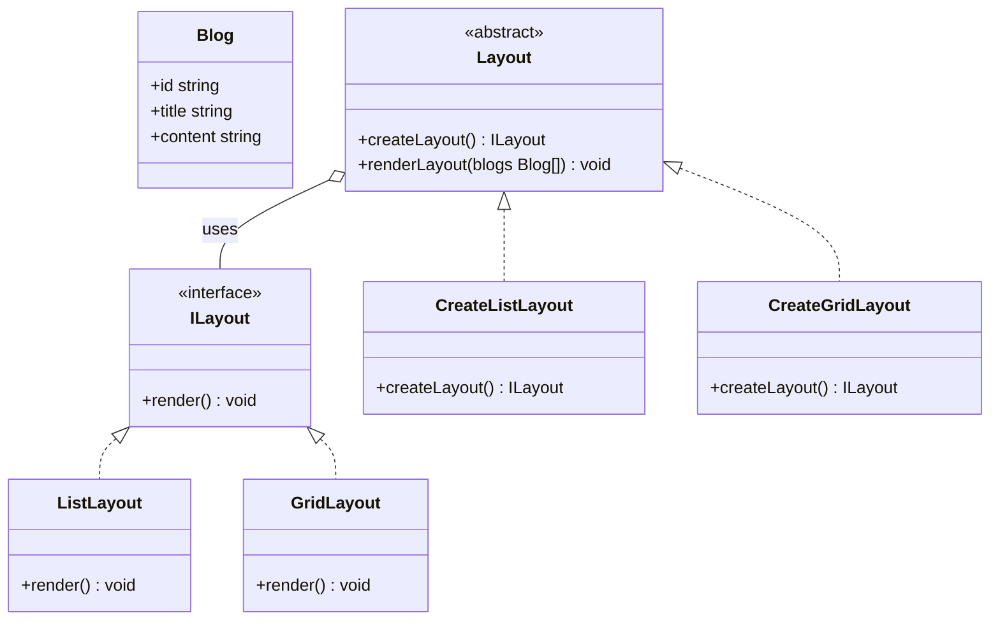

```mermaid
classDiagram
    class Blog{
        +id string
        +title string
        +content string
    }
    class ILayout{
        <<interface>>
        +render() void
    }
    class ListLayout{
        +render() void
    }
    class GridLayout{
        +render() void
    }
    class Layout{
        <<abstract>>
        +createLayout() ILayout
        +renderLayout(blogs Blog[]) void
        %% layout = this.createLayout()
        %% layout.render(blogs)
    }
    class CreateListLayout{
        +createLayout() ILayout
        %% return new ListLayout()
    }
    class CreateGridLayout{
        +createLayout() ILayout
        %% return new GridLayout()
    }
    ILayout <|.. ListLayout
    ILayout <|.. GridLayout
    Layout <|.. CreateListLayout
    Layout <|.. CreateGridLayout
    Layout o-- ILayout : uses
```