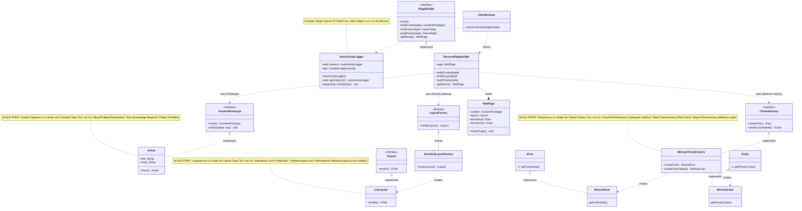

```mermaid
classDiagram
    %% ==========================================
    %% 1. SINGLETON: User Activity Logger
    %% ==========================================
    class UserActivityLogger {
        -static instance: UserActivityLogger
        -logs: ComplexLogStructure[]
        -UserActivityLogger()
        +static getInstance() UserActivityLogger
        +log(activity: ActivityData) void
    }
    note for UserActivityLogger "Concept: Single Source of Truth\nไม่ต้อง New Object บ่อยๆ ประหยัด Memory"

    %% ==========================================
    %% 2. PROTOTYPE: Content Management
    %% ==========================================
    class IContentPrototype {
        <<interface>>
        +clone() IContentPrototype
        +setData(data: any) void
    }

    class Article {
        +title: String
        +body: String
        +clone() Article
    }
    
    %% SCALE POINT 1: Content Types
    note for Article "SCALE POINT: Content Types\nสามารถ Scale เพิ่ม Concrete Class ได้อีก เช่น:\n1. Blog (Problem/Solution)\n2. Docs (Knowledge Base)\n3. Project (Portfolio)"

    IContentPrototype <|.. Article : implements

    %% ==========================================
    %% 3. FACTORY METHOD: Layout System
    %% ==========================================
    class ILayout {
        <<interface>>
        +render() HTML
    }

    class ListLayout {
        +render() HTML
    }

    %% SCALE POINT 2: Layouts
    note for ListLayout "SCALE POINT: Layouts\nสามารถ Scale เพิ่ม Layout Class ได้อีก เช่น:\n1. GridLayout (สำหรับ Project)\n2. TimelineLayout (สำหรับ Resume)\n3. MasonryLayout (สำหรับ Gallery)"

    class LayoutFactory {
        <<abstract>>
        +createLayout() ILayout
    }

    class StandardLayoutFactory {
        +createLayout() ILayout
    }

    ILayout <|.. ListLayout : implements
    LayoutFactory <|-- StandardLayoutFactory : inherits
    StandardLayoutFactory ..> ListLayout : creates

    %% ==========================================
    %% 4. ABSTRACT FACTORY: Theme & Style (Art)
    %% ==========================================
    class IThemeFactory {
        <<interface>>
        +createFont() IFont
        +createColorPalette() IColor
    }

    class MinimalThemeFactory {
        +createFont() MinimalFont
        +createColorPalette() MinimalColor
    }

    %% SCALE POINT 3: Themes
    note for MinimalThemeFactory "SCALE POINT: Themes\nสามารถ Scale เพิ่ม Theme Factory ได้อีก เช่น:\n1. FutureThemeFactory (Cyberpunk style)\n2. RetroThemeFactory (Pixel art)\n3. NatureThemeFactory (Wellness style)"

    %% Abstract Products
    class IFont { <<interface>> getFontFamily() }
    class IColor { <<interface>> getPrimaryColor() }
    
    %% Concrete Products (Minimal)
    class MinimalFont { getFontFamily() }
    class MinimalColor { getPrimaryColor() 
    }

    IThemeFactory <|.. MinimalThemeFactory : implements
    IFont <|.. MinimalFont : implements
    IColor <|.. MinimalColor : implements
    MinimalThemeFactory ..> MinimalFont : creates
    MinimalThemeFactory ..> MinimalColor : creates

    %% ==========================================
    %% 5. BUILDER: Page Construction
    %% ==========================================
    class WebPage {
        +content: IContentPrototype
        +layout: ILayout
        +themeFont: IFont
        +themeColor: IColor
        +renderPage() void
    }

    class IPageBuilder {
        <<interface>>
        +reset()
        +buildContent(data: IContentPrototype)
        +buildLayout(type: LayoutType)
        +buildTheme(style: ThemeStyle)
        +getResult() WebPage
    }

    class PersonalPageBuilder {
        -page: WebPage
        +buildContent(data)
        +buildLayout(type)
        +buildTheme(style)
        +getResult() WebPage
    }

    IPageBuilder <|.. PersonalPageBuilder : implements
    PersonalPageBuilder --* WebPage : builds
    
    %% Relationships to Builder
    PersonalPageBuilder ..> IContentPrototype : uses (Prototype)
    PersonalPageBuilder ..> LayoutFactory : uses (Factory Method)
    PersonalPageBuilder ..> IThemeFactory : uses (Abstract Factory)

    %% Client / Director
    class ClientDirector {
        +constructArticlePage(builder)
    }
    ClientDirector ..> PersonalPageBuilder : directs
    ClientDirector ..> UserActivityLogger : logs activity
```