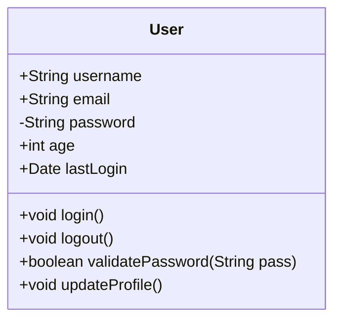

# Mermaid Class Diagram Generator Demo

## Overview
This tool allows you to create and update Mermaid class diagrams interactively. Here are the key features:

## Features Demonstrated

### 1. Create New Diagram Mode
- Interactive class name input with validation
- Multi-line attribute entry
- Multi-line method entry  
- Optional diagram title
- Save to file or print to console

### 2. Update Existing Diagram Mode
Two input methods:
- **Load from file**: Parse existing markdown files with mermaid diagrams
- **Manual entry**: Enter diagram details manually

### 3. File Loading Capabilities
- Automatically detects mermaid code blocks in markdown files
- Handles multiple diagrams in one file (user selects which to update)
- Parses class name, attributes, methods, and title
- Robust error handling with fallback to manual entry

### 4. Update Operations
- **Update class name**: Change the class name
- **Update attributes**: Add, edit, or delete attributes
- **Update methods**: Add, edit, or delete methods
- **Preview**: See the diagram before saving
- **Save and finish**: Export to markdown file

## Example Usage Scenarios

### Scenario 1: Creating a New Class Diagram

```
--- Mermaid Class Diagram Generator ---
--- Select Mode ---
1. Create new class diagram
2. Update existing class diagram

Select option (1-2): 1

Enter Diagram Title (optional, press Enter to skip): User Management System

Enter Class Name (e.g., User): User

Enter Attributes (one per line, e.g., +String name, -int age):
  (Press Enter twice when done)
+String username
+String email
-String password
+int age


Enter Methods (one per line, e.g., +void login(), +boolean logout()):
  (Press Enter twice when done)
+void login()
+void logout()
+boolean validatePassword(String pass)
+void updateProfile()


Enter output Markdown filename (e.g., my_class_diagram.md, press Enter to print to console): user_diagram.md

Mermaid Class Diagram has been appended to 'user_diagram.md'
You can now open this Markdown file in a viewer that supports Mermaid.js (e.g., VS Code).
```

### Scenario 2: Loading and Updating from File

```
--- Mermaid Class Diagram Generator ---
--- Select Mode ---
1. Create new class diagram
2. Update existing class diagram

Select option (1-2): 2

--- Update Existing Class Diagram ---
--- How do you want to provide the existing diagram? ---
1. Load from existing markdown file
2. Enter diagram details manually

Select option (1-2): 1

Enter the path to the markdown file containing the diagram: ./demo/example_diagram.md

Found 2 mermaid diagrams in the file.

Available diagrams:
1. classDiagram   %% title: User Management System   class User{     +String username     +String email...
2. classDiagram   class Account{     +String accountId     +double balance     +void deposit(double...

Select diagram (1-2): 1

Loaded diagram for class: User

--- What would you like to update? ---
1. Update class name
2. Update attributes  
3. Update methods
4. Preview diagram
5. Save and finish

Select option (1-5): 2

Current attributes:
1. +String username
2. +String email
3. -String password
4. +int age

--- Update Attributes ---
1. Add new attribute
2. Edit existing attribute
3. Delete attribute
4. Finish updating

Select option (1-4): 1

Enter new attribute: +Date lastLogin

Added: +Date lastLogin

--- Update Attributes ---
1. Add new attribute
2. Edit existing attribute
3. Delete attribute
4. Finish updating

Select option (1-4): 4

--- What would you like to update? ---
1. Update class name
2. Update attributes
3. Update methods
4. Preview diagram
5. Save and finish

Select option (1-5): 4

--- Preview ---


Select option (1-5): 5

Enter output Markdown filename (e.g., updated_diagram.md, press Enter to print to console): updated_user_diagram.md

Mermaid Class Diagram has been appended to 'updated_user_diagram.md'
You can now open this Markdown file in a viewer that supports Mermaid.js (e.g., VS Code).
```

## Generated Output Example

The tool generates clean, properly formatted Mermaid diagrams:


## Key Benefits

1. **Interactive**: No need to manually write Mermaid syntax
2. **Flexible**: Create new or update existing diagrams
3. **File Integration**: Load from existing markdown files
4. **Error Handling**: Robust parsing with graceful fallbacks
5. **Preview**: See results before saving
6. **Iterative**: Easy to make multiple updates
7. **Professional Output**: Clean, properly formatted diagrams

## Technical Features

- TypeScript class-based architecture
- Async/await for smooth user interaction
- Regex-based markdown parsing
- Multiple diagram support in single files
- Comprehensive error handling
- Input validation and sanitization
