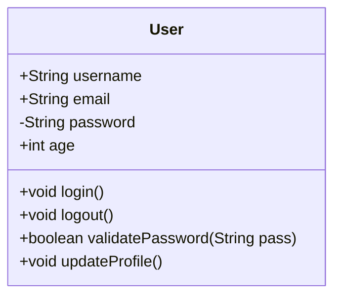
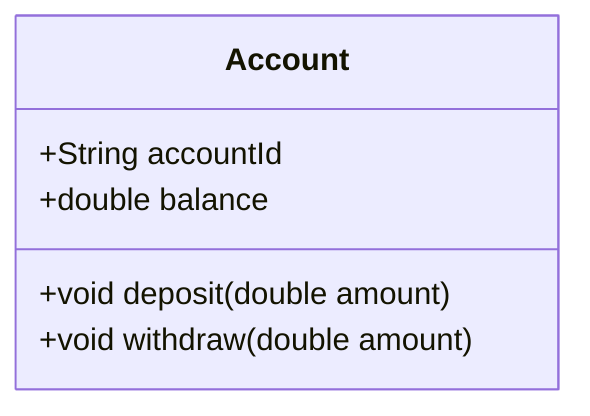

# User Management System

This is an example class diagram for demonstration purposes.

```mermaid
classDiagram
  %% title: User Management System
  class User{
    +String username
    +String email
    -String password
    +int age
    +void login()
    +void logout()
    +boolean validatePassword(String pass)
    +void updateProfile()
  }
```

## Features

- User authentication
- Profile management
- Security features

```mermaid
classDiagram
  class Account{
    +String accountId
    +double balance
    +void deposit(double amount)
    +void withdraw(double amount)
  }
```
