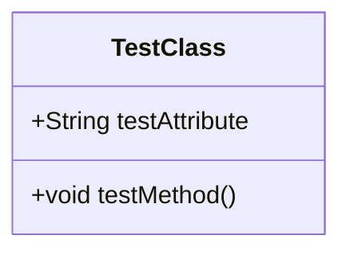

# Test Update Feature

Let's test the improved update functionality.

```mermaid
classDiagram
  %% title: Test System
  class TestClass{
    +String testAttribute
    +void testMethod()
  }
```

This diagram should be replaceable when we update it using the tool.
