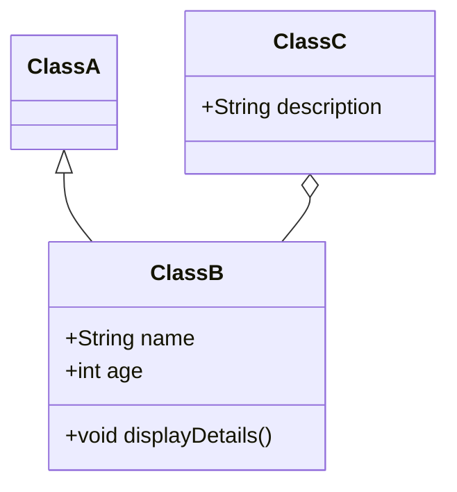
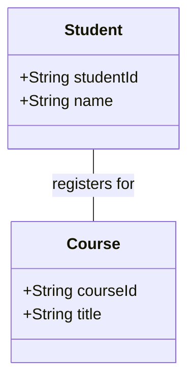
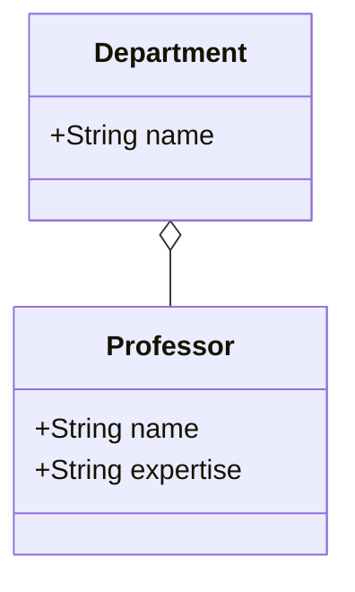
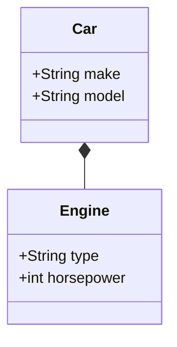

```mermaid
classDiagram
    ClassA <|-- ClassB
    ClassB : +String name
    ClassB : +int age
    ClassB : +void displayDetails()
    ClassC o-- ClassB
    ClassC : +String description
```

```mermaid
classDiagram
    Student -- Course : registers for
    Student : +String studentId
    Student : +String name
    Course : +String courseId
    Course : +String title
```


```mermaid
classDiagram
    Department o-- Professor
    Department : +String name
    Professor : +String name
    Professor : +String expertise
```


```mermaid
classDiagram
    Car *-- Engine
    Car : +String make
    Car : +String model
    Engine : +String type
    Engine : +int horsepower
```
````mermaid
classDiagram
  %% title: Car
  class Car{
    int age
    +void show()
  }
```