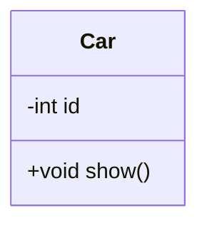
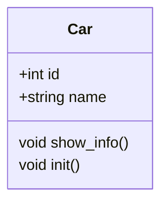
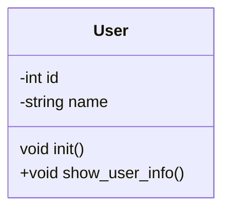
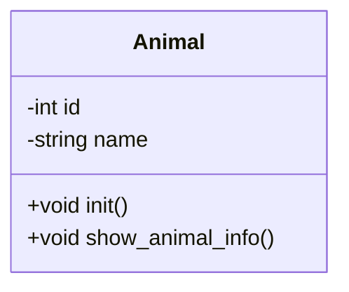
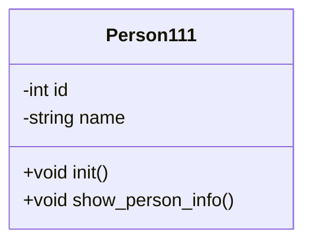
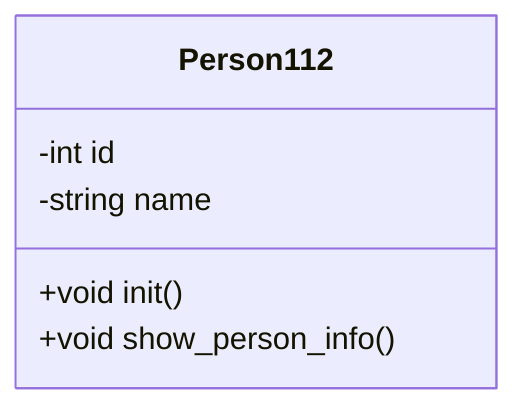

```mermaid
classDiagram
  class Car{
    -int id
    +void show()
  }
```

```mermaid
classDiagram
  class Car{
    +int id
    +string name
    void show_info()
    void init()
  }
```

```mermaid
classDiagram
  class User{
    -int id
    -string name
    void init()
    +void show_user_info()
  }
```

```mermaid
classDiagram
  class Animal{
    -int id
    -string name
    +void init()
    +void show_animal_info()
  }
```

```mermaid
classDiagram
  class Person111{
    -int id
    -string name
    +void init()
    +void show_person_info()
  }
```

```mermaid
classDiagram
  class Person112{
    -int id
    -string name
    +void init()
    +void show_person_info()
  }
```
