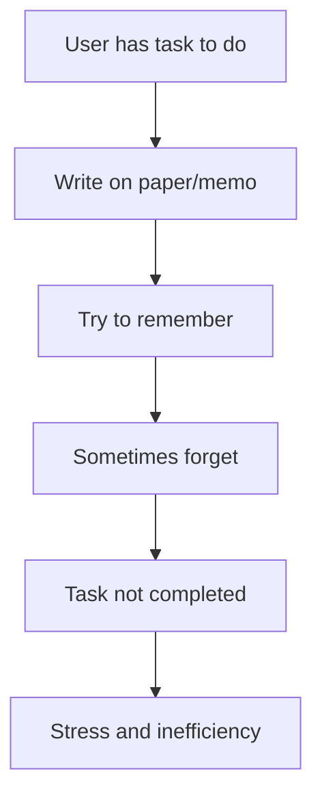
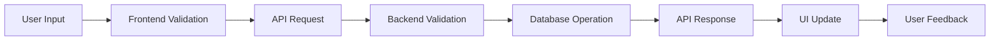
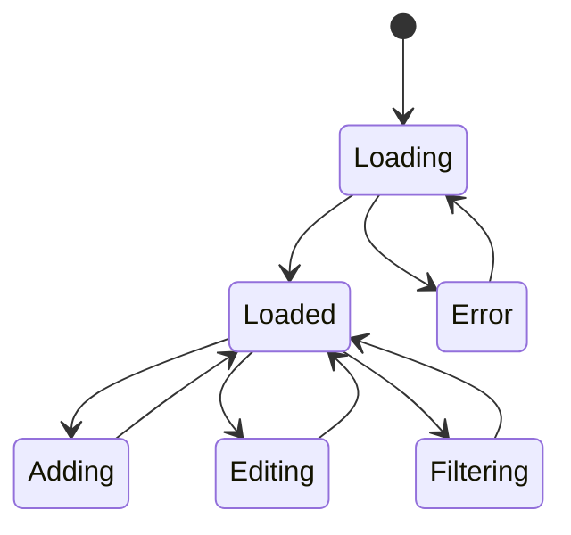

# Phase 2: System Analysis

## 📋 Overview
การวิเคราะห์ระบบ Todo List Application เพื่อทำความเข้าใจ business process, user behavior, และ system requirements ในระดับลึก

---

## 🔍 Business Process Analysis

### Current State (Before System)


**ปัญหาที่พบ:**
- ลืมงานที่ต้องทำ
- ไม่มีการจัดลำดับความสำคัญ
- ยากต่อการติดตามความคืบหน้า
- ไม่สามารถแชร์งานกับคนอื่นได้

### Future State (With System)
```mermand
graph TD
    A[User has task to do] --> B[Add to Todo System]
    B --> C[Set priority and details]
    C --> D[Track progress]
    D --> E[Mark as completed]
    E --> F[View statistics and achievements]
    F --> G[Better productivity]
```

**ผลประโยชน์ที่ได้:**
- จัดการงานอย่างเป็นระบบ
- ติดตามความคืบหน้าได้
- ลดความเครียดจากการลืมงาน
- เพิ่มประสิทธิภาพในการทำงาน

---

## 👤 User Behavior Analysis

### User Personas

#### Primary Persona: "Busy Professional"
```yaml
Name: นายชาติชาย นักทำงาน
Age: 28-35
Occupation: Software Developer / Project Manager
Tech Savviness: High
Goals:
  - จัดการงานได้อย่างมีประสิทธิภาพ
  - ติดตามความคืบหน้าของ tasks
  - ลดเวลาที่ใช้ในการจัดระเบียบงาน
Frustrations:
  - ลืมงานสำคัญบ่อยครั้ง
  - ไม่รู้ว่างานไหนควรทำก่อน
  - ใช้เวลามากกับการจัดระเบียบ
Preferred Features:
  - Quick add todo
  - Priority levels
  - Search and filter
  - Statistics and progress tracking
```

#### Secondary Persona: "Student Organizer"
```yaml
Name: น.ส.สุดา นักเรียน
Age: 18-25
Occupation: University Student
Tech Savviness: Medium-High
Goals:
  - จัดการการบ้านและโครงงาน
  - ติดตามเดดไลน์
  - วางแผนการเรียน
Frustrations:
  - งานเยอะและมีเดดไลน์หลายอัน
  - ลืมส่งงาน
  - ไม่รู้ว่าควรเริ่มงานไหนก่อน
Preferred Features:
  - Due date reminders
  - Category organization
  - Simple interface
  - Mobile responsive
```

### User Journey Mapping

#### Journey 1: Adding a New Todo
```
1. User Recognition
   User realizes they have a new task
   💭 "I need to remember to do this"

2. Access System
   User opens the Todo application
   🖱️ Navigate to homepage

3. Create Todo
   User clicks "Add New Todo"
   ⌨️ Enter title and description

4. Confirmation
   System confirms todo creation
   ✅ Todo appears in list

5. Satisfaction
   User feels organized and in control
   😊 Peace of mind
```

#### Journey 2: Completing a Todo
```
1. Task Review
   User reviews their todo list
   👀 Look at pending tasks

2. Task Selection
   User identifies task to work on
   🎯 Choose based on priority/urgency

3. Task Execution
   User works on the task
   ⚒️ Complete the actual work

4. Mark Complete
   User marks todo as completed
   ✅ Click checkbox or complete button

5. Achievement
   User sees progress and statistics
   📊 Feel sense of accomplishment
```

---

## 🎯 Use Case Analysis

### Primary Use Cases

#### UC-01: Manage Todo Items
```yaml
Use Case: Manage Todo Items
Actor: End User
Precondition: User has access to the application
Main Flow:
  1. User navigates to todo list
  2. User can see all existing todos
  3. User can add new todo with title and description
  4. User can edit existing todos
  5. User can delete unwanted todos
  6. User can mark todos as complete/incomplete
Alternative Flow:
  - If no todos exist, show empty state with call-to-action
  - If edit fails, show error message and keep original data
Postcondition: Todo list reflects all changes
Success Criteria: All CRUD operations work correctly
```

#### UC-02: Filter and Search Todos
```yaml
Use Case: Filter and Search Todos
Actor: End User
Precondition: User has todos in the system
Main Flow:
  1. User selects filter option (All/Pending/Completed)
  2. System displays filtered results
  3. User can search by keyword
  4. System shows matching todos
Alternative Flow:
  - If no results found, show "no todos found" message
  - If search is cleared, show all todos in current filter
Postcondition: User sees relevant todos
Success Criteria: Filtering and search work accurately and fast
```

#### UC-03: View Statistics
```yaml
Use Case: View Todo Statistics
Actor: End User
Precondition: User has todos in the system
Main Flow:
  1. User accesses statistics panel/page
  2. System calculates and displays:
     - Total todos count
     - Completed todos count
     - Pending todos count
     - Completion percentage
Alternative Flow:
  - If no todos exist, show zero statistics
Postcondition: User sees current progress metrics
Success Criteria: Statistics are accurate and update in real-time
```

### Secondary Use Cases

#### UC-04: Data Persistence
```yaml
Use Case: Persist Todo Data
Actor: System
Precondition: User performs any data operation
Main Flow:
  1. User performs CRUD operation
  2. Frontend sends API request
  3. Backend processes request
  4. Database stores/retrieves data
  5. Backend returns response
  6. Frontend updates UI
Alternative Flow:
  - If database unavailable, show error message
  - If network fails, retry with exponential backoff
Postcondition: Data is safely stored and retrievable
Success Criteria: 99.9% data consistency and availability
```

---

## 📊 Data Flow Analysis

### High-Level Data Flow


### Detailed Data Flows

#### 1. Create Todo Data Flow
```
User Input:
├── Title (string, required, max 200 chars)
├── Description (string, optional, max 1000 chars)
└── Implicit fields:
    ├── completed: false
    ├── createdAt: current timestamp
    └── updatedAt: current timestamp

Frontend Processing:
├── Validate input fields
├── Sanitize user input
└── Send POST request to /api/todos

Backend Processing:
├── Validate request body
├── Create new todo record
├── Generate unique ID (CUID)
└── Save to database

Database Operation:
├── INSERT INTO todos (...)
├── Return created record
└── Update indexes

Response Flow:
├── Backend returns created todo
├── Frontend updates local state
├── UI shows new todo in list
└── Show success feedback
```

#### 2. Update Todo Data Flow
```
User Action:
├── Edit todo details, OR
└── Toggle completion status

Data Changes:
├── Modified fields only
├── updatedAt: current timestamp
└── Preserve unchanged fields

Processing:
├── Frontend optimistic update
├── Send PUT/PATCH request
├── Backend validates and updates
├── Database commits changes
├── Return updated record
└── Frontend confirms or reverts
```

### Data Validation Rules

#### Frontend Validation
```javascript
const todoValidation = {
  title: {
    required: true,
    minLength: 1,
    maxLength: 200,
    trim: true
  },
  description: {
    required: false,
    maxLength: 1000,
    trim: true
  }
}
```

#### Backend Validation
```typescript
interface TodoValidation {
  title: string & { length: 1..200 }
  description?: string & { length: 0..1000 }
  completed: boolean
  id: CUID
}
```

---

## 🔄 State Management Analysis

### Application State Structure
```typescript
interface AppState {
  todos: {
    items: Todo[]
    loading: boolean
    error: string | null
    filter: 'all' | 'pending' | 'completed'
  }
  ui: {
    isAddingTodo: boolean
    editingTodoId: string | null
    showStats: boolean
  }
}
```

### State Transitions


---

## 🚀 Performance Analysis

### Performance Requirements
| Operation | Expected Response Time | Maximum Acceptable Time |
|-----------|------------------------|-------------------------|
| Load todos | < 500ms | < 1000ms |
| Add todo | < 200ms | < 500ms |
| Update todo | < 200ms | < 500ms |
| Delete todo | < 200ms | < 500ms |
| Filter todos | < 100ms | < 300ms |
| Search todos | < 300ms | < 600ms |

### Scalability Considerations
```yaml
Current Scale:
  - Users: 1 (development/demo)
  - Todos per user: < 1000
  - Concurrent operations: < 10/sec

Target Scale:
  - Users: 100-1000
  - Todos per user: < 10000
  - Concurrent operations: < 100/sec

Scalability Strategies:
  - Database indexing on frequently queried fields
  - API response caching
  - Frontend state management optimization
  - Pagination for large todo lists
```

---

## 🔒 Security Analysis

### Security Requirements
| Area | Requirement | Implementation |
|------|-------------|----------------|
| Input Validation | All user inputs validated | Frontend + Backend validation |
| SQL Injection | Prevent malicious queries | Prisma ORM parameterized queries |
| XSS Prevention | Sanitize user content | React built-in protection + validation |
| CORS | Control API access | Proper CORS configuration |
| Data Privacy | Protect user data | No sensitive data logging |

### Security Threats & Mitigation
```yaml
Threat: SQL Injection
Risk Level: Medium
Mitigation: Use Prisma ORM with parameterized queries

Threat: Cross-Site Scripting (XSS)
Risk Level: Low
Mitigation: React's built-in XSS protection + input sanitization

Threat: Data Loss
Risk Level: High
Mitigation: Database transactions + backup strategy

Threat: Unauthorized Access
Risk Level: Low (current scope)
Mitigation: Future authentication implementation
```

---

## 📋 Analysis Summary

### Key Findings
1. **User Needs**: Simple, fast, and reliable todo management
2. **Technical Requirements**: Full-stack CRUD with real-time updates
3. **Performance Goals**: Sub-second response times for all operations
4. **Scalability**: Architecture should support future growth
5. **Security**: Basic input validation and data protection

### Recommended Solutions
1. **Database Design**: Normalized schema with proper indexing
2. **API Design**: RESTful endpoints with consistent response format
3. **Frontend Architecture**: Component-based with efficient state management
4. **Error Handling**: Comprehensive error handling at all levels
5. **Testing Strategy**: Unit, integration, and end-to-end testing

### Success Metrics
- User task completion rate > 95%
- System response time < 1 second
- Zero data loss incidents
- Minimal learning curve for new users

---

## 🔗 Related Documents
- [Previous Phase: Planning & Requirements](./01-planning-requirements.md)
- [Next Phase: Design](./03-design.md)
- [Project Overview](./README.md)