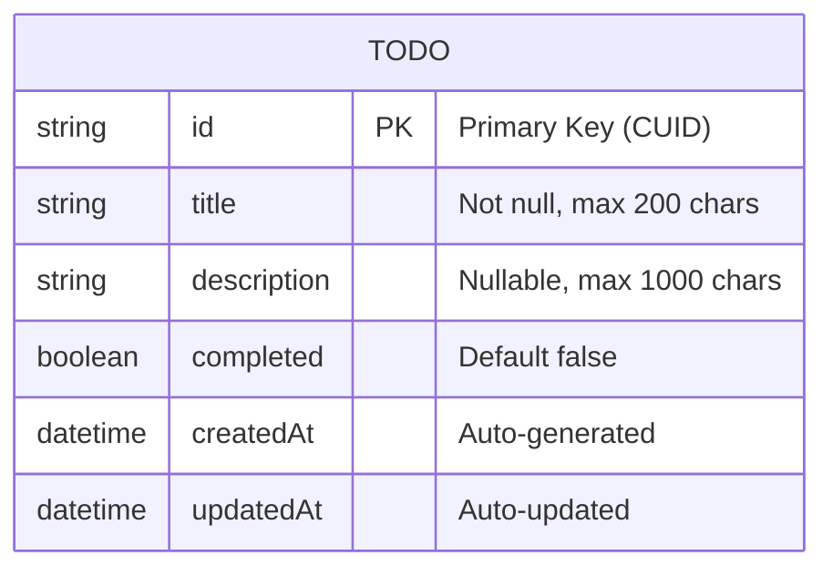
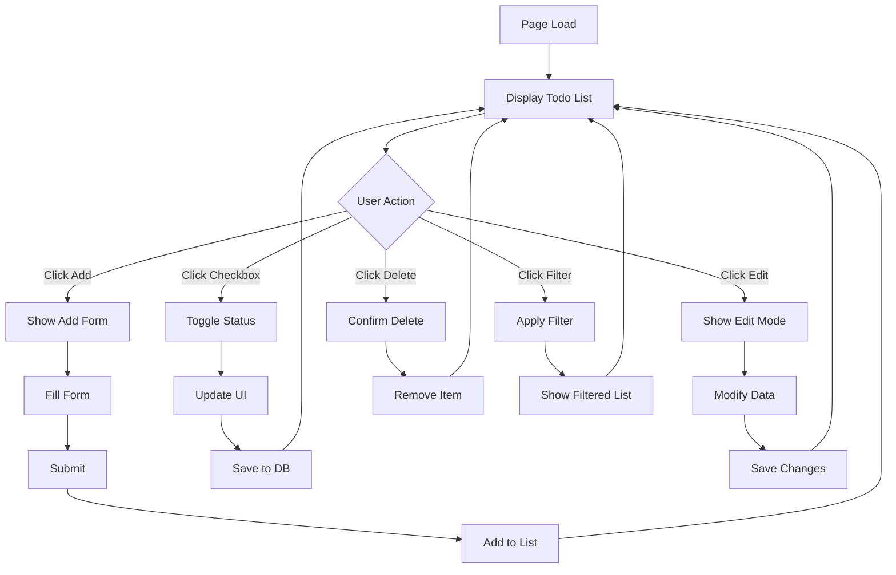
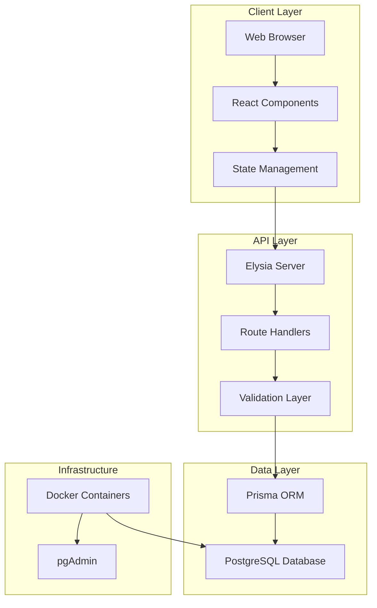
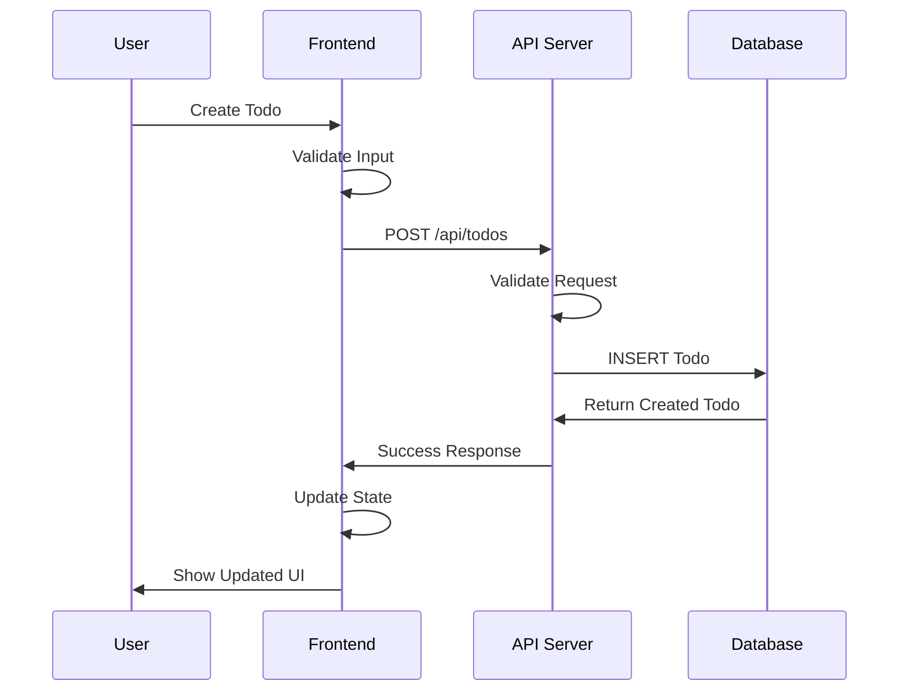

# Phase 3: System Design

## 📋 Overview
การออกแบบระบบ Todo List Application ในทุกด้าน ตั้งแต่ database schema, API endpoints, UI/UX design, และ system architecture

---

## 🗄️ Database Design

### Entity Relationship Diagram (ERD)


### Database Schema

#### Todo Table Structure
```sql
CREATE TABLE todos (
    id          TEXT PRIMARY KEY,           -- CUID for unique identification
    title       TEXT NOT NULL,              -- Todo title (required)
    description TEXT,                       -- Todo description (optional)
    completed   BOOLEAN DEFAULT FALSE,      -- Completion status
    created_at  TIMESTAMP DEFAULT NOW(),    -- Creation timestamp
    updated_at  TIMESTAMP DEFAULT NOW()     -- Last update timestamp
);

-- Indexes for performance
CREATE INDEX idx_todos_completed ON todos(completed);
CREATE INDEX idx_todos_created_at ON todos(created_at DESC);
CREATE INDEX idx_todos_title ON todos(title);
```

#### Prisma Schema Definition
```prisma
model Todo {
  id          String   @id @default(cuid())
  title       String
  description String?
  completed   Boolean  @default(false)
  createdAt   DateTime @default(now())
  updatedAt   DateTime @updatedAt

  @@map("todos")
}
```

### Database Design Principles
1. **Normalization**: Simple structure, no redundancy
2. **Performance**: Strategic indexing for common queries
3. **Scalability**: Design allows for future user authentication
4. **Data Integrity**: Constraints and validation at DB level
5. **Audit Trail**: CreatedAt/UpdatedAt for tracking changes

---

## 🌐 API Design

### RESTful API Endpoints

#### Base Configuration
```yaml
Base URL: http://localhost:3001
Content-Type: application/json
CORS: Enabled for localhost:3000
```

#### Endpoint Specifications

##### 1. Health Check
```http
GET /
Response: { "message": "Todo API Server is running!" }
Status: 200 OK
```

##### 2. Get All Todos
```http
GET /api/todos

Response Format:
{
  "success": true,
  "data": [
    {
      "id": "clx1234567890",
      "title": "Learn TypeScript",
      "description": "Study TypeScript fundamentals",
      "completed": false,
      "createdAt": "2025-09-28T16:31:36.084Z",
      "updatedAt": "2025-09-28T16:31:36.084Z"
    }
  ]
}
```

##### 3. Get Todo by ID
```http
GET /api/todos/{id}

Success Response (200):
{
  "success": true,
  "data": { /* todo object */ }
}

Error Response (404):
{
  "success": false,
  "error": "Todo not found"
}
```

##### 4. Create New Todo
```http
POST /api/todos
Content-Type: application/json

Request Body:
{
  "title": "New Todo Title",
  "description": "Optional description"
}

Success Response (201):
{
  "success": true,
  "data": { /* created todo object */ }
}

Error Response (400):
{
  "success": false,
  "error": "Title is required"
}
```

##### 5. Update Todo
```http
PUT /api/todos/{id}
Content-Type: application/json

Request Body:
{
  "title": "Updated title",
  "description": "Updated description",
  "completed": true
}

Success Response (200):
{
  "success": true,
  "data": { /* updated todo object */ }
}
```

##### 6. Delete Todo
```http
DELETE /api/todos/{id}

Success Response (200):
{
  "success": true,
  "message": "Todo deleted successfully"
}

Error Response (404):
{
  "success": false,
  "error": "Todo not found"
}
```

##### 7. Toggle Todo Status
```http
PATCH /api/todos/{id}/toggle

Success Response (200):
{
  "success": true,
  "data": { /* updated todo object */ }
}
```

### API Design Patterns

#### Consistent Response Format
```typescript
interface ApiResponse<T> {
  success: boolean
  data?: T
  error?: string
  message?: string
}
```

#### Error Handling Strategy
```typescript
enum ApiErrorTypes {
  VALIDATION_ERROR = 'VALIDATION_ERROR',
  NOT_FOUND = 'NOT_FOUND',
  INTERNAL_ERROR = 'INTERNAL_ERROR',
  DATABASE_ERROR = 'DATABASE_ERROR'
}

interface ApiError {
  type: ApiErrorTypes
  message: string
  details?: any
}
```

---

## 🎨 UI/UX Design

### Design System

#### Color Palette
```css
:root {
  /* Primary Colors */
  --blue-50: #eff6ff;
  --blue-600: #2563eb;
  --blue-700: #1d4ed8;
  
  /* Status Colors */
  --green-50: #f0fdf4;
  --green-500: #22c55e;
  --green-600: #16a34a;
  --red-50: #fef2f2;
  --red-500: #ef4444;
  
  /* Neutral Colors */
  --gray-50: #f9fafb;
  --gray-100: #f3f4f6;
  --gray-300: #d1d5db;
  --gray-600: #4b5563;
  --gray-900: #111827;
}
```

#### Typography
```css
/* Headings */
.text-3xl { font-size: 1.875rem; font-weight: 700; }
.text-lg { font-size: 1.125rem; font-weight: 600; }

/* Body Text */
.text-base { font-size: 1rem; font-weight: 400; }
.text-sm { font-size: 0.875rem; font-weight: 400; }

/* Interactive Elements */
.text-blue-600 { color: var(--blue-600); }
.hover:text-blue-700:hover { color: var(--blue-700); }
```

### Component Design

#### 1. Todo Item Component
```
┌─────────────────────────────────────────────────────────┐
│ ☐ Todo Title                                    [✏️] [🗑️] │
│   Optional description text here...                     │
│   📅 Created: 2025-09-28 16:31  📝 Updated: 2025-09-28 │
└─────────────────────────────────────────────────────────┘
```

**States:**
- Default (pending)
- Completed (with strikethrough and green background)
- Editing mode (inline editing)
- Loading (during API operations)

#### 2. Add Todo Form Component
```
┌─────────────────────────────────────────────────────────┐
│ ➕ Add New Todo                                         │
│ ┌─────────────────────────────────────────────────────┐ │
│ │ Todo Title *                                        │ │
│ │ [Enter todo title...]                               │ │
│ └─────────────────────────────────────────────────────┘ │
│ ┌─────────────────────────────────────────────────────┐ │
│ │ Description                                         │ │
│ │ [Enter description...]                              │ │
│ │                                                     │ │
│ └─────────────────────────────────────────────────────┘ │
│                                    [Add Todo] [Cancel] │
└─────────────────────────────────────────────────────────┘
```

#### 3. Statistics Panel Component
```
┌─────────────────────────────────────────────────────────┐
│ 📊 Todo Statistics                                      │
│                                                         │
│    5        3        2                                  │
│  Total   Completed  Pending                             │
│                                                         │
│ Completion Rate: 60%                                    │
│ ████████████████████████████░░░░░░░░░░ 60%               │
└─────────────────────────────────────────────────────────┘
```

### User Interface Wireframes

#### Main Layout Structure
```
┌─────────────────────────────────────────────────────────┐
│                    📝 Todo List                         │
│            Manage your tasks efficiently               │
├─────────────────────────────────┬───────────────────────┤
│                                 │                       │
│  ➕ Add New Todo Form            │   📊 Statistics        │
│                                 │                       │
│  🔍 [All] [Pending] [Completed] │   💡 Quick Tips        │
│     [🔄 Refresh]                │                       │
│                                 │                       │
│  📝 Todo Items List:            │                       │
│  ┌─────────────────────────────┐ │                       │
│  │ ☐ Todo Item 1               │ │                       │
│  │   Description...            │ │                       │
│  └─────────────────────────────┘ │                       │
│  ┌─────────────────────────────┐ │                       │
│  │ ✅ Todo Item 2 (Completed)  │ │                       │
│  │   Description...            │ │                       │
│  └─────────────────────────────┘ │                       │
│                                 │                       │
└─────────────────────────────────┴───────────────────────┘
```

#### Responsive Breakpoints
```css
/* Mobile First Approach */
/* Mobile: 320px - 768px */
.container { padding: 1rem; }
.grid { grid-template-columns: 1fr; }

/* Tablet: 768px - 1024px */
@media (min-width: 768px) {
  .container { padding: 2rem; }
  .grid { grid-template-columns: 1fr; }
}

/* Desktop: 1024px+ */
@media (min-width: 1024px) {
  .container { max-width: 1024px; margin: 0 auto; }
  .grid { grid-template-columns: 2fr 1fr; gap: 2rem; }
}
```

### Interaction Design

#### User Interactions Flow


#### Micro-interactions
```yaml
Hover Effects:
  - Todo items: Subtle background color change
  - Buttons: Color transition and slight scale
  - Icons: Color change and rotation for refresh button

Loading States:
  - Skeleton screens for initial load
  - Spinner for form submissions
  - Disabled states during API calls

Success Feedback:
  - Green flash for successful operations
  - Smooth animations for status changes
  - Progress bar updates for statistics

Error Handling:
  - Red border for invalid inputs
  - Toast notifications for errors
  - Inline error messages with clear actions
```

---

## 🏗️ System Architecture

### High-Level Architecture


### Component Architecture

#### Frontend Architecture
```
src/
├── app/                    # Next.js App Router
│   ├── page.tsx           # Main todo page
│   ├── layout.tsx         # Root layout
│   └── globals.css        # Global styles
├── components/            # Reusable UI components
│   ├── TodoItem.tsx       # Individual todo display/edit
│   ├── AddTodoForm.tsx    # Todo creation form
│   ├── TodoStats.tsx      # Statistics dashboard
│   ├── ErrorDisplay.tsx   # Error handling component
│   └── LoadingSpinner.tsx # Loading state component
├── lib/                   # Utility functions
│   └── api.ts            # API client with axios
└── types/                 # TypeScript type definitions
    └── todo.ts           # Todo-related types
```

#### Backend Architecture
```
backend/
├── index.ts              # Main server file with Elysia
├── service.ts            # Business logic layer
├── types.ts              # TypeScript interfaces
├── lib/                  # Utility modules
│   └── prisma.ts         # Database connection
└── prisma/               # Database schema and migrations
    └── schema.prisma     # Prisma schema definition
```

### Data Flow Architecture


### Error Handling Architecture
```typescript
// Error Boundary Pattern
interface ErrorBoundary {
  // Frontend: React Error Boundaries
  componentDidCatch(error: Error, errorInfo: ErrorInfo): void
  
  // API: Structured Error Responses
  handleApiError(error: ApiError): ApiResponse<null>
  
  // Database: Transaction Rollback
  handleDatabaseError(error: PrismaError): never
}

// Error Recovery Strategies
enum ErrorRecovery {
  RETRY_WITH_BACKOFF = 'retry',
  SHOW_ERROR_MESSAGE = 'message',
  FALLBACK_TO_CACHE = 'cache',
  REDIRECT_TO_SAFE_STATE = 'redirect'
}
```

### Security Architecture
```yaml
Security Layers:
  Frontend:
    - Input sanitization and validation
    - XSS protection via React
    - CSRF protection via same-origin policy
    
  API:
    - Request validation with schemas
    - CORS configuration
    - Rate limiting (future enhancement)
    
  Database:
    - Parameterized queries via Prisma
    - Connection pooling
    - Transaction isolation
    
  Infrastructure:
    - Docker container isolation
    - Environment variable security
    - Database credential management
```

---

## 📱 Responsive Design Strategy

### Breakpoint System
```scss
$breakpoints: (
  'mobile': 320px,
  'tablet': 768px,
  'desktop': 1024px,
  'wide': 1440px
);

// Usage
@include mobile { /* Mobile styles */ }
@include tablet-up { /* Tablet and larger */ }
@include desktop-up { /* Desktop and larger */ }
```

### Layout Adaptations
```css
/* Mobile Layout (320px - 767px) */
.todo-layout {
  display: grid;
  grid-template-columns: 1fr;
  gap: 1rem;
  padding: 1rem;
}

.todo-stats { order: 1; }
.todo-main { order: 2; }

/* Desktop Layout (1024px+) */
@media (min-width: 1024px) {
  .todo-layout {
    grid-template-columns: 2fr 1fr;
    gap: 2rem;
    padding: 2rem;
    max-width: 1200px;
    margin: 0 auto;
  }
  
  .todo-stats { order: 2; }
  .todo-main { order: 1; }
}
```

---

## 🔧 Performance Design

### Frontend Performance
```typescript
// Code Splitting Strategy
const TodoStats = lazy(() => import('./components/TodoStats'));
const AddTodoForm = lazy(() => import('./components/AddTodoForm'));

// Memoization Strategy
const MemoizedTodoItem = memo(TodoItem, (prevProps, nextProps) => {
  return prevProps.todo.id === nextProps.todo.id &&
         prevProps.todo.updatedAt === nextProps.todo.updatedAt;
});

// State Management Optimization
const todoReducer = (state: TodoState, action: TodoAction) => {
  switch (action.type) {
    case 'UPDATE_TODO':
      return {
        ...state,
        todos: state.todos.map(todo =>
          todo.id === action.id ? { ...todo, ...action.updates } : todo
        )
      };
  }
};
```

### Backend Performance
```typescript
// Database Query Optimization
class TodoService {
  static async getAllTodos(): Promise<Todo[]> {
    return prisma.todo.findMany({
      orderBy: { createdAt: 'desc' },
      // Limit results for pagination
      take: 100,
      skip: 0
    });
  }
  
  // Batch Operations
  static async batchUpdateTodos(updates: TodoUpdate[]): Promise<Todo[]> {
    return prisma.$transaction(
      updates.map(update => 
        prisma.todo.update({
          where: { id: update.id },
          data: update.data
        })
      )
    );
  }
}
```

---

## 📋 Design Validation Checklist

### Technical Design Review
- [ ] Database schema is normalized and efficient
- [ ] API endpoints follow RESTful conventions
- [ ] Error handling is comprehensive and consistent
- [ ] Security considerations are addressed
- [ ] Performance optimizations are planned

### UX Design Review
- [ ] User flows are intuitive and efficient
- [ ] Interface is accessible and responsive
- [ ] Feedback mechanisms are clear and immediate
- [ ] Error states are handled gracefully
- [ ] Loading states provide appropriate feedback

### Integration Design Review
- [ ] Frontend and backend contracts are well-defined
- [ ] Data flow is optimized and secure
- [ ] Component interfaces are clean and reusable
- [ ] State management is efficient and predictable
- [ ] Testing strategies are incorporated into design

---

## 🔗 Related Documents
- [Previous Phase: Analysis](./02-analysis.md)
- [Next Phase: Implementation](./04-implementation.md)
- [Project Overview](./README.md)
- [API Documentation](./api.md)
- [Database Documentation](./database.md)