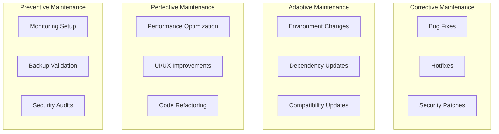
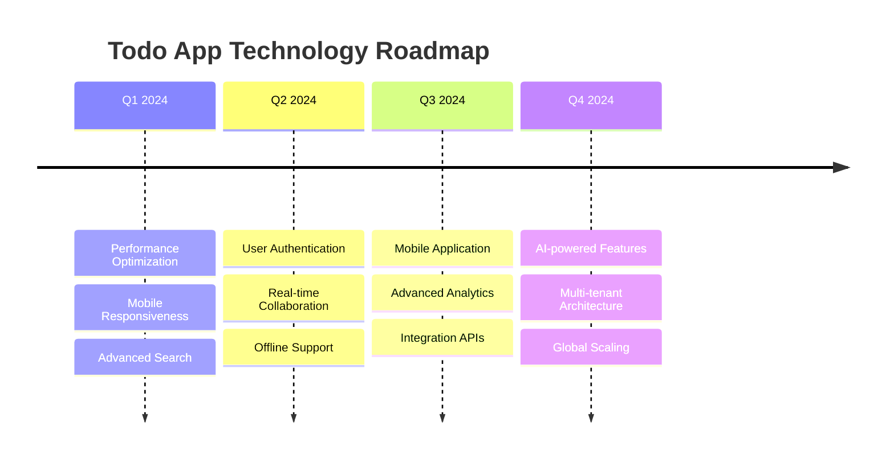

# Phase 7: Maintenance & Operations

## 📋 Overview
การดูแลรักษา Todo List Application หลังจากนำไปใช้งานจริง รวมถึงการแก้ไขปัญหา การเพิ่มฟีเจอร์ และการปรับปรุงประสิทธิภาพ

---

## 🔧 Maintenance Framework

### Maintenance Types


---

## 🐛 Bug Management

### 1. Bug Tracking System

#### Issue Template
```markdown
---
name: Bug Report
about: Create a report to help us improve
title: '[BUG] Brief description'
labels: bug, needs-triage
---

## 🐛 Bug Description
A clear and concise description of what the bug is.

## 🔄 Steps to Reproduce
1. Go to '...'
2. Click on '....'
3. Scroll down to '....'
4. See error

## ✅ Expected Behavior
A clear description of what you expected to happen.

## ❌ Actual Behavior
A clear description of what actually happened.

## 📸 Screenshots
If applicable, add screenshots to help explain your problem.

## 🌐 Environment
- OS: [e.g. iOS, Windows, Ubuntu]
- Browser: [e.g. chrome, safari, firefox]
- Version: [e.g. 22]
- Device: [e.g. iPhone6, Desktop]

## 📋 Additional Context
Add any other context about the problem here.

## 🚨 Priority
- [ ] Critical (System down)
- [ ] High (Major feature broken)
- [ ] Medium (Minor feature issue)
- [ ] Low (Cosmetic issue)
```

### 2. Bug Fix Process

#### Critical Bug Response (P0)
```bash
# 1. Immediate Response (< 1 hour)
git checkout -b hotfix/critical-bug-fix
git pull origin main

# 2. Identify and Fix
# - Check logs
# - Reproduce locally
# - Apply minimal fix
# - Test thoroughly

# 3. Emergency Deployment
git add .
git commit -m "hotfix: critical bug fix for [issue]"
git push origin hotfix/critical-bug-fix

# 4. Immediate merge and deploy
git checkout main
git merge hotfix/critical-bug-fix
git push origin main

# Trigger emergency deployment
```

#### Standard Bug Fix Workflow
```bash
# 1. Create feature branch
git checkout -b bugfix/todo-delete-not-working
git pull origin main

# 2. Investigate and fix
# - Add debugging
# - Write test to reproduce
# - Fix the issue
# - Ensure test passes

# 3. Test locally
npm test
npm run e2e

# 4. Create pull request
git add .
git commit -m "fix: resolve todo deletion issue (#123)"
git push origin bugfix/todo-delete-not-working

# 5. Code review and merge
# 6. Deploy to staging
# 7. Deploy to production
```

### 3. Common Bug Categories & Solutions

#### Frontend Issues
```typescript
// Common: State not updating
// Solution: Check React state management
const TodoItem = ({ todo, onUpdate }: TodoItemProps) => {
  const [isCompleted, setIsCompleted] = useState(todo.completed);
  
  // ❌ Bug: State not syncing with props
  useEffect(() => {
    setIsCompleted(todo.completed);
  }, [todo.completed]); // ✅ Fix: Add dependency
  
  const handleToggle = async () => {
    try {
      await onUpdate(todo.id, { completed: !isCompleted });
      setIsCompleted(!isCompleted); // ✅ Update local state
    } catch (error) {
      console.error('Failed to update todo:', error);
      // ✅ Revert on error
      setIsCompleted(isCompleted);
    }
  };
};
```

#### Backend Issues
```typescript
// Common: Database connection issues
// Solution: Add proper error handling and retries
async function connectWithRetry(maxRetries = 3) {
  for (let i = 0; i < maxRetries; i++) {
    try {
      await prisma.$connect();
      logger.info('Database connected successfully');
      return;
    } catch (error) {
      logger.error(`Database connection attempt ${i + 1} failed:`, error);
      
      if (i === maxRetries - 1) {
        throw new Error('Max database connection retries exceeded');
      }
      
      // Wait before retry (exponential backoff)
      await new Promise(resolve => setTimeout(resolve, Math.pow(2, i) * 1000));
    }
  }
}
```

---

## 🚀 Feature Enhancement

### 1. Feature Request Process

#### Enhancement Template
```markdown
---
name: Feature Request
about: Suggest an idea for this project
title: '[FEATURE] Brief description'
labels: enhancement, needs-discussion
---

## 🎯 Problem Statement
A clear description of what problem this feature would solve.

## 💡 Proposed Solution
A clear description of what you want to happen.

## 🔄 User Stories
- As a [user type], I want [goal] so that [reason]
- As a [user type], I want [goal] so that [reason]

## 📋 Acceptance Criteria
- [ ] Criteria 1
- [ ] Criteria 2
- [ ] Criteria 3

## 🎨 UI/UX Considerations
Describe any UI changes or user experience improvements.

## 🔧 Technical Considerations
Any technical implementation details or constraints.

## 📊 Success Metrics
How will we measure if this feature is successful?

## 🚫 Alternatives Considered
Describe alternatives you've considered and why this is the best approach.
```

### 2. Feature Implementation Example

#### Adding Todo Categories
```typescript
// 1. Database Schema Update
// prisma/schema.prisma
model Category {
  id    String @id @default(cuid())
  name  String
  color String
  todos Todo[]
  
  createdAt DateTime @default(now())
  updatedAt DateTime @updatedAt
}

model Todo {
  id          String   @id @default(cuid())
  title       String
  completed   Boolean  @default(false)
  categoryId  String?
  category    Category? @relation(fields: [categoryId], references: [id])
  
  createdAt   DateTime @default(now())
  updatedAt   DateTime @updatedAt
}
```

```bash
# 2. Apply Migration
npx prisma db push
```

```typescript
// 3. Backend API Updates
// Add category routes
.get('/categories', async () => {
  const categories = await prisma.category.findMany({
    include: { _count: { select: { todos: true } } }
  });
  return categories;
})

.post('/categories', async ({ body }) => {
  const { name, color } = body as { name: string; color: string };
  
  const category = await prisma.category.create({
    data: { name, color }
  });
  
  return category;
})

// Update todo routes to include category
.get('/todos', async ({ query }) => {
  const { category } = query;
  
  const todos = await prisma.todo.findMany({
    where: category ? { categoryId: category as string } : {},
    include: { category: true },
    orderBy: { createdAt: 'desc' }
  });
  
  return todos;
})
```

```typescript
// 4. Frontend Component Updates
interface Category {
  id: string;
  name: string;
  color: string;
  _count: { todos: number };
}

const CategoryFilter = ({ onSelectCategory }: { onSelectCategory: (id: string | null) => void }) => {
  const [categories, setCategories] = useState<Category[]>([]);
  
  useEffect(() => {
    fetchCategories();
  }, []);
  
  const fetchCategories = async () => {
    try {
      const response = await fetch(`${API_URL}/categories`);
      const data = await response.json();
      setCategories(data);
    } catch (error) {
      console.error('Failed to fetch categories:', error);
    }
  };
  
  return (
    <div className="flex gap-2 mb-4">
      <button
        onClick={() => onSelectCategory(null)}
        className="px-3 py-1 bg-gray-200 rounded"
      >
        All ({categories.reduce((sum, cat) => sum + cat._count.todos, 0)})
      </button>
      
      {categories.map(category => (
        <button
          key={category.id}
          onClick={() => onSelectCategory(category.id)}
          className="px-3 py-1 rounded"
          style={{ backgroundColor: category.color }}
        >
          {category.name} ({category._count.todos})
        </button>
      ))}
    </div>
  );
};
```

### 3. Feature Rollout Strategy

#### Gradual Rollout
```typescript
// Feature flags implementation
const featureFlags = {
  TODO_CATEGORIES: process.env.FEATURE_TODO_CATEGORIES === 'true',
  DARK_MODE: process.env.FEATURE_DARK_MODE === 'true',
  ADVANCED_SEARCH: process.env.FEATURE_ADVANCED_SEARCH === 'true'
};

// Usage in components
const TodoApp = () => {
  return (
    <div>
      {featureFlags.TODO_CATEGORIES && <CategoryFilter />}
      <TodoList />
      {featureFlags.ADVANCED_SEARCH && <AdvancedSearch />}
    </div>
  );
};
```

---

## ⚡ Performance Optimization

### 1. Performance Monitoring

#### Frontend Performance
```typescript
// Performance monitoring utility
class PerformanceMonitor {
  private metrics: Map<string, number[]> = new Map();
  
  startTiming(label: string): () => void {
    const start = performance.now();
    
    return () => {
      const duration = performance.now() - start;
      const existing = this.metrics.get(label) || [];
      existing.push(duration);
      this.metrics.set(label, existing);
      
      // Log slow operations
      if (duration > 1000) {
        console.warn(`Slow operation: ${label} took ${duration}ms`);
      }
    };
  }
  
  getAverageTime(label: string): number {
    const times = this.metrics.get(label) || [];
    return times.reduce((sum, time) => sum + time, 0) / times.length;
  }
  
  getReport(): Record<string, { average: number; samples: number }> {
    const report: Record<string, { average: number; samples: number }> = {};
    
    for (const [label, times] of this.metrics.entries()) {
      report[label] = {
        average: this.getAverageTime(label),
        samples: times.length
      };
    }
    
    return report;
  }
}

const monitor = new PerformanceMonitor();

// Usage in components
const TodoList = () => {
  const [todos, setTodos] = useState([]);
  
  const fetchTodos = async () => {
    const endTiming = monitor.startTiming('fetch-todos');
    
    try {
      const response = await fetch(`${API_URL}/todos`);
      const data = await response.json();
      setTodos(data);
    } finally {
      endTiming();
    }
  };
};
```

#### Backend Performance
```typescript
// API response time monitoring
const responseTimeMiddleware = () => {
  return async (context: any) => {
    const start = Date.now();
    
    await context.proceed();
    
    const duration = Date.now() - start;
    
    // Log slow requests
    if (duration > 500) {
      logger.warn(`Slow API request: ${context.request.method} ${context.request.url} took ${duration}ms`);
    }
    
    // Add header for debugging
    context.response.headers.set('X-Response-Time', `${duration}ms`);
  };
};

// Database query optimization
const optimizedTodoFetch = async (limit = 50, offset = 0) => {
  return await prisma.todo.findMany({
    take: limit,
    skip: offset,
    include: {
      category: {
        select: {
          id: true,
          name: true,
          color: true
        }
      }
    },
    orderBy: [
      { completed: 'asc' },
      { createdAt: 'desc' }
    ]
  });
};
```

### 2. Database Optimization

#### Query Performance
```sql
-- Add database indexes
CREATE INDEX idx_todo_completed ON "Todo"(completed);
CREATE INDEX idx_todo_category ON "Todo"("categoryId");
CREATE INDEX idx_todo_created_at ON "Todo"("createdAt");

-- Analyze query performance
EXPLAIN ANALYZE SELECT * FROM "Todo" 
WHERE completed = false 
ORDER BY "createdAt" DESC 
LIMIT 20;
```

#### Database Maintenance
```bash
#!/bin/bash
# database_maintenance.sh

# 1. Update database statistics
psql $DATABASE_URL -c "ANALYZE;"

# 2. Vacuum database (reclaim space)
psql $DATABASE_URL -c "VACUUM;"

# 3. Check for unused indexes
psql $DATABASE_URL -c "
SELECT schemaname, tablename, indexname, idx_tup_read, idx_tup_fetch
FROM pg_stat_user_indexes 
WHERE idx_tup_read = 0 AND idx_tup_fetch = 0
ORDER BY schemaname, tablename;"

# 4. Check table sizes
psql $DATABASE_URL -c "
SELECT tablename, 
       pg_size_pretty(pg_total_relation_size(tablename::text)) as size
FROM pg_tables 
WHERE schemaname = 'public' 
ORDER BY pg_total_relation_size(tablename::text) DESC;"
```

---

## 📊 Monitoring & Alerting

### 1. Application Metrics

#### Custom Metrics Collection
```typescript
// Metrics collector
interface Metric {
  name: string;
  value: number;
  timestamp: Date;
  tags?: Record<string, string>;
}

class MetricsCollector {
  private metrics: Metric[] = [];
  
  increment(name: string, tags?: Record<string, string>) {
    this.metrics.push({
      name,
      value: 1,
      timestamp: new Date(),
      tags
    });
  }
  
  gauge(name: string, value: number, tags?: Record<string, string>) {
    this.metrics.push({
      name,
      value,
      timestamp: new Date(),
      tags
    });
  }
  
  async flush() {
    if (this.metrics.length > 0) {
      // Send to monitoring service
      console.log('Sending metrics:', this.metrics);
      this.metrics = [];
    }
  }
}

const metrics = new MetricsCollector();

// Usage in API routes
.post('/todos', async ({ body }) => {
  metrics.increment('todo.created');
  
  try {
    const todo = await prisma.todo.create({ data: body });
    metrics.increment('todo.created.success');
    return todo;
  } catch (error) {
    metrics.increment('todo.created.error');
    throw error;
  }
})
```

### 2. Health Check System

#### Comprehensive Health Checks
```typescript
// Health check service
interface HealthCheck {
  name: string;
  status: 'healthy' | 'unhealthy' | 'degraded';
  responseTime: number;
  details?: any;
}

class HealthChecker {
  private checks: Array<() => Promise<HealthCheck>> = [];
  
  addCheck(name: string, checkFn: () => Promise<boolean | any>) {
    this.checks.push(async () => {
      const start = Date.now();
      
      try {
        const result = await checkFn();
        const responseTime = Date.now() - start;
        
        return {
          name,
          status: result ? 'healthy' : 'unhealthy',
          responseTime,
          details: typeof result === 'object' ? result : undefined
        };
      } catch (error) {
        return {
          name,
          status: 'unhealthy',
          responseTime: Date.now() - start,
          details: { error: error.message }
        };
      }
    });
  }
  
  async runAll(): Promise<{ status: string; checks: HealthCheck[] }> {
    const checks = await Promise.all(this.checks.map(check => check()));
    
    const hasUnhealthy = checks.some(check => check.status === 'unhealthy');
    const hasDegraded = checks.some(check => check.status === 'degraded');
    
    const overallStatus = hasUnhealthy ? 'unhealthy' : 
                         hasDegraded ? 'degraded' : 'healthy';
    
    return { status: overallStatus, checks };
  }
}

// Setup health checks
const healthChecker = new HealthChecker();

healthChecker.addCheck('database', async () => {
  await prisma.$queryRaw`SELECT 1`;
  return true;
});

healthChecker.addCheck('memory', async () => {
  const usage = process.memoryUsage();
  const heapUsed = usage.heapUsed / 1024 / 1024; // MB
  
  return {
    healthy: heapUsed < 500, // Alert if over 500MB
    heapUsed: `${Math.round(heapUsed)}MB`,
    heapTotal: `${Math.round(usage.heapTotal / 1024 / 1024)}MB`
  };
});

// Health endpoint
.get('/health', async () => {
  return await healthChecker.runAll();
})
```

### 3. Error Tracking

#### Structured Error Logging
```typescript
// Error tracking service
interface ErrorContext {
  userId?: string;
  requestId?: string;
  userAgent?: string;
  ip?: string;
  url?: string;
  method?: string;
}

class ErrorTracker {
  static captureError(error: Error, context?: ErrorContext) {
    const errorData = {
      message: error.message,
      stack: error.stack,
      timestamp: new Date().toISOString(),
      context,
      fingerprint: this.generateFingerprint(error)
    };
    
    // Log locally
    logger.error('Error captured:', errorData);
    
    // Send to external service (Sentry, LogRocket, etc.)
    // this.sendToErrorService(errorData);
  }
  
  private static generateFingerprint(error: Error): string {
    // Create unique fingerprint for error grouping
    const key = `${error.name}:${error.message}:${error.stack?.split('\n')[1]}`;
    return Buffer.from(key).toString('base64').slice(0, 16);
  }
}

// Global error handler
process.on('uncaughtException', (error) => {
  ErrorTracker.captureError(error, { context: 'uncaughtException' });
  process.exit(1);
});

process.on('unhandledRejection', (reason, promise) => {
  const error = reason instanceof Error ? reason : new Error(String(reason));
  ErrorTracker.captureError(error, { context: 'unhandledRejection' });
});
```

---

## 📚 Documentation Maintenance

### 1. API Documentation Updates

#### Automated API Docs
```typescript
// Generate OpenAPI specification
import { swagger } from '@elysiajs/swagger';

const app = new Elysia()
  .use(swagger({
    documentation: {
      info: {
        title: 'Todo API',
        version: '1.0.0',
        description: 'A simple todo list API'
      },
      tags: [
        { name: 'todos', description: 'Todo management endpoints' },
        { name: 'categories', description: 'Category management endpoints' }
      ]
    }
  }))
  // Your routes with proper typing for auto-documentation
  .get('/todos', () => todos, {
    detail: {
      summary: 'Get all todos',
      description: 'Retrieve a list of all todos with optional filtering',
      tags: ['todos']
    }
  });
```

### 2. Code Documentation

#### JSDoc Standards
```typescript
/**
 * Represents a Todo item in the application
 * 
 * @interface Todo
 * @property {string} id - Unique identifier for the todo
 * @property {string} title - The todo item title
 * @property {boolean} completed - Whether the todo is completed
 * @property {string} [categoryId] - Optional category association
 * @property {Date} createdAt - When the todo was created
 * @property {Date} updatedAt - When the todo was last updated
 */
interface Todo {
  id: string;
  title: string;
  completed: boolean;
  categoryId?: string;
  createdAt: Date;
  updatedAt: Date;
}

/**
 * Creates a new todo item
 * 
 * @async
 * @function createTodo
 * @param {Partial<Todo>} todoData - The todo data to create
 * @returns {Promise<Todo>} The created todo item
 * @throws {ValidationError} When todo data is invalid
 * @throws {DatabaseError} When database operation fails
 * 
 * @example
 * ```typescript
 * const newTodo = await createTodo({
 *   title: 'Learn TypeScript',
 *   categoryId: 'learning-category-id'
 * });
 * ```
 */
async function createTodo(todoData: Partial<Todo>): Promise<Todo> {
  // Implementation
}
```

### 3. User Documentation

#### README Updates
```markdown
# Todo Application - Updated Features

## 🆕 Recent Updates

### Version 2.1.0 (2024-01-15)
- ✅ Added todo categories
- ✅ Improved performance with pagination
- ✅ Enhanced error handling
- 🐛 Fixed todo deletion bug
- 📚 Updated API documentation

### Version 2.0.0 (2024-01-01)
- ✅ Complete UI redesign
- ✅ Added user authentication
- ✅ Implemented real-time sync
- 💔 BREAKING: Changed API response format

## 🚀 Migration Guides

### Migrating from v1.x to v2.x
[Detailed migration steps...]

## 📋 Known Issues
- [ ] Safari compatibility issue with date picker (#45)
- [ ] Mobile keyboard overlaps input field (#67)

## 🔮 Roadmap
- [ ] Todo sharing between users
- [ ] Mobile application
- [ ] Offline synchronization
- [ ] Advanced filtering and search
```

---

## 🔄 Update Management

### 1. Dependency Updates

#### Automated Dependency Monitoring
```json
// renovate.json (Renovate Bot configuration)
{
  "extends": ["config:base"],
  "schedule": ["before 6am on monday"],
  "packageRules": [
    {
      "matchPackagePatterns": ["^@types/"],
      "groupName": "type definitions",
      "automerge": true
    },
    {
      "matchPackagePatterns": ["eslint", "prettier"],
      "groupName": "linting",
      "automerge": true
    },
    {
      "matchPackageNames": ["react", "next"],
      "groupName": "react ecosystem",
      "reviewers": ["team:frontend"]
    }
  ]
}
```

#### Manual Update Process
```bash
# Check for outdated packages
npm outdated

# Update dependencies safely
npm update

# Update major versions carefully
npm install react@latest next@latest

# Test after updates
npm test
npm run e2e
npm run build
```

### 2. Security Updates

#### Security Audit Process
```bash
# Run security audit
npm audit

# Fix automatically fixable issues
npm audit fix

# Check for known vulnerabilities
npx snyk test

# Update vulnerable packages
npm install package-name@latest
```

#### Security Monitoring
```bash
#!/bin/bash
# security-check.sh

echo "🔍 Running security checks..."

# 1. NPM Audit
echo "📦 Checking NPM packages..."
npm audit --audit-level=moderate

# 2. Dependency vulnerability check
echo "🔒 Checking for known vulnerabilities..."
npx snyk test

# 3. Docker image security
echo "🐳 Checking Docker images..."
docker run --rm -v $(pwd):/app -v /var/run/docker.sock:/var/run/docker.sock \
  aquasec/trivy fs /app

# 4. OWASP dependency check
echo "🛡️ Running OWASP dependency check..."
# dependency-check --project "Todo App" --scan .

echo "✅ Security check complete!"
```

---

## 📈 Capacity Planning

### 1. Usage Monitoring

#### User Metrics
```typescript
// User activity tracking
interface UserMetrics {
  activeUsers: number;
  todosCreated: number;
  todosCompleted: number;
  apiRequests: number;
  errorRate: number;
}

class UsageTracker {
  private dailyMetrics: Map<string, UserMetrics> = new Map();
  
  trackActivity(activity: keyof UserMetrics, count = 1) {
    const today = new Date().toISOString().split('T')[0];
    const current = this.dailyMetrics.get(today) || {
      activeUsers: 0,
      todosCreated: 0,
      todosCompleted: 0,
      apiRequests: 0,
      errorRate: 0
    };
    
    current[activity] += count;
    this.dailyMetrics.set(today, current);
  }
  
  getGrowthTrend(days = 30): UserMetrics[] {
    const result: UserMetrics[] = [];
    const startDate = new Date();
    startDate.setDate(startDate.getDate() - days);
    
    for (let i = 0; i < days; i++) {
      const date = new Date(startDate);
      date.setDate(startDate.getDate() + i);
      const dateStr = date.toISOString().split('T')[0];
      
      const metrics = this.dailyMetrics.get(dateStr) || {
        activeUsers: 0,
        todosCreated: 0,
        todosCompleted: 0,
        apiRequests: 0,
        errorRate: 0
      };
      
      result.push(metrics);
    }
    
    return result;
  }
}
```

### 2. Scaling Strategies

#### Database Scaling
```sql
-- Read replicas for scaling reads
-- Master-slave configuration

-- Partitioning large tables
CREATE TABLE todos_2024 PARTITION OF todos
FOR VALUES FROM ('2024-01-01') TO ('2025-01-01');

-- Archiving old data
CREATE TABLE todos_archive AS 
SELECT * FROM todos 
WHERE "createdAt" < NOW() - INTERVAL '1 year';

DELETE FROM todos 
WHERE "createdAt" < NOW() - INTERVAL '1 year';
```

#### Application Scaling
```dockerfile
# Multi-stage production build for scaling
FROM node:18-alpine AS base
WORKDIR /app

# Dependencies
COPY package*.json ./
RUN npm ci --only=production

# Application
COPY . .
RUN npm run build

# Production image
FROM node:18-alpine AS production
WORKDIR /app

# Security: Run as non-root user
RUN addgroup -g 1001 -S nodejs
RUN adduser -S nextjs -u 1001

# Copy built application
COPY --from=base --chown=nextjs:nodejs /app .

USER nextjs

EXPOSE 3000
CMD ["npm", "start"]
```

---

## 📋 Maintenance Checklist

### Daily Tasks (Automated)
- [ ] Monitor application health
- [ ] Check error logs
- [ ] Verify backup completion
- [ ] Monitor performance metrics
- [ ] Review security alerts

### Weekly Tasks
- [ ] Review and triage new issues
- [ ] Update dependencies (patch versions)
- [ ] Analyze performance trends
- [ ] Review user feedback
- [ ] Test disaster recovery procedures

### Monthly Tasks
- [ ] Security audit and updates
- [ ] Performance optimization review
- [ ] Database maintenance (vacuum, analyze)
- [ ] Documentation updates
- [ ] Capacity planning review

### Quarterly Tasks
- [ ] Major dependency updates
- [ ] Architecture review
- [ ] User experience analysis
- [ ] Technology roadmap review
- [ ] Team training and knowledge transfer

---

## 🔮 Future Planning

### Technology Roadmap


### Sunset Planning
```markdown
## Feature Deprecation Process

### Phase 1: Deprecation Notice (3 months before removal)
- Add deprecation warnings in API responses
- Update documentation with migration guide
- Notify users via email/in-app notifications

### Phase 2: Limited Support (1 month before removal)
- Remove feature from new user onboarding
- Stop active development and bug fixes
- Provide migration tools and support

### Phase 3: Removal
- Remove feature code
- Archive related documentation
- Monitor for any breaking changes
```

---

## 🔗 Related Documents
- [Previous Phase: Deployment](./06-deployment.md)
- [Project Overview](./README.md)
- [Architecture Documentation](./03-design.md)