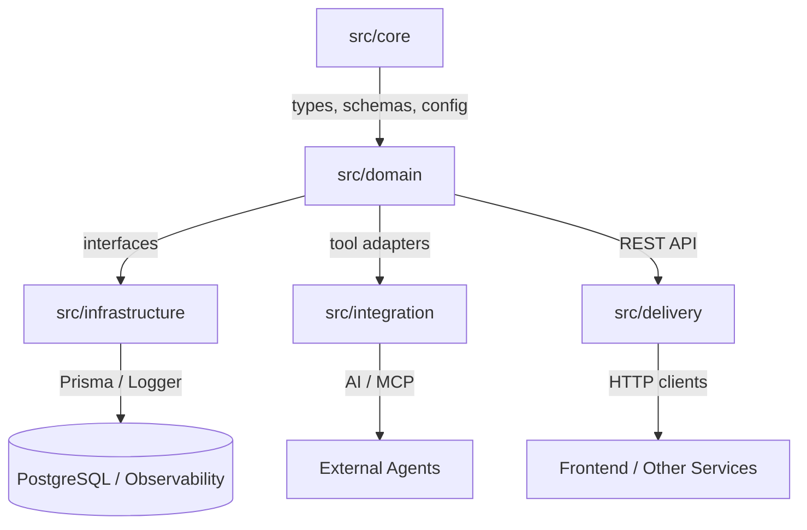

# UAPS Documentation

Universal Academic Portfolio System is a Bun-first TypeScript backend built around Clean Architecture, runtime validation, typed data access, and production-friendly observability.

Use this document as a fast project map for new contributors.

## Start Here

If you want to understand the system in the fastest possible order, read these files first:

1. [index.ts](../index.ts) for the composition root and end-to-end bootstrap.
2. [src/core/types.ts](../src/core/types.ts) for the central domain types.
3. [src/domain/ProfileService.ts](../src/domain/ProfileService.ts) for the main use-case logic.
4. [src/infrastructure/PrismaProfileRepository.ts](../src/infrastructure/PrismaProfileRepository.ts) for persistence.
5. [src/delivery/ProfileApiServer.ts](../src/delivery/ProfileApiServer.ts) for the HTTP entry point.

## Architecture



The project is intentionally separated so each layer has one clear job:

- `src/core` defines the language of the domain.
- `src/domain` owns business rules and abstractions.
- `src/infrastructure` implements those abstractions with real systems.
- `src/integration` exposes the domain to AI/MCP consumers.
- `src/delivery` exposes the domain to HTTP clients.

## What Lives Where

### Core

- [src/core/types.ts](../src/core/types.ts) defines profile types, DTOs, unions, and response shapes.
- [src/core/schemas.ts](../src/core/schemas.ts) owns runtime validation with Zod.
- [src/core/errors.ts](../src/core/errors.ts) defines application-level errors.
- [src/core/config.ts](../src/core/config.ts) validates environment variables at startup.

### Domain

- [src/domain/ProfileFactory.ts](../src/domain/ProfileFactory.ts) contains factory abstractions and concrete factories.
- [src/domain/ProfileRepository.ts](../src/domain/ProfileRepository.ts) defines the async persistence contract.
- [src/domain/ProfileService.ts](../src/domain/ProfileService.ts) contains the main application logic.

### Infrastructure

- [src/infrastructure/MockProfileRepository.ts](../src/infrastructure/MockProfileRepository.ts) is the in-memory test double.
- [src/infrastructure/PrismaProfileRepository.ts](../src/infrastructure/PrismaProfileRepository.ts) is the real database adapter.
- [src/infrastructure/Logger.ts](../src/infrastructure/Logger.ts) provides structured logging.

### Integration and Delivery

- [src/integration/McpToolAdapter.ts](../src/integration/McpToolAdapter.ts) exposes profile lookup as an MCP tool.
- [src/delivery/ProfileApiServer.ts](../src/delivery/ProfileApiServer.ts) exposes the REST API.

### Runtime and Ops

- [index.ts](../index.ts) is the composition root and demo runner.
- [prisma/schema.prisma](../prisma/schema.prisma) defines the database schema.
- [prisma.config.ts](../prisma.config.ts) configures Prisma 7.
- [docker-compose.yml](../docker-compose.yml) runs PostgreSQL locally.
- [.github/workflows/ci.yml](../.github/workflows/ci.yml) runs type-safety checks in CI.
- [tests/domain/ProfileService.test.ts](../tests/domain/ProfileService.test.ts) covers the service layer.

## How The App Flows

1. `index.ts` creates the repository, factory, service, and MCP adapter.
2. `ProfileService` validates and prepares profile data.
3. `ProfileRepository` saves or retrieves profiles.
4. `PrismaProfileRepository` maps domain objects to the database.
5. `ProfileApiServer` and `ProfileMcpAdapter` expose the same domain behavior to different consumers.

This means most changes should start in the domain layer, then ripple outward to infrastructure or delivery.

## Setup

Install dependencies:

```bash
bun install
```

Start PostgreSQL:

```bash
wsl -e docker compose up -d
```

Generate Prisma client:

```bash
bunx prisma generate
```

Run the app:

```bash
bun run index.ts
```

Run tests:

```bash
bun test
```

## Environment

Required environment variables are validated in [src/core/config.ts](../src/core/config.ts):

- `DATABASE_URL`
- `PORT`

If these values are missing or invalid, the app should fail fast instead of booting with broken configuration.

## Data Model

The project currently uses a single-table profile design.

- [prisma/schema.prisma](../prisma/schema.prisma) stores student and alumni fields in one `Profile` table.
- `UserRole` is the discriminator.
- The domain mirrors that structure with `StudentProfile` and `AlumniProfile`.

This is the main place to look when you want to add fields, new profile variants, or database constraints.

## API and Tooling

- [src/delivery/ProfileApiServer.ts](../src/delivery/ProfileApiServer.ts) defines HTTP routes.
- [src/integration/McpToolAdapter.ts](../src/integration/McpToolAdapter.ts) defines the AI/MCP-facing contract.
- [src/core/schemas.ts](../src/core/schemas.ts) keeps payload validation consistent across both.

## Quick Mental Model

If you remember only one thing, remember this:

- core defines the shape
- domain defines the rule
- infrastructure performs the work
- integration exports it to AI tools
- delivery exports it to HTTP clients

That is the safest order to touch when you want to contribute without breaking the architecture.
