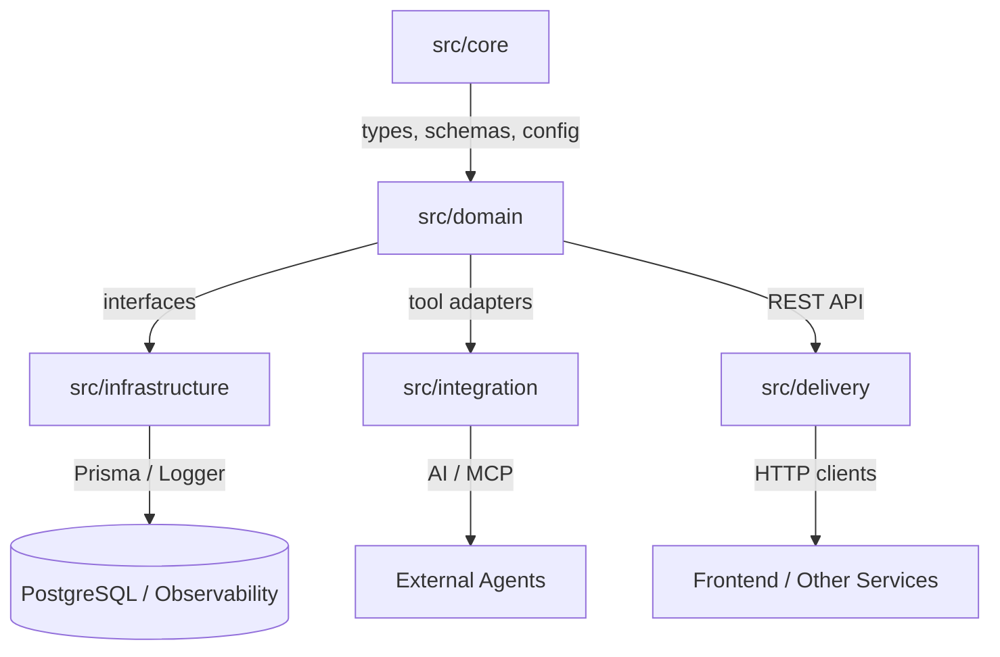

# UAPS Documentation

Universal Academic Portfolio System is a Bun-first TypeScript backend built around Clean Architecture, runtime validation, typed data access, and production-friendly observability.

## At a Glance

- `src/core` holds shared types, schemas, config, and errors.
- `src/domain` contains business rules, service logic, factories, and repository contracts.
- `src/infrastructure` contains concrete implementations such as Prisma, logging, and mock adapters.
- `src/integration` exposes domain capabilities to AI and MCP tooling.
- `src/delivery` serves HTTP APIs with Elysia.

## Architecture



## Technology Stack

- Bun for runtime and package management
- TypeScript in strict mode
- Zod for runtime validation and DTO inference
- Prisma for database access
- PostgreSQL via Docker Compose
- Elysia for HTTP APIs
- pino for structured logging
- bun:test for unit tests

## Project Structure

```text
index.ts
docker-compose.yml
.env
prisma/
src/
  core/
  domain/
  infrastructure/
  integration/
  delivery/
tests/
```

## Core Design

The codebase is organized as a layered system:

1. `src/core` defines the shared language of the application.
2. `src/domain` owns use cases and business rules.
3. `src/infrastructure` implements persistence and runtime concerns.
4. `src/integration` translates internal behavior into external tool interfaces.
5. `src/delivery` exposes the system over HTTP.

This keeps the domain independent from Prisma, HTTP, and AI-specific details.

## Main Concepts

### Profile Model

- `UserRole` represents `STUDENT`, `ALUMNI`, and `ADMIN`.
- `BaseProfile` defines the shared profile fields.
- `StudentProfile` and `AlumniProfile` narrow `role` using discriminated unions.
- `AnyProfile` represents polymorphic profile data.

### Validation

- `CreateProfileSchema` is the source of truth for create payloads.
- `CreateProfileDTO` is inferred from Zod instead of duplicated manually.
- `ProfileService.registerStudent()` validates input before business logic runs.

### Repositories

- `ProfileRepository` is the domain contract.
- `MockProfileRepository` provides an in-memory implementation for tests and demos.
- `PrismaProfileRepository` maps Prisma records to domain profiles.

### Errors

- `AppError` is the shared application error base class.
- `NotFoundError` is used when a profile cannot be found.
- `DatabaseError` is used when persistence fails.

### AI Integration

- `ProfileMcpAdapter` exposes profile lookup as an MCP tool.
- Successful calls return JSON strings.
- Failed calls return human-readable messages so the tool chain can keep working.

### HTTP API

- `ProfileApiServer` exposes REST endpoints with Elysia.
- Request bodies are validated with Zod.
- Domain errors are translated into HTTP responses.

## Database Setup

PostgreSQL is run locally with Docker Compose.

```bash
wsl -e docker compose up -d
```

Required environment variables:

- `DATABASE_URL`
- `PORT`

Environment validation happens in `src/core/config.ts`, so the app fails fast if configuration is incomplete.

## Prisma

The database uses a single `Profile` table with nullable fields for student and alumni-specific data.

Generate the Prisma client:

```bash
bunx prisma generate
```

Run the migration locally:

```bash
bunx prisma migrate dev --name init_profile_schema
```

The Prisma 7 datasource URL is configured in `prisma.config.ts`.

## Running the App

```bash
bun install
bunx prisma generate
bun index.ts
```

The entry point wires together:

- `PrismaProfileRepository`
- `StudentProfileFactory`
- `ProfileService`
- `ProfileMcpAdapter`

It also simulates both a successful lookup and a failing lookup so the full flow can be observed end to end.

## REST API

Base routes:

- `POST /api/profiles`
- `GET /api/profiles/:id`

The POST route validates the request body before it reaches the domain layer. The GET route returns the stored profile or a not-found error.

## Logging

Logging is handled by `pino` through `src/infrastructure/Logger.ts`.

- Logs are emitted as JSON.
- This makes them easier to search, filter, and forward to external monitoring systems.

## Testing

Unit tests use `bun:test`.

```bash
bun test
```

Current coverage focuses on `ProfileService` behavior:

- student registration
- profile retrieval
- not-found handling

## CI

GitHub Actions runs on `main` and performs:

1. `bun install`
2. `bunx prisma generate`
3. `bunx tsc --noEmit`

This provides a fast type-safety check without requiring a live database in CI.

## Implementation Notes

- Avoid `any` in application code.
- Prefer domain interfaces over direct infrastructure calls.
- Keep validation at the boundary and business logic in the domain.
- Use structured logs instead of raw `console.log` in runtime code.

## Roadmap

- Expand API routes for alumni profiles.
- Add request logging and correlation IDs.
- Add more repository-focused tests.
- Add OpenAPI generation if the public API grows further.
