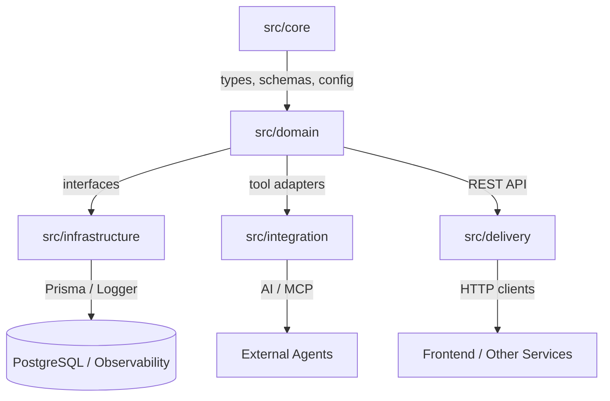

# คู่มือโปรเจกต์ UAPS

Universal Academic Portfolio System คือ Bun + TypeScript backend สำหรับ profile management, database persistence, HTTP delivery และ MCP tooling

เอกสารนี้เขียนเป็นไทยผสมอังกฤษ โดยตั้งใจไม่ใช้คำทับศัพท์เกินจำเป็น เพื่อให้อ่านตาม flow ของระบบได้ง่ายขึ้น

## เริ่มจากตรงนี้

ถ้าต้องการเข้าใจโปรเจกต์แบบเร็วที่สุด ให้อ่านไฟล์ต่อไปนี้ตามลำดับ:

1. [index.ts](../index.ts) สำหรับ composition root และ bootstrap ของระบบ
2. [src/core/types.ts](../src/core/types.ts) สำหรับ type หลักของโปรเจกต์
3. [src/domain/ProfileService.ts](../src/domain/ProfileService.ts) สำหรับ business logic หลัก
4. [src/infrastructure/PrismaProfileRepository.ts](../src/infrastructure/PrismaProfileRepository.ts) สำหรับ persistence layer
5. [src/delivery/ProfileApiServer.ts](../src/delivery/ProfileApiServer.ts) สำหรับ HTTP entry point

## Architecture



แนวคิดหลักคือแยกแต่ละ layer ให้มีหน้าที่ชัดเจน:

- `src/core` เก็บ type, schema, config และ error ที่ใช้ร่วมกัน
- `src/domain` เก็บ business rule, use case และ contract
- `src/infrastructure` เก็บ implementation ที่เชื่อมกับระบบจริง
- `src/integration` เก็บ adapter สำหรับ AI / MCP
- `src/delivery` เก็บ HTTP API

## มีอะไรอยู่ตรงไหน

### Core

- [src/core/types.ts](../src/core/types.ts) เก็บ profile types, DTOs, unions และ response shape
- [src/core/schemas.ts](../src/core/schemas.ts) ทำ runtime validation ด้วย Zod
- [src/core/errors.ts](../src/core/errors.ts) เก็บ application errors
- [src/core/config.ts](../src/core/config.ts) ตรวจ env vars ตอนเริ่มแอป

### Domain

- [src/domain/ProfileFactory.ts](../src/domain/ProfileFactory.ts) เก็บ factory abstractions และ concrete factories
- [src/domain/ProfileRepository.ts](../src/domain/ProfileRepository.ts) เก็บ async persistence contract
- [src/domain/ProfileService.ts](../src/domain/ProfileService.ts) เก็บ application logic หลัก

### Infrastructure

- [src/infrastructure/MockProfileRepository.ts](../src/infrastructure/MockProfileRepository.ts) ใช้เป็น in-memory test double
- [src/infrastructure/PrismaProfileRepository.ts](../src/infrastructure/PrismaProfileRepository.ts) เป็น database adapter จริง
- [src/infrastructure/Logger.ts](../src/infrastructure/Logger.ts) เก็บ structured logging

### Integration และ Delivery

- [src/integration/McpToolAdapter.ts](../src/integration/McpToolAdapter.ts) เปิด profile lookup ให้ MCP ใช้
- [src/delivery/ProfileApiServer.ts](../src/delivery/ProfileApiServer.ts) เปิด REST API

### Runtime และ Ops

- [index.ts](../index.ts) คือ composition root และ demo runner
- [prisma/schema.prisma](../prisma/schema.prisma) คือ database schema
- [prisma.config.ts](../prisma.config.ts) คือ Prisma 7 config
- [docker-compose.yml](../docker-compose.yml) ใช้รัน PostgreSQL local
- [.github/workflows/ci.yml](../.github/workflows/ci.yml) ใช้ตรวจ type-safety ใน CI
- [tests/domain/ProfileService.test.ts](../tests/domain/ProfileService.test.ts) ครอบคลุม service layer

## Data Flow

1. `index.ts` สร้าง repository, factory, service และ MCP adapter
2. `ProfileService` ตรวจข้อมูลและเตรียม profile
3. `ProfileRepository` เป็นทางกลางสำหรับ save และ find
4. `PrismaProfileRepository` map domain object ไปยัง database
5. `ProfileApiServer` และ `ProfileMcpAdapter` เปิดใช้ domain เดียวกันในคนละช่องทาง

ถ้าจะเปลี่ยนอะไร ส่วนใหญ่ควรเริ่มที่ domain แล้วค่อยไล่ไป infrastructure หรือ delivery

## Setup

ติดตั้ง dependency:

```bash
bun install
```

เปิด PostgreSQL:

```bash
wsl -e docker compose up -d
```

Generate Prisma client:

```bash
bunx prisma generate
```

รันแอป:

```bash
bun run index.ts
```

รันทดสอบ:

```bash
bun test
```

## Environment

ค่าที่ต้องมีและถูก validate ใน [src/core/config.ts](../src/core/config.ts):

- `DATABASE_URL`
- `PORT`

ถ้าค่าใดหายหรือไม่ถูกต้อง แอปควร fail fast ทันที ไม่ควร boot แบบ config ผิด

## Data Model

ตอนนี้โปรเจกต์ใช้ single-table profile design

- [prisma/schema.prisma](../prisma/schema.prisma) เก็บ student และ alumni fields ในตารางเดียวกัน
- `UserRole` ทำหน้าที่เป็น discriminator
- domain mirror โครงสร้างนี้ผ่าน `StudentProfile` และ `AlumniProfile`

ถ้าจะเพิ่ม field, เพิ่ม profile variant หรือเปลี่ยน database constraint ให้เริ่มดูตรงนี้

## API และ Tooling

- [src/delivery/ProfileApiServer.ts](../src/delivery/ProfileApiServer.ts) เก็บ HTTP routes
- [src/integration/McpToolAdapter.ts](../src/integration/McpToolAdapter.ts) เก็บ contract สำหรับ AI/MCP
- [src/core/schemas.ts](../src/core/schemas.ts) ทำให้ payload validation ใช้มาตรฐานเดียวกัน

## จำง่าย ๆ

ถ้าจะจำแค่ประโยคเดียว ให้จำว่า:

- core กำหนด shape
- domain กำหนด rule
- infrastructure ทำงานจริง
- integration ส่งออกให้ AI tools
- delivery ส่งออกให้ HTTP clients

ลำดับนี้คือทางที่ปลอดภัยที่สุดเวลาจะอ่านหรือแก้โปรเจกต์นี้
